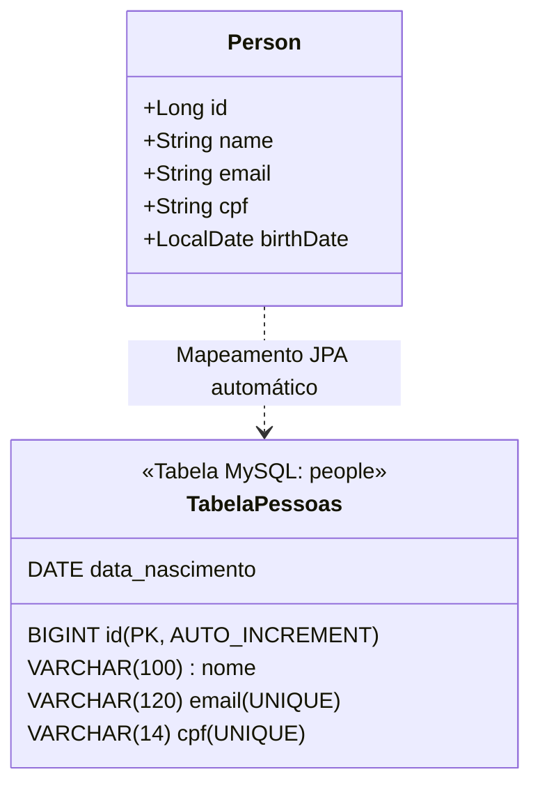

# 02. O Conceito de Model e Entidades JPA

No capítulo anterior, configuramos o MySQL e o pool de conexões HikariCP no
`application.properties`. Agora que o banco de dados está conectado e pronto
para responder, precisamos definir **como os dados do nosso negócio serão
representados em código Java**.

Neste capítulo, você aprenderá o conceito de **Model** na arquitetura de
software, como mapear classes Java para tabelas relacionais usando as anotações
oficiais da **JPA** (_Jakarta Persistence_) e como integrar o **Lombok** de
forma cirúrgica e segura, evitando as armadilhas clássicas que quebram
aplicações em produção.

## A Dor: O Mapeamento Manual e Frágil

No modelo tradicional com JDBC puro, uma classe Java que representava uma pessoa
era apenas um objeto de dados passivo (_POJO_). Para gravar ou ler esse objeto
no MySQL, você precisava escrever manualmente dezenas de instruções SQL
repetitivas:

```java
// ❌ ABORDAGEM FRÁGIL DO PASSADO: Mapeamento manual coluna por coluna
String sql = "INSERT INTO pessoas (nome, email, cpf, data_nascimento) VALUES (?, ?, ?, ?)";
PreparedStatement ps = conn.prepareStatement(sql);
ps.setString(1, person.getName());
ps.setString(2, person.getEmail());
ps.setString(3, person.getCpf());
ps.setDate(4, Date.valueOf(person.getBirthDate()));
ps.executeUpdate();
```

Essa abordagem sofria de três grandes problemas:

1. **Fragilidade a Mudanças:** Adicionar uma nova coluna na tabela exigia
   alterar manualmente todos os `INSERT`, `UPDATE` e `SELECT` espalhados pelo
   sistema.
2. **Duplicação de Código:** Para cada tabela do banco, era necessário criar um
   DAO gigantesco cheio de conversões manuais de tipos.
3. **Ausência de Tipagem Forte no SQL:** Erros de digitação no nome das colunas
   só explodiam em tempo de execução quando o cliente tentava salvar o registro.

## O Conceito de Model e Entidade

Na arquitetura de software, o termo **Model** refere-se à camada responsável por
representar as regras e os dados do domínio da aplicação.

Quando utilizamos um framework ORM (_Object-Relational Mapping_) como a JPA com
o Hibernate, uma classe do Model que possui correspondência direta com uma
tabela do banco de dados é chamada de **Entidade** (_Entity_).



O Hibernate analisa as anotações presentes na classe Java e traduz
automaticamente as operações de objetos para comandos SQL no MySQL.

## As Anotações Essenciais da JPA (`jakarta.persistence.*`)

Se você já estudou o nosso capítulo sobre [Mapeamento de Entidades no submódulo
de Hibernate e JPA](../../hibernate-jpa/03-mapeamento-de-entidades.md), vai se
sentir em casa! Lá nós exploramos minuciosamente cada estratégia de chave
primária, tipos temporais e chaves compostas.

Aqui no Spring Boot, a especificação é rigorosamente a mesma: utilizamos as
anotações padrão do pacote **`jakarta.persistence.*`**. Vamos fazer uma rápida
recapitulação das anotações essenciais que darão vida à nossa entidade `Person`:

| Anotação                   | Onde se aplica   | O que faz no Banco de Dados                                                      |
| :------------------------- | :--------------- | :------------------------------------------------------------------------------- |
| **`@Entity`**              | Classe           | Marca a classe como uma Entidade JPA gerenciada pelo Hibernate.                  |
| **`@Table(name = "...")`** | Classe           | Especifica o nome exato da tabela no MySQL (ex: `@Table(name = "pessoas")`).     |
| **`@Id`**                  | Atributo         | Define o atributo que atua como **Chave Primária** (_Primary Key - PK_).         |
| **`@GeneratedValue`**      | Atributo (`@Id`) | Define a estratégia de geração do ID (ex: `strategy = GenerationType.IDENTITY`). |
| **`@Column`**              | Atributo         | Customiza a coluna (`name`, `nullable`, `unique`, `length`).                     |
| **`@Enumerated`**          | Atributo (Enum)  | Grava enums como texto legível no banco (`EnumType.STRING`).                     |

## A Armadilha de Usar `@Data` do Lombok em Entidades

Muitos desenvolvedores iniciantes cometem o erro grave de colocar a anotação
`@Data` do Lombok sobre uma entidade JPA:

```java
// ❌ CÓDIGO PERIGOSO: O @Data quebra entidades JPA em produção!
@Entity
@Table(name = "pessoas")
@Data // NUNCA USE EM ENTIDADES JPA!
public class Person {
    @Id
    @GeneratedValue(strategy = GenerationType.IDENTITY)
    private Long id;
    private String name;
    // ...
}
```

**Por que você NUNCA deve usar `@Data` em Entidades JPA?**

1. **Quebra de Consistência de Coleções (`Set` e `Map`):** O `@Data` gera um
   método `equals()` e `hashCode()` que compara **todos os campos** da classe.
   Quando uma entidade é criada com `new Person()`, seu `id` é `null`. Depois de
   salva no banco, o MySQL atribui um `id` (ex: `1L`). A alteração do valor do
   campo muda o `hashCode` do objeto em tempo de execução, fazendo com que ele
   "desapareça" de dentro de `HashSet`s ou coleções do Hibernate!
2. **Loops Infinitos de Recursão:** Em relacionamentos bidirecionais (como `1:N`
   entre Pedido e Itens), o `@ToString` gerado pelo `@Data` tenta imprimir o
   Pedido, que imprime os Itens, que imprimem o Pedido de volta, estourando a
   memória da JVM com `StackOverflowError`.

## A Abordagem Recomendada e Segura com Lombok

A forma profissional e limpa de combinar o Lombok com a JPA consiste em usar
anotações granulares e seguras:

```java
package com.fatecpg.sistemapessoas.model;

import jakarta.persistence.Column;
import jakarta.persistence.Entity;
import jakarta.persistence.GeneratedValue;
import jakarta.persistence.GenerationType;
import jakarta.persistence.Id;
import jakarta.persistence.Table;
import lombok.AccessLevel;
import lombok.AllArgsConstructor;
import lombok.EqualsAndHashCode;
import lombok.Getter;
import lombok.NoArgsConstructor;
import lombok.Setter;

import java.time.LocalDate;

// ✅ MODELO PROFISSIONAL: Seguro para JPA, imutabilidade de identidade e sem código repetitivo
@Entity
@Table(name = "people")
@Getter
@Setter
@NoArgsConstructor(access = AccessLevel.PROTECTED) // Exigido pela JPA, mas protegido contra uso indevido
@AllArgsConstructor
@EqualsAndHashCode(onlyExplicitlyIncluded = true) // Duas pessoas no banco são iguais se possuem o mesmo ID!
public class Person {

    @Id
    @GeneratedValue(strategy = GenerationType.IDENTITY) // AUTO_INCREMENT nativo do MySQL
    @EqualsAndHashCode.Include // Apenas o ID entra no cálculo de igualdade e hash
    @Setter(AccessLevel.NONE) // Chave primária gerada pelo banco: não deve existir setter público!
    private Long id;

    @Column(name = "name", nullable = false, length = 100)
    private String name;

    @Column(name = "email", nullable = false, unique = true, length = 120)
    private String email;

    @Column(name = "cpf", nullable = false, unique = true, length = 14)
    private String cpf;

    @Column(name = "birth_date")
    private LocalDate birthDate;
}
```

### Por que esse design é impecável?

1. **Identidade Estável:** Duas instâncias de `Person` serão consideradas iguais
   se e somente se possuírem o mesmo `id` no banco de dados, garantindo
   comportamento perfeito dentro do Hibernate.
2. **Imutabilidade do ID:** Com `@Setter(AccessLevel.NONE)`, protegemos a chave
   primária contra alterações manuais acidentais após a criação. O JPA gerencia
   o valor diretamente via reflexão interna nos campos privados.
3. **Validações de Banco pelo DDL:** Com `nullable = false` e `unique = true`, o
   Hibernate gera automaticamente as restrições `NOT NULL` e `UNIQUE KEY` no
   MySQL caso a propriedade `ddl-auto=update` esteja ativada!

## O Resultado no Console do MySQL

Quando você inicializa a aplicação com essa entidade criada e o
`spring.jpa.hibernate.ddl-auto=update` configurado, o Hibernate detecta a classe
`Person` e executa automaticamente no MySQL:

```sql
CREATE TABLE people (
    id BIGINT NOT NULL AUTO_INCREMENT,
    name VARCHAR(100) NOT NULL,
    email VARCHAR(120) NOT NULL,
    cpf VARCHAR(14) NOT NULL,
    birth_date DATE,
    PRIMARY KEY (id),
    CONSTRAINT uk_people_email UNIQUE (email),
    CONSTRAINT uk_people_cpf UNIQUE (cpf)
) ENGINE=InnoDB;
```

Você não precisou abrir nenhum cliente SQL para criar essa tabela manualmente. O
seu código Java é a fonte única da verdade da estrutura dos dados!

<details>
<summary>🔍 Por que a JPA exige um construtor sem argumentos (`no-arg constructor`)?</summary>

Quando o Spring Data faz um `SELECT` no MySQL e resgata 50 linhas da tabela
`people`, o Hibernate precisa transformar cada registro do banco em um novo
objeto `Person` na memória.

Como o Hibernate não sabe quais construtores customizados você criou, a
especificação da JPA exige que toda entidade possua um construtor público ou
protegido sem argumentos:

```java
// O Hibernate usa Reflection para chamar este construtor nos bastidores:
Person person = Person.class.getDeclaredConstructor().newInstance();
```

Ao utilizar `@NoArgsConstructor(access = AccessLevel.PROTECTED)`, nós atendemos
ao requisito estrito do Hibernate e ao mesmo tempo **protegemos nossa
aplicação**, impedindo que outros desenvolvedores instanciem acidentalmente um
`new Person()` vazio e sem dados no meio das regras de negócio.

</details>

---

<a href="01-configuracao-datasource-mysql.md">← 01. Configuração do DataSource e
MySQL</a>

<p align="right"><a href="03-spring-data-jpa-e-repositories.md">Próximo: 03. Spring Data JPA e Repositories →</a></p>
