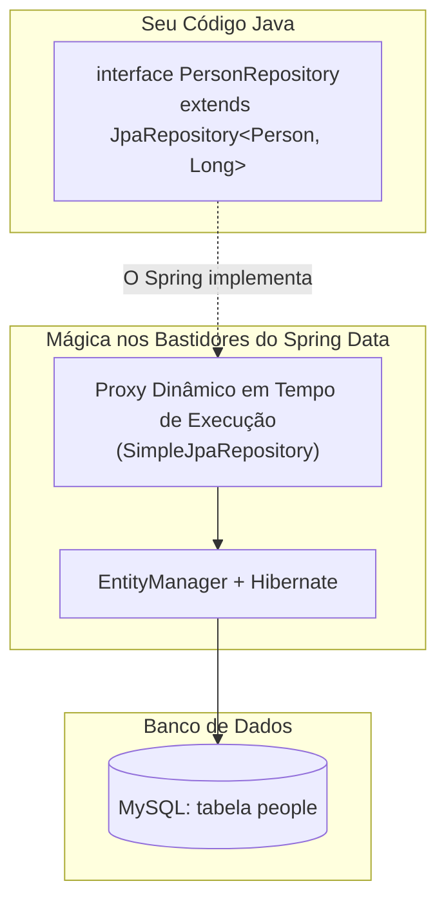

# 03. Spring Data JPA e Repositories

Nos capítulos anteriores, nós conectamos o MySQL no `application.properties` e
mapeamos nossa entidade `Person` com as anotações da JPA.

Agora chegamos a um dos momentos mais marcantes do curso: **como salvar, buscar,
atualizar e deletar dados no banco de dados sem escrever nenhuma linha de SQL ou
código de persistência repetitivo**.

Neste capítulo, você conhecerá o **Spring Data JPA**, a poderosa abstração da
interface `JpaRepository`, os métodos CRUD prontos para uso e a mágica
compreensível dos **Query Methods** (consultas derivadas pelo nome do método).

## A Dor: O Boilerplate Infinito dos DAOs

Seja com JDBC puro ou com JPA pura standalone, o padrão da indústria sempre foi
criar uma classe **DAO** (_Data Access Object_) ou um **Repository** para cada
entidade do sistema:

```java
// ❌ ABORDAGEM TRADICIONAL: Dezenas de linhas de código repetitivo para cada entidade
@Repository
public class PersonDaoJpa {

    @PersistenceContext
    private EntityManager em;

    public Person save(Person person) {
        if (person.getId() == null) {
            em.persist(person);
            return person;
        }
        return em.merge(person);
    }

    public Optional<Person> findById(Long id) {
        return Optional.ofNullable(em.find(Person.class, id));
    }

    public List<Person> findAll() {
        return em.createQuery("SELECT p FROM Person p", Person.class).getResultList();
    }

    public void deleteById(Long id) {
        findById(id).ifPresent(em::remove);
    }
}
```

Imagine um sistema com 20 entidades (`Product`, `Order`, `Customer`, `Category`,
etc.). Você precisaria duplicar essa mesma estrutura vinte vezes!

Além do tédio de escrever código idêntico, qualquer erro de digitação em uma
query JPQL ou esquecimento de transação resultava em bugs em produção.

## A Solução: A Interface `JpaRepository`

O **Spring Data JPA** foi criado para erradicar completamente esse código
repetitivo. Ele introduz uma convenção genial: **em vez de criar uma classe e
escrever código, você apenas declara uma interface**.

Basta criar uma interface que herda de `JpaRepository<T, ID>`, informando o
**tipo da entidade** e o **tipo da chave primária**:

```java
package com.fatecpg.sistemapessoas.repository;

import com.fatecpg.sistemapessoas.model.Person;
import org.springframework.data.jpa.repository.JpaRepository;
import org.springframework.stereotype.Repository;

// ✅ REPOSITÓRIO SPRING DATA: Apenas uma interface, zero linhas de implementação!
@Repository
public interface PersonRepository extends JpaRepository<Person, Long> {
    // Todos os métodos de CRUD já existem aqui dentro prontos para uso!
}
```

> **Sim, é apenas isso!**
>
> Você não precisa escrever uma classe que faça `implements PersonRepository`. O
> próprio Spring Data detecta essa interface na inicialização da aplicação e
> gera automaticamente uma classe concreta em memória nos bastidores com todos
> os métodos implementados e otimizados.



## O Catálogo de Métodos CRUD Prontos

Ao herdar de `JpaRepository<Person, Long>`, seu repositório ganha
instantaneamente uma suíte completa de operações de banco de dados:

| Método Pronto        | O que ele faz no Banco de Dados                                      | Retorno                               |
| :------------------- | :------------------------------------------------------------------- | :------------------------------------ |
| **`save(entity)`**   | Se o `id` for `null`, faz `INSERT`. Se o `id` existir, faz `UPDATE`. | `T` (Entidade salva/atualizada)       |
| **`findById(id)`**   | Executa `SELECT ... WHERE id = ?`.                                   | `Optional<T>` (Elimina risco de NPE!) |
| **`findAll()`**      | Executa `SELECT * FROM people`.                                      | `List<T>`                             |
| **`deleteById(id)`** | Busca e executa `DELETE FROM people WHERE id = ?`.                   | `void`                                |
| **`existsById(id)`** | Executa `SELECT count(*) > 0 WHERE id = ?` (super leve!).            | `boolean`                             |
| **`count()`**        | Retorna o total de linhas da tabela (`SELECT count(*)`).             | `long`                                |

### Destaque Didático: O Retorno `Optional<T>`

Observe que o método `findById` não retorna `Person`, mas sim um
**`Optional<Person>`**!

Como estudamos no capítulo de `Optional` no módulo de Java in-Depth, essa é a
prática recomendada do Java moderno para **eliminar o temido
`NullPointerException`**. O método força o desenvolvedor a lidar explicitamente
com a possibilidade de o registro não existir no banco antes de tentar acessar
seus dados:

```java
// ✅ USO SEGURO DO RETORNO: O Optional protege contra valores nulos
Optional<Person> optionalPerson = personRepository.findById(1L);

if (optionalPerson.isPresent()) {
    Person person = optionalPerson.get();
    System.out.println("Nome encontrado: " + person.getName());
} else {
    System.out.println("Pessoa não encontrada no MySQL!");
}
```

## _Query Methods_: Consultas Derivadas pelo Nome

E se você precisar buscar uma pessoa pelo seu **e-mail** ou pelo seu **CPF**? A
interface padrão `JpaRepository` possui apenas busca por ID (`findById`).

Você precisaria abrir uma transação e escrever código SQL ou JPQL na mão?
**Não!**

O Spring Data introduz o conceito de **Query Methods**: você simplesmente
declara a assinatura de um método em inglês seguindo convenções de nomenclatura,
e o Spring Data **lê o nome do método, entende a sua intenção e gera a consulta
SQL automaticamente**!

```java
package com.fatecpg.sistemapessoas.repository;

import com.fatecpg.sistemapessoas.model.Person;
import org.springframework.data.jpa.repository.JpaRepository;
import org.springframework.stereotype.Repository;

import java.util.List;
import java.util.Optional;

@Repository
public interface PersonRepository extends JpaRepository<Person, Long> {

    // 1. O Spring gera: SELECT * FROM people WHERE email = ?
    Optional<Person> findByEmail(String email);

    // 2. O Spring gera: SELECT * FROM people WHERE cpf = ?
    Optional<Person> findByCpf(String cpf);

    // 3. O Spring gera: SELECT count(*) > 0 FROM people WHERE email = ?
    boolean existsByEmail(String email);

    // 4. O Spring gera: SELECT * FROM people WHERE LOWER(name) LIKE LOWER('%texto%')
    List<Person> findByNameContainingIgnoreCase(String name);
}
```

### Palavras-Chave Mais Usadas em Query Methods

O mecanismo de reflexão do Spring Data é capaz de interpretar combinações ricas
de filtros:

| Palavra-chave no Nome do Método | Exemplo de Assinatura                    | SQL Equivalente Gerado              |
| :------------------------------ | :--------------------------------------- | :---------------------------------- |
| **`findBy[Campo]`**             | `findByEmail(String email)`              | `WHERE email = ?`                   |
| **`And`**                       | `findByNameAndEmail(String n, String e)` | `WHERE name = ? AND email = ?`      |
| **`Or`**                        | `findByNameOrEmail(String n, String e)`  | `WHERE name = ? OR email = ?`       |
| **`Containing`**                | `findByNameContaining(String termo)`     | `WHERE name LIKE '%termo%'`         |
| **`IgnoreCase`**                | `findByEmailIgnoreCase(String email)`    | `WHERE UPPER(email) = UPPER(?)`     |
| **`OrderBy...Asc/Desc`**        | `findAllByOrderByNameAsc()`              | `ORDER BY name ASC`                 |
| **`existsBy...`**               | `existsByCpf(String cpf)`                | `SELECT count(*) > 0 WHERE cpf = ?` |

> **Regra de Ouro:**
>
> O nome do campo na assinatura do método deve bater exatamente com o nome do
> atributo declarado na sua classe Java (respeitando _CamelCase_). Se a sua
> classe tem `private String email;`, o método deve ser `findByEmail`.

## Consultas Customizadas com `@Query` (JPQL e SQL Nativo)

Embora os _Query Methods_ sejam extremamente convenientes para consultas
simples, há dois cenários onde eles se tornam limitados:

1. **Nomes Quilométricos:** Tentar filtrar por muitos campos simultâneos gera
   nomes de método ilegíveis (ex:
   `findByNameContainingAndBirthDateAfterAndEmailEndingWithOrderByNameAsc(...)`).
2. **Otimizações e Recursos Específicos:** Quando você precisa de uma consulta
   composta mais sofisticada, uma junção (_JOIN_) específica ou otimizações
   finas de performance.

Nesses casos, você não fica preso ao que o Spring gera automaticamente! Você
pode assumir o controle total da query utilizando a anotação **`@Query`**.

### 1. Consultas com JPQL (Recomendado)

Por padrão, o `@Query` aceita a sintaxe do **JPQL** (_Jakarta Persistence Query
Language_), que é orientada a entidades e atributos Java (como estudamos no
módulo de Hibernate):

```java
import org.springframework.data.jpa.repository.Query;
import org.springframework.data.repository.query.Param;

@Repository
public interface PersonRepository extends JpaRepository<Person, Long> {

    // ✅ CONSULTA JPQL CUSTOMIZADA: Orientada à classe 'Person' e atributos Java
    @Query("SELECT p FROM Person p WHERE p.birthDate >= :startDate ORDER BY p.name ASC")
    List<Person> findBornAfter(@Param("startDate") LocalDate startDate);

    // Consulta de contagem com agrupamento ou projeção customizada
    @Query("SELECT p FROM Person p WHERE p.email LIKE %:domain")
    List<Person> findByEmailDomain(@Param("domain") String domain);
}
```

### 2. Consultas com SQL Nativo (`nativeQuery = true`)

Se você precisar de recursos exclusivos do MySQL (como funções nativas de banco,
tabelas temporárias ou queries otimizadas pelo DBA), basta ativar o parâmetro
`nativeQuery = true`. Nesse caso, você escreve o SQL real apontando diretamente
para os nomes das tabelas e colunas:

```java
// ✅ CONSULTA SQL NATIVA: Executa diretamente contra o motor do MySQL
@Query(value = "SELECT * FROM people WHERE DATEDIFF(CURRENT_DATE, birth_date) / 365 >= :minAge", nativeQuery = true)
List<Person> findAdultsOlderThan(@Param("minAge") int minAge);
```

> **Dica de Segurança com `@Param`:**
>
> Ao utilizar `@Query`, sempre use parâmetros nomeados no formato
> `:nomeVariavel` combinados com a anotação `@Param("nomeVariavel")`. O Spring
> Data utiliza internamente o `PreparedStatement`, garantindo que sua aplicação
> fique **100% protegida contra ataques de SQL Injection**!

<details>
<summary>🔍 O que acontece nos bastidores? O SimpleJpaRepository</summary>

Você deve estar se perguntando: _"Mas onde está o código Java de verdade que
chama o `EntityManager`?"_

Quando o Spring Boot inicializa, ele procura todas as interfaces que estendem
`Repository`. Para cada interface encontrada, o Spring Data instancia uma classe
interna oficial chamada
**`org.springframework.data.jpa.repository.support.SimpleJpaRepository`**.

É o `SimpleJpaRepository` que contém o código real:

- O método `save()` do `SimpleJpaRepository` verifica se a entidade é nova
  chamando `em.persist(entity)`, ou se já possui ID chamando `em.merge(entity)`.
- O método `findById()` chama diretamente `em.find(domainClass, id)`.
- As anotações `@Transactional` de leitura e escrita já vêm configuradas nos
  métodos do `SimpleJpaRepository`.

Portanto, não há "mágica obscura": o Spring Data JPA é uma camada de design
brilhante construída com padrões de projeto clássicos da Orientação a Objetos
(como _Proxy Pattern_ e _Template Method_) sobre o mesmo JPA/Hibernate que você
já domina.

</details>

---

<a href="02-o-conceito-de-model-e-entidades.md">← 02. O Conceito de Model e
Entidades JPA</a>

<p align="right"><a href="04-camada-de-servico-e-regras-de-negocio.md">Próximo: 04. Camada de Serviço e Regras de Negócio →</a></p>
