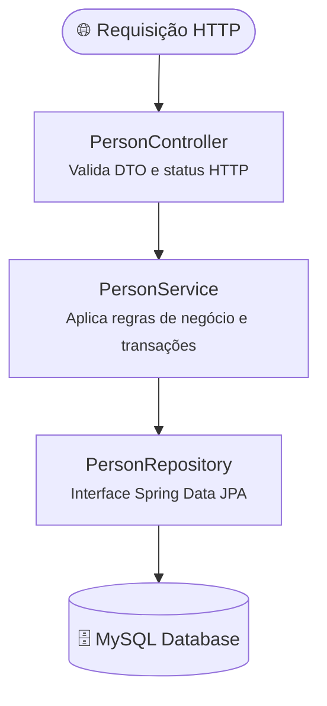

# 04. Camada de Serviço e Regras de Negócio

No capítulo anterior, você viu como o **Spring Data JPA** facilita a comunicação
com o banco de dados através dos repositórios. Com poucas linhas de interface,
ganhamos operações completas de CRUD e consultas derivadas.

Diante dessa facilidade, um impulso muito comum de quem está começando com
Spring Boot é injetar o repositório diretamente no Controller web e executar as
operações de banco logo após receber a requisição HTTP. Embora pareça rápido,
essa prática gera acoplamento indevido, duplicação de validações e viola o
princípio de responsabilidade única.

Neste capítulo, você aprenderá a estruturar a **camada de serviço** (`Service
Layer`), centralizar regras de domínio e manipular `Optional<T>` de forma
idiomática.

## Onde Devem Viver as Regras de Negócio?

Uma aplicação bem estruturada divide suas responsabilidades em camadas
distintas:

1. **Controller (Apresentação / Transporte):** Recebe a requisição HTTP, extrai
   parâmetros, valida o formato dos dados de entrada (DTOs) e devolve a resposta
   com o código HTTP adequado. **Não toma decisões de negócio**.
2. **Service (Domínio / Negócio):** Orquestra os fluxos, aplica validações de
   regras (ex.: _"não permitir dois clientes com o mesmo e-mail"_ ou _"não
   permitir saque maior que o saldo"_), gerencia transações e decide quando
   chamar os repositórios.
3. **Repository (Persistência):** Executa operações diretas de leitura e
   gravação no banco de dados.
4. **Entity / Model (Estrutura de Dados de Domínio):** Representa o estado
   persistido e comportamentos intrínsecos do objeto.



### O Contraste: Lógica no Controller vs. Lógica no Service

Veja o problema de tentar orquestrar regras no Controller:

```java
// ❌ Problemático: Controller misturando protocolo HTTP, regra de negócio e persistência
@RestController
@RequestMapping("/people")
@RequiredArgsConstructor
public class PersonController {

    private final PersonRepository personRepository;

    @PostMapping
    public ResponseEntity<?> create(@RequestBody Person person) {
        // Regra de negócio misturada com o transporte HTTP:
        if (personRepository.existsByEmail(person.getEmail())) {
            return ResponseEntity.badRequest().body("E-mail já cadastrado");
        }
        if (personRepository.existsByCpf(person.getCpf())) {
            return ResponseEntity.badRequest().body("CPF já cadastrado");
        }

        // Se amanhã tivermos uma importação via fila RabbitMQ ou CLI,
        // essas regras precisarão ser duplicadas!
        Person saved = personRepository.save(person);
        return ResponseEntity.status(HttpStatus.CREATED).body(saved);
    }
}
```

```java
// ✅ Recomendado: Controller apenas delega para o Service, que concentra a inteligência
@Service
@RequiredArgsConstructor
public class PersonService {

    private final PersonRepository personRepository;

    @Transactional
    public Person create(Person person) {
        if (personRepository.existsByEmail(person.getEmail())) {
            throw new IllegalArgumentException("Já existe uma pessoa cadastrada com o e-mail: " + person.getEmail());
        }
        if (personRepository.existsByCpf(person.getCpf())) {
            throw new IllegalArgumentException("Já existe uma pessoa cadastrada com o CPF: " + person.getCpf());
        }
        return personRepository.save(person);
    }
}
```

Dessa forma, qualquer ponto de entrada da aplicação (REST, fila assíncrona,
agendador cron ou testes unitários) pode reutilizar o `PersonService` e ter a
garantia de que as regras serão executadas de forma idêntica.

## Criando a Classe de Serviço com `@Service`

A anotação `@Service` é uma especialização de `@Component`. Para o mecanismo de
Injeção de Dependências do Spring, ela registra a classe como um _Bean_
gerenciado no ApplicationContext. Semanticamente, ela documenta para a equipe e
ferramentas de monitoramento que aquela classe carrega regras de negócio.

A forma canônica e moderna de estruturar um serviço no ecossistema Spring é via
**injeção por construtor**, combinada com a anotação `@RequiredArgsConstructor`
do Lombok:

```java
package br.gov.sp.fatec.springintro.service;

import br.gov.sp.fatec.springintro.model.Person;
import br.gov.sp.fatec.springintro.repository.PersonRepository;
import lombok.RequiredArgsConstructor;
import org.springframework.stereotype.Service;
import org.springframework.transaction.annotation.Transactional;

import java.util.List;

@Service
@RequiredArgsConstructor
public class PersonService {

    private final PersonRepository personRepository;

    @Transactional(readOnly = true)
    public List<Person> findAll() {
        return personRepository.findAll();
    }
}
```

Como o atributo `personRepository` é `final`, a anotação
`@RequiredArgsConstructor` gera o construtor parametrizado em tempo de
compilação, e o Spring realiza a injeção automaticamente sem precisar de
`@Autowired`.

## Propagação de `Optional<T>`: Service vs. Controller

Ao consultar entidades por chave primária, o Spring Data JPA retorna
`Optional<Person>` em métodos como `findById(id)`.

O `Optional` foi introduzido no Java 8 justamente para forçar quem consome o
método a tratar a possibilidade de ausência de dados, evitando os infames
`NullPointerException`. No entanto, surge uma decisão arquitetural fundamental:
**quem deve desembrulhar o `Optional`?**

### Evitando Exceções como Controle de Fluxo

Um vício comum é fazer o Service sempre lançar uma exceção quando um registro
não é encontrado em uma busca simples:

```java
// ❌ Problemático: Service presume que a ausência é um erro catastrófico
@Transactional(readOnly = true)
public Person findById(Long id) {
    return personRepository.findById(id)
            .orElseThrow(() -> new IllegalArgumentException("Pessoa não encontrada"));
}
```

Usar exceções para fluxos previsíveis (_Exceptions as Flow Control_) é um
anti-padrão. Disparar uma exceção na JVM exige montar toda a árvore de chamadas
(_stack trace_), o que consome ciclos de CPU desnecessários. Além disso, a
ausência de um registro ao consultar não é uma falha interna da aplicação: é um
cenário esperado da Web (onde deve virar um `404 Not Found`).

### A Boa Prática: Propagar o `Optional` até a Camada de Apresentação

O `Optional` deve viajar até a camada que possui o contexto semântico adequado
para decidir o que fazer com a ausência:

1. **Em consultas de leitura (`findById`):** O Service repassa o
   `Optional<Person>`. O **Controller** recebe esse `Optional` e decide mapear a
   resposta HTTP de forma declarativa e sem o peso de exceções:

   ```java
   // No Controller (visão do próximo submódulo):
   @GetMapping("/{id}")
   public ResponseEntity<Person> findById(@PathVariable Long id) {
       return personService.findById(id)
               .map(ResponseEntity::ok)
               .orElseGet(() -> ResponseEntity.notFound().build());
   }
   ```

   Se a pessoa existir, o Controller responde `200 OK` com o JSON. Se não
   existir, responde `404 Not Found` diretamente, com custo de processamento
   mínimo.

2. **Em operações de mutação interna (`update`):** Aqui a existência da entidade
   é um **pré-requisito mandatório** para que a regra de negócio prossiga. Se a
   entidade não existir no banco, a operação não pode ser concluída, tornando
   legítimo o uso de `orElseThrow()` dentro do Service:

   ```java
   // No Service: a pré-condição de existência falhou durante a atualização
   Person existingPerson = personRepository.findById(id)
           .orElseThrow(() -> new IllegalArgumentException("Pessoa não encontrada para atualização: ID " + id));
   ```

## Implementando os Fluxos de Negócio no `PersonService`

Vejamos agora a implementação coesa do `PersonService`, aplicando a propagação
do `Optional` na busca e as validações defensivas nas mutações:

```java
package br.gov.sp.fatec.springintro.service;

import br.gov.sp.fatec.springintro.model.Person;
import br.gov.sp.fatec.springintro.repository.PersonRepository;
import lombok.RequiredArgsConstructor;
import org.springframework.stereotype.Service;
import org.springframework.transaction.annotation.Transactional;

import java.util.List;
import java.util.Optional;

@Service
@RequiredArgsConstructor
public class PersonService {

    private final PersonRepository personRepository;

    @Transactional(readOnly = true)
    public List<Person> findAll() {
        return personRepository.findAll();
    }

    @Transactional(readOnly = true)
    public Optional<Person> findById(Long id) {
        // Repassa o Optional para que o chamador decida como tratar a ausência
        return personRepository.findById(id);
    }

    @Transactional
    public Person create(Person person) {
        // 1. Validação defensiva: uma nova entidade não deve possuir ID atribuído
        if (person.getId() != null) {
            throw new IllegalArgumentException("Uma nova pessoa não deve possuir ID pré-definido.");
        }

        // 2. Validação de unicidade de e-mail e CPF
        if (personRepository.existsByEmail(person.getEmail())) {
            throw new IllegalArgumentException("E-mail já cadastrado: " + person.getEmail());
        }
        if (personRepository.existsByCpf(person.getCpf())) {
            throw new IllegalArgumentException("CPF já cadastrado: " + person.getCpf());
        }

        return personRepository.save(person);
    }

    @Transactional
    public Person update(Long id, Person updatedData) {
        // 1. Pré-condição: a entidade PRECISA existir para ser atualizada
        Person existingPerson = personRepository.findById(id)
                .orElseThrow(() -> new IllegalArgumentException("Pessoa não encontrada para atualização: ID " + id));

        // 2. Se o e-mail mudou, valida se o novo e-mail já não pertence a outra pessoa
        if (!existingPerson.getEmail().equalsIgnoreCase(updatedData.getEmail())
                && personRepository.existsByEmail(updatedData.getEmail())) {
            throw new IllegalArgumentException("O e-mail " + updatedData.getEmail() + " já está em uso.");
        }

        // 3. Atualiza os dados permitidos
        existingPerson.setName(updatedData.getName());
        existingPerson.setEmail(updatedData.getEmail());
        existingPerson.setBirthDate(updatedData.getBirthDate());
        // Nota: O CPF geralmente é imutável após o cadastro

        // 4. Salva a entidade atualizada
        return personRepository.save(existingPerson);
    }

    @Transactional
    public void delete(Long id) {
        // Garante que a entidade existe antes de tentar deletar
        if (!personRepository.existsById(id)) {
            throw new IllegalArgumentException("Não foi possível excluir: Pessoa inexistente com ID " + id);
        }
        personRepository.deleteById(id);
    }
}
```

## Próximos Passos: E o Controle de Transações?

Você deve ter reparado que utilizamos a anotação `@Transactional` nos métodos do
`PersonService`.

Em operações de persistência, garantir a integridade dos dados exige muito
cuidado com **transações de banco de dados** (garantir atomicidade e evitar que
operações pela metade deixem tabelas em estado corrompido).

No entanto, o gerenciamento transacional no Spring é cercado de nuances
históricas:

- Como o Spring intercepta as chamadas com proxies AOP?
- Por que chamar outro método `@Transactional` da mesma classe falha
  silenciosamente?
- Quais são os perigos de segurar conexões com o banco durante chamadas de rede
  lentas?
- E qual é a alternativa moderna e programática (`TransactionTemplate`) para
  evitar essas armadilhas?

É exatamente isso que você explorará no próximo capítulo dedicado exclusivamente
ao controle transacional!

---

<a href="03-spring-data-jpa-e-repositories.md">← 03. Spring Data JPA e
Repositories</a>

<p align="right"><a href="05-controle-transacional-e-boas-praticas.md">Próximo: 05. Controle Transacional e Boas Práticas →</a></p>
