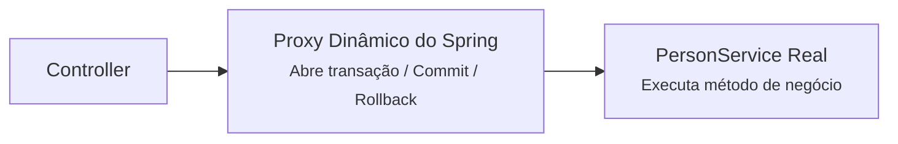
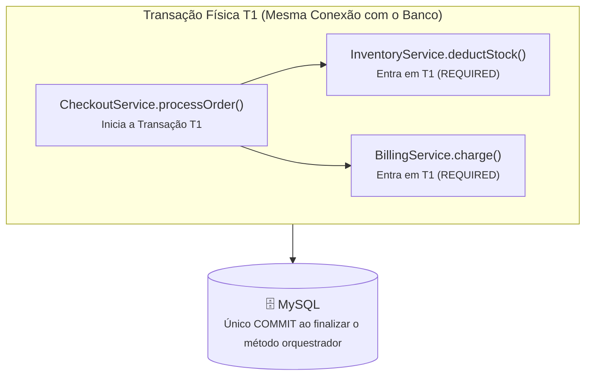

# 05. Controle Transacional e Boas Práticas

No capítulo anterior, você estruturou a camada de serviço (`PersonService`) e
viu como isolar regras de negócio da camada de apresentação web. Durante essa
construção, utilizamos a anotação `@Transactional` para garantir que as
alterações no banco de dados fossem tratadas de forma atômica.

No entanto, o gerenciamento de transações no Spring é frequentemente apontado
como uma das maiores fontes de comportamentos inesperados e gargalos de
performance em produção se a equipe não compreender exatamente o que acontece
sob o capô.

Neste capítulo, você entenderá o funcionamento interno do `@Transactional`,
conhecerá suas principais armadilhas (_pitfalls_), aprenderá a alternativa
programática mais segura com `TransactionTemplate` e descobrirá as boas práticas
de arquitetura para delimitar fronteiras transacionais.

## O Que é uma Transação e Por Que Ela é Vital?

Em aplicações corporativas, uma operação de negócio raramente afeta apenas uma
linha isolada em uma única tabela. Imagine um cenário financeiro ou de compras:

```text
1. Debitar R$ 500 da conta de Alice
2. Creditar R$ 500 na conta de Bob
3. Registrar o comprovante no extrato
```

Se o passo 1 for executado com sucesso no MySQL, mas uma pane de rede ou erro de
código interromper a aplicação antes do passo 2, o dinheiro de Alice sumirá sem
nunca chegar a Bob.

Para impedir inconsistências desse tipo, utilizamos **transações de banco de
dados**, fundamentadas no modelo **ACID**:

- **Atomicidade (Atomicity):** Tudo ou nada. Ou todas as operações da transação
  são confirmadas (`COMMIT`), ou qualquer falha desfaz todas as alterações
  parciais (`ROLLBACK`).
- **Consistência (Consistency):** O banco transita de um estado válido para
  outro, respeitando todas as regras de integridade (chaves estrangeiras, chaves
  únicas, constraints).
- **Isolamento (Isolation):** Transações simultâneas não devem interferir de
  forma caótica no estado visível umas das outras.
- **Durabilidade (Durability):** Uma vez confirmada a transação, seus dados
  persistirão mesmo em caso de reinicialização ou falha no servidor.

No Spring, o controle transacional pode ser gerenciado de duas formas:
**declarativa** (com anotações) ou **programática** (com código explícito).

## Gerenciamento Declarativo: `@Transactional`

A abordagem mais popular no ecossistema Spring é a anotação declarativa
`@Transactional` (`org.springframework.transaction.annotation.Transactional`).

Com ela, você sinaliza para o framework que determinado método deve ser
executado dentro de um contexto transacional:

```java
@Service
@RequiredArgsConstructor
public class BankService {

    private final AccountRepository accountRepository;

    @Transactional
    public void transfer(Long fromAccountId, Long toAccountId, BigDecimal amount) {
        // 1. Debita da conta de origem
        accountRepository.debit(fromAccountId, amount);

        // 2. Se estourar qualquer RuntimeException aqui...
        if (amount.compareTo(BigDecimal.valueOf(10_000)) > 0) {
            throw new IllegalStateException("Transferências acima de R$ 10.000 exigem validação biométrica.");
        }

        // 3. Credita na conta de destino
        accountRepository.credit(toAccountId, amount);
        // Graças ao @Transactional, o débito do passo 1 sofrerá ROLLBACK automático caso ocorra erro!
    }
}
```

### O Ciclo de Vida do `@Transactional`

- **Início:** Quando a execução entra no método anotado, o Spring obtém uma
  conexão física com o banco a partir do pool de conexões (HikariCP) e inicia
  uma transação (`START TRANSACTION`).
- **Sucesso (Commit):** Se o método for concluído sem disparar nenhuma exceção
  não checada, o Spring emite um `COMMIT` no banco de dados e devolve a conexão
  ao pool.
- **Falha (Rollback):** Se qualquer `RuntimeException` (ou `Error`) for lançada,
  o Spring emite um `ROLLBACK`, revertendo qualquer escrita realizada no banco
  durante aquele método.

### A Importância de `readOnly = true`

Em métodos de consulta que não realizam mutação de dados (como `findAll` ou
`findById`), declare sempre `@Transactional(readOnly = true)`:

```java
@Transactional(readOnly = true)
public Optional<Person> findById(Long id) {
    return personRepository.findById(id);
}
```

**Por que usar `readOnly = true`?**

1. **Economia de Memória e CPU:** Por padrão, o Hibernate mantém um instantâneo
   (_snapshot_) de cada entidade carregada no contexto de persistência para
   comparar alterações (_Dirty Checking_). Com `readOnly = true`, esse
   monitoramento é desativado.
2. **Otimização de Infraestrutura:** Drivers de banco e provedores em nuvem
   conseguem direcionar automaticamente consultas somente-leitura para nós
   secundários de leitura (_read replicas_), poupando o banco de dados principal
   de escrita.

## Sob o Capô: Como o Spring Intercepta o `@Transactional`

O Spring não altera o bytecode da sua classe por padrão. Ele utiliza
**Programação Orientada a Aspectos (AOP)** e **Proxies Dinâmicos** (via CGLIB ou
JDK Dynamic Proxies).

Quando outro Bean (como um Controller) injeta o `PersonService`, ele não recebe
a instância original do seu serviço, mas sim um **Proxy intermediário**:



O Proxy atua como uma casca protetora: ele abre a transação antes de chamar seu
código, intercepta eventuais exceções para disparar o rollback e comita ao
finalizar com sucesso.

## Armadilhas Comuns do `@Transactional` (_Pitfalls_)

Embora muito prático, o uso ingênuo de proxies AOP esconde detalhes que todo
desenvolvedor Java profissional precisa dominar:

### 1. A Armadilha da Auto-invocação (_Self-Invocation Trap_)

Se um método sem anotação chamar diretamente outro método da **mesma classe**
que possui `@Transactional`, a transação será **completamente ignorada**:

```java
@Service
public class OrderService {

    public void processOrder() {
        // Chamada interna direta: equivale a "this.saveWithAudit()"
        saveWithAudit();
    }

    @Transactional
    public void saveWithAudit() {
        // ❌ NENHUMA transação será aberta aqui!
        // A chamada foi feita diretamente no objeto interno, sem passar pelo Proxy do Spring.
    }
}
```

_Regra:_ Para que o `@Transactional` seja ativado, a invocação deve vir de uma
classe externa passando pelo Bean gerenciado pelo Spring.

### 2. Métodos `private` ou `protected`

Por padrão no Spring AOP, anotações `@Transactional` colocadas em métodos
privados são **silenciosamente ignoradas**. O compilador não emite erro e
nenhuma transação é aberta. Mantenha os métodos transacionais sempre com
visibilidade `public`.

### 3. Rollback Apenas para Exceções Não Checadas (_Unchecked_)

Por padrão, o Spring **só executa rollback** para subclasses de
`RuntimeException` e `Error`.

Se o seu método lançar uma _Checked Exception_ (como `IOException`,
`SQLException` ou qualquer subclasse de `Exception`), o Spring efetuará o
**`COMMIT` no banco normalmente**, mesmo após a falha!

```java
// ❌ O commit acontecerá mesmo se lançar IOException!
@Transactional
public void processReport() throws IOException { ... }

// ✅ Força o rollback para qualquer exceção checada ou não
@Transactional(rollbackFor = Exception.class)
public void processReportSafe() throws IOException { ... }
```

### 4. Esgotamento do Pool de Conexões por I/O Demorado

Ao entrar em um método `@Transactional`, uma conexão física do banco de dados
(do pool HikariCP) fica vinculada à thread de execução e **só é liberada quando
o método inteiro terminar**:

```java
// ❌ Perigo grave de escalabilidade em produção
@Transactional
public void registerUser(Person person) {
    personRepository.save(person); // Usou o banco em 2 milissegundos

    // Chamada de rede externa (HTTP/SMTP): demora 2 a 4 segundos!
    emailSenderService.sendWelcomeEmail(person.getEmail());

    // A conexão física do MySQL permaneceu travada e ociosa durante todo o envio de e-mail!
}
```

Se 30 requisições simultâneas chegarem em uma aplicação cujo pool tem 10
conexões, todas as conexões ficarão presas aguardando servidores de e-mail
externos. Novas requisições travarão até estourar um
`ConnectionTimeoutException`, derrubando a aplicação.

## Alternativa Mais Segura: Transações Programáticas com `TransactionTemplate`

Quando um fluxo de trabalho envolve operações mistas (banco de dados combinado
com chamadas a APIs externas, filas RabbitMQ/Kafka ou relatórios lentos), a
solução oficial e mais segura do Spring é o **`TransactionTemplate`**.

Em vez de decorar o método inteiro, você injeta o `TransactionTemplate` e
delimita o bloco de banco com **precisão cirúrgica** através de uma expressão
Lambda (padrão _Execute-Around_):

```java
package br.gov.sp.fatec.springintro.service;

import br.gov.sp.fatec.springintro.model.Person;
import br.gov.sp.fatec.springintro.repository.PersonRepository;
import lombok.RequiredArgsConstructor;
import org.springframework.stereotype.Service;
import org.springframework.transaction.support.TransactionTemplate;

@Service
@RequiredArgsConstructor
public class PersonRegistrationService {

    private final PersonRepository personRepository;
    private final TransactionTemplate transactionTemplate;
    private final EmailService emailService;

    public Person register(Person person) {
        // 1. Validações preliminares (fora da transação: zero conexões do pool gastas)
        if (person.getId() != null) {
            throw new IllegalArgumentException("Uma nova pessoa não deve possuir ID pré-definido.");
        }

        // 2. Transação cirúrgica: abre a conexão, salva e comita imediatamente
        Person savedPerson = transactionTemplate.execute(status -> {
            if (personRepository.existsByEmail(person.getEmail())) {
                status.setRollbackOnly(); // Rollback explícito se necessário
                throw new IllegalArgumentException("E-mail já cadastrado");
            }
            return personRepository.save(person);
        });

        // 3. I/O lento (executado APÓS o commit: a conexão do banco já foi devolvida ao pool!)
        emailService.sendWelcomeEmail(savedPerson.getEmail());

        return savedPerson;
    }
}
```

### Qual Abordagem Escolher?

| Critério           | Declarativo (`@Transactional`)                         | Programático (`TransactionTemplate`)                              |
| :----------------- | :----------------------------------------------------- | :---------------------------------------------------------------- |
| **Estilo**         | Declarativo (anotação concisa)                         | Programático (expressão lambda)                                   |
| **Ideal para**     | CRUDs diretos e métodos focados apenas em persistência | Fluxos com chamadas externas, e-mails, filas ou I/O demorado      |
| **Auto-invocação** | ⚠️ Falha silenciosamente na mesma classe               | ✅ Imune (executa em qualquer método, inclusive `private`)        |
| **Uso do Pool**    | Segura a conexão durante o método todo                 | Segura a conexão apenas durante o bloco lambda                    |
| **Recomendação**   | Padrão idiomático para rotinas simples de domínio      | Padrão arquitetural sênior para operações críticas de alta escala |

<details>
<summary>🔍 Aprofundamento: O que acontece quando um <code>@Transactional</code> chama outro? (Propagação e Fronteiras)</summary>

Em aplicações corporativas reais, é muito comum um serviço chamar outro (por
exemplo, um `CheckoutService` orquestrador chamando `InventoryService` para
baixar estoque e `BillingService` para cobrar).

Como o Spring lida com isso? Através do atributo `propagation` da anotação
`@Transactional`.

#### 1. O Comportamento Padrão: `Propagation.REQUIRED`

Por padrão, toda anotação `@Transactional` sem argumentos equivale a:

```java
@Transactional(propagation = Propagation.REQUIRED)
```

O modo `REQUIRED` segue a seguinte regra:

- **Se já existir uma transação ativa** iniciada por quem chamou o método, ele
  **participa dessa mesma transação** (compartilhando a mesma conexão física com
  o banco e o mesmo ciclo de commit/rollback).
- **Se não existir nenhuma transação**, ele abre uma nova.



> **A Pegadinha do Rollback Compartilhado:** Se o `InventoryService` lançar uma
> exceção de negócio, o Spring marcará a transação inteira `T1` como
> _Rollback-Only_. Mesmo que o `CheckoutService` tente colocar um `try-catch` em
> volta de `deductStock()` para abafar o erro e tentar continuar com outros
> passos, no final o Spring lançará uma `UnexpectedRollbackException`, pois a
> transação compartilhada já foi irreversivelmente cancelada.

#### 2. E se uma ação precisar persistir mesmo que o resto falhe? (`REQUIRES_NEW`)

Para cenários onde você precisa gravar algo independentemente do sucesso do
fluxo principal (como salvar uma tentativa de fraude ou log de auditoria no
banco), utiliza-se `Propagation.REQUIRES_NEW`:

```java
@Service
public class AuditLogService {

    @Transactional(propagation = Propagation.REQUIRES_NEW)
    public void logFailure(String reason) {
        // Suspende a transação principal, abre uma NOVA conexão com o MySQL,
        // salva o log e faz commit mesmo que o resto do sistema sofra ROLLBACK!
    }
}
```

_Atenção:_ `REQUIRES_NEW` suspende a transação anterior e aloca uma **segunda
conexão física** do pool HikariCP simultaneamente para a mesma thread. Se usado
sem critério, pode acelerar o esgotamento do pool de conexões.

#### 3. Boa Prática de Mercado: "A Transação Pertence ao Orquestrador"

Em arquiteturas limpas e _Domain-Driven Design_ (DDD), a recomendação para
demarcar fronteiras de transação (_Transaction Boundaries_) é:

1. **Suba o limite transacional para o nível do Caso de Uso:** A transação deve
   ser aberta no orquestrador do caso de uso de mais alto nível
   (`CheckoutService`, `UserRegistrationService`), pois só ele conhece os
   limites atômicos do negócio como um todo.
2. **Serviços especialistas funcionam como colaboradores:** Métodos de serviços
   granulares mantêm o `REQUIRED` padrão para reutilizarem transparentemente a
   transação aberta pelo orquestrador quando invocados em conjunto, mas ainda
   funcionam de forma independente se chamados isoladamente.

</details>

---

<a href="04-camada-de-servico-e-regras-de-negocio.md">← 04. Camada de Serviço e
Regras de Negócio</a>

<p align="right"><a href="../03-web-e-controllers/01-rest-controllers-e-verbos-http.md">Próximo: 01. REST Controllers e Verbos HTTP →</a></p>
