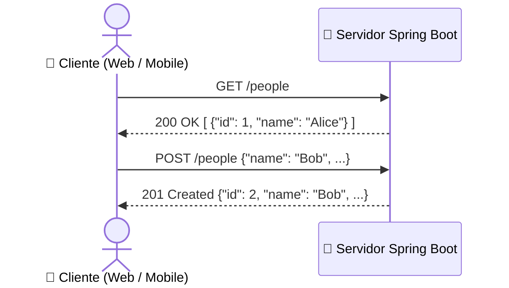

# 01. REST Controllers e Verbos HTTP

Nos submódulos anteriores, você construiu a espinha dorsal de dados da nossa
aplicação: mapeou a entidade `Person` com JPA, criou o `PersonRepository` com
Spring Data e encapsulou as regras de negócio no `PersonService`.

No entanto, até agora nosso sistema é uma fortaleza fechada: ele roda na JVM,
mas ninguém de fora consegue interagir com ele. Para que aplicativos mobile,
front-ends modernos (React, Vue, Angular) ou outros microsserviços consigam
cadastrar, listar e atualizar pessoas, precisamos expor esses recursos através
de uma **API RESTful**.

Neste capítulo, você aprenderá o papel da anotação `@RestController`, entenderá
a diferença fundamental entre controladores de páginas e controladores de API, e
mapeará os principais verbos do protocolo HTTP.

## O Que é uma API RESTful?

**REST** (_Representational State Transfer_) é um estilo arquitetural de
comunicação cliente-servidor construído sobre o protocolo **HTTP**.

Em uma API REST bem projetada:

1. **Recursos são Substantivos:** Os dados expostos são chamados de _recursos_ e
   identificados por URLs limpas, geralmente no plural (ex.: `/people`,
   `/products`, `/orders`).
2. **Ações são Verbos HTTP:** Em vez de inventar nomes de métodos na URL (como
   `/salvarPessoa` ou `/removerPessoa`), usamos os próprios verbos padronizados
   pelo protocolo HTTP (`GET`, `POST`, `PUT`, `DELETE`).
3. **Formato Padrão JSON:** O cliente e o servidor conversam trocando mensagens
   no formato JSON (_JavaScript Object Notation_).



## `@Controller` vs. `@RestController`

No ecossistema Spring MVC, existem duas anotações para declarar pontos de
entrada na Web:

```java
// 1. Spring MVC Clássico (Renderização de Páginas no Servidor)
@Controller
public class HomeController {
    @GetMapping("/home")
    public String renderPage() {
        return "index"; // O Spring procura um arquivo HTML chamado "index.html" (ex: Thymeleaf)
    }
}
```

```java
// 2. Spring Web / REST (APIs de Dados)
@RestController
public class PersonApiController {
    @GetMapping("/people")
    public List<Person> listAll() {
        return personService.findAll(); // O Spring devolve a lista diretamente como JSON!
    }
}
```

### O Que Torna o `@RestController` Especial?

A anotação `@RestController` é uma anotação composta pelo Spring:

$$\text{@RestController} = \text{@Controller} + \text{@ResponseBody}$$

A anotação `@ResponseBody` avisa ao Spring:

> _"Não tente resolver o retorno deste método como o nome de uma página HTML.
> Pegue o objeto Java retornado, converta-o diretamente em bytes JSON e escreva
> no corpo da resposta HTTP."_

E quem faz essa conversão automática de objetos Java para texto JSON nos
bastidores? O **Jackson**, que você já conheceu em detalhes no submódulo
dedicado (`ecossistema/jackson/`). O Spring Boot já vem integrado de fábrica com
o `ObjectMapper` do Jackson, serializando listas, records e entidades sem você
precisar escrever uma linha manual de parsing!

## O Prefixo de Rota com `@RequestMapping`

Para evitar repetir o caminho base `/people` em todos os métodos do controlador,
anotamos o topo da classe com `@RequestMapping("/people")`:

```java
package br.gov.sp.fatec.springintro.controller;

import br.gov.sp.fatec.springintro.service.PersonService;
import lombok.RequiredArgsConstructor;
import org.springframework.web.bind.annotation.RequestMapping;
import org.springframework.web.bind.annotation.RestController;

@RestController
@RequestMapping("/people") // Prefixo aplicado a todas as rotas desta classe
@RequiredArgsConstructor
public class PersonController {

    private final PersonService personService;
}
```

Novamente, utilizamos **injeção por construtor** combinada com o
`@RequiredArgsConstructor` do Lombok, garantindo que o controlador seja coeso,
imutável e simples de testar.

## Os Verbos HTTP Fundamentais

O Spring Web fornece anotações especializadas para cada verbo HTTP clássico:

| Verbo HTTP   | Anotação Spring  | Finalidade REST                                         | Exemplo de Rota       |
| :----------- | :--------------- | :------------------------------------------------------ | :-------------------- |
| **`GET`**    | `@GetMapping`    | Consultar dados (leitura pura, sem efeitos colaterais)  | `GET /people`         |
| **`POST`**   | `@PostMapping`   | Criar um novo recurso                                   | `POST /people`        |
| **`PUT`**    | `@PutMapping`    | Atualizar/substituir um recurso existente por completo  | `PUT /people/{id}`    |
| **`DELETE`** | `@DeleteMapping` | Remover um recurso existente                            | `DELETE /people/{id}` |
| **`PATCH`**  | `@PatchMapping`  | Atualizar parcialmente campos específicos de um recurso | `PATCH /people/{id}`  |

### O Contraste: URL Procedural vs. REST Idiomático

Observe a diferença entre um design ingênuo (procedural) e o padrão idiomático
da Web:

```java
// ❌ Design Procedural: URLs poluídas com ações no caminho
@RestController
public class PersonController {

    @GetMapping("/get-all-people")      // Errado: verbo na URL
    public List<Person> getAll() { ... }

    @PostMapping("/create-person")       // Errado: verbo na URL
    public Person create() { ... }

    @PostMapping("/delete-person-by-id") // Errado: POST usado para deletar
    public void delete() { ... }
}
```

```java
// ✅ Design RESTful Idiomático: URL representa o RECURSO; o VERBO HTTP representa a AÇÃO
@RestController
@RequestMapping("/people")
@RequiredArgsConstructor
public class PersonController {

    private final PersonService personService;

    @GetMapping                         // GET /people -> Listar todas
    public List<Person> findAll() {
        return personService.findAll();
    }

    @PostMapping                        // POST /people -> Criar nova
    public Person create(@RequestBody Person person) {
        return personService.create(person);
    }
}
```

Na abordagem REST, a URL `/people` é a mesma. O que determina a intenção do
cliente é o **verbo HTTP** utilizado na requisição.

## Esboçando o Controlador Completo

Veja como fica a estrutura inicial do nosso `PersonController` integrando os
métodos do `PersonService`:

```java
package br.gov.sp.fatec.springintro.controller;

import br.gov.sp.fatec.springintro.model.Person;
import br.gov.sp.fatec.springintro.service.PersonService;
import lombok.RequiredArgsConstructor;
import org.springframework.web.bind.annotation.DeleteMapping;
import org.springframework.web.bind.annotation.GetMapping;
import org.springframework.web.bind.annotation.PathVariable;
import org.springframework.web.bind.annotation.PostMapping;
import org.springframework.web.bind.annotation.PutMapping;
import org.springframework.web.bind.annotation.RequestBody;
import org.springframework.web.bind.annotation.RequestMapping;
import org.springframework.web.bind.annotation.RestController;

import java.util.List;

@RestController
@RequestMapping("/people")
@RequiredArgsConstructor
public class PersonController {

    private final PersonService personService;

    @GetMapping
    public List<Person> findAll() {
        return personService.findAll();
    }

    @PostMapping
    public Person create(@RequestBody Person person) {
        return personService.create(person);
    }

    @PutMapping("/{id}")
    public Person update(@PathVariable Long id, @RequestBody Person person) {
        return personService.update(id, person);
    }

    @DeleteMapping("/{id}")
    public void delete(@PathVariable Long id) {
        personService.delete(id);
    }
}
```

> No código acima, utilizamos `@PathVariable` (para ler o `{id}` da URL) e
> `@RequestBody` (para ler o JSON do corpo). No próximo capítulo, exploraremos
> essas anotações e a passagem de parâmetros em profundidade!

<details>
<summary>🔍 Aprofundamento: Idempotência e Segurança dos Métodos HTTP</summary>

Em arquitetura de redes e APIs REST, dois conceitos teóricos fundamentais regem
o comportamento dos métodos HTTP:

### 1. Métodos Seguros (_Safe Methods_)

Um método é considerado seguro se a sua execução **não altera o estado do
servidor**. Ele é uma operação puramente de leitura.

- `GET`, `HEAD` e `OPTIONS` são métodos seguros.
- Executar `GET /people` 100 vezes seguidas deve produzir exatamente o mesmo
  efeito no banco que executar 0 vezes: nenhum dado é alterado.

### 2. Métodos Idempotentes (_Idempotent Methods_)

Um método é considerado idempotente se executar a mesma requisição **uma única
vez** produz o mesmo efeito colateral no servidor que executá-la **múltiplas
vezes consecutivas** ($f(x) = f(f(x))$).

- **`GET` é idempotente:** Consultar os mesmos dados 5 vezes deixa o servidor no
  mesmo estado.
- **`PUT` é idempotente:** Se você envia um payload atualizando o nome de Alice
  para `"Alice Silva"`, executar essa requisição 1 vez ou 10 vezes deixa o
  registro no mesmo estado final no banco.
- **`DELETE` é idempotente:** Deletar o ID 5 uma vez apaga o registro. Deletar o
  ID 5 novamente mantém o registro apagado (o estado do servidor após a primeira
  exclusão não muda).
- **`POST` NÃO é idempotente:** Se o cliente enviar uma requisição `POST
/people` 3 vezes (por exemplo, por um clique duplo do usuário ou instabilidade
  de rede), o servidor poderá criar **3 registros diferentes** com IDs distintos
  no banco de dados!

|  Verbo   | Seguro? |    Idempotente?     | Finalidade Primária              |
| :------: | :-----: | :-----------------: | :------------------------------- |
|  `GET`   | ✅ Sim  |       ✅ Sim        | Leitura de recursos              |
|  `POST`  | ❌ Não  |       ❌ Não        | Criação de novos recursos        |
|  `PUT`   | ❌ Não  |       ✅ Sim        | Substituição integral de recurso |
| `PATCH`  | ❌ Não  | ❌ Não (geralmente) | Modificação parcial de recurso   |
| `DELETE` | ❌ Não  |       ✅ Sim        | Remoção de recurso               |

Compreender idempotência é vital para desenhar estratégias de _retry_
(retentativas automáticas de requisição) e evitar duplicação indevida de dados
em sistemas distribuídos.

</details>

---

<a
href="../02-persistencia-e-dados/05-controle-transacional-e-boas-praticas.md">← 05. Controle Transacional e Boas Práticas</a>

<p align="right"><a href="02-parametros-de-rota-e-payloads.md">Próximo: 02. Parâmetros de Rota e Payloads →</a></p>
