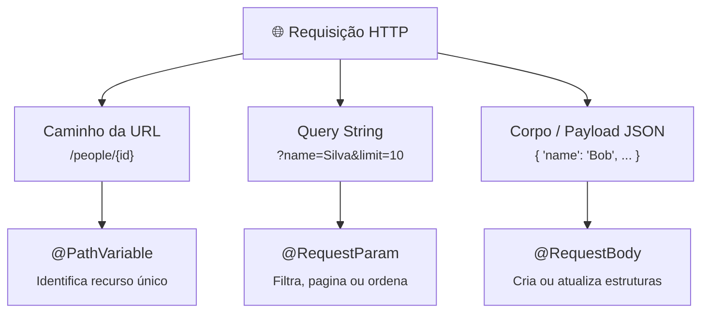

# 02. Parâmetros de Rota e Payloads

No capítulo anterior, você conheceu a semântica dos verbos HTTP (`GET`, `POST`,
`PUT`, `DELETE`) e viu como o `@RestController` expõe endpoints na Web.

No entanto, uma API raramente opera sem receber dados do cliente. Seja para
consultar uma pessoa específica pelo seu identificador, filtrar uma listagem por
nome ou receber os dados completos de um novo cadastro, o protocolo HTTP oferece
diferentes canais para envio de parâmetros.

Neste capítulo, você aprenderá as três principais formas de receber dados no
Spring Boot: **`@PathVariable`**, **`@RequestParam`** e **`@RequestBody`**, além
de entender por que o uso de DTOs (_Data Transfer Objects_) com Java Records é a
prática recomendada para blindar sua aplicação contra ataques de injeção de
dados.

## As Três Portas de Entrada de Dados no HTTP

Ao desenhar uma API REST, cada tipo de dado tem seu local correto para trafegar:

```text
1. No Caminho (Path):      GET  /people/42                ──> @PathVariable
2. Na Consulta (Query):    GET  /people?name=Silva&page=0 ──> @RequestParam
3. No Corpo (Body):        POST /people { "name": "..." } ──> @RequestBody
```



## 1. Identificando Recursos com `@PathVariable`

O `@PathVariable` é utilizado quando um parâmetro faz parte da própria estrutura
da URL, servindo para **identificar unicamente um recurso** na hierarquia da
API.

O caso de uso mais clássico é a busca por chave primária (`id`):

```java
@GetMapping("/{id}")
public ResponseEntity<Person> findById(@PathVariable Long id) {
    return personService.findById(id)
            .map(ResponseEntity::ok)
            .orElseGet(() -> ResponseEntity.notFound().build());
}
```

### Conversão Automática de Tipos

O Spring realiza o _type casting_ do parâmetro automaticamente. Na URL, o valor
`42` trafega como texto (`String`), mas o Spring converte transparentemente para
`Long`, `Integer`, `UUID` ou qualquer tipo compatível.

Se o cliente tentar enviar um valor incompatível (por exemplo, `GET
/people/abc`), o Spring rejeita a requisição antes mesmo de entrar no seu
método, devolvendo um código HTTP `400 Bad Request` com o erro de
`MethodArgumentTypeMismatchException`.

### Quando o Nome da Variável Diverge

Se o nome do parâmetro no caminho da URL for diferente do nome da variável Java,
você pode especificar o nome explicitamente dentro da anotação:

```java
// O placeholder {personId} mapeia diretamente para o argumento "id"
@GetMapping("/{personId}")
public ResponseEntity<Person> findById(@PathVariable("personId") Long id) {
    return personService.findById(id)
            .map(ResponseEntity::ok)
            .orElseGet(() -> ResponseEntity.notFound().build());
}
```

## 2. Filtrando e Paginando com `@RequestParam`

O `@RequestParam` extrai valores da **Query String** da URL — a seção que começa
com `?` após o caminho do recurso e separa múltiplos parâmetros com `&`:

$$\text{GET } \texttt{/people/search?name=Silva\&status=active}$$

Enquanto o `@PathVariable` identifica _qual recurso_ acessar, o `@RequestParam`
serve para **filtrar, ordenar ou paginar** uma coleção de recursos.

```java
@GetMapping("/search")
public List<Person> search(
        @RequestParam String name,
        @RequestParam(required = false, defaultValue = "10") int limit
) {
    // Busca registros que contenham o nome informado, limitando o resultado
    return personService.searchByName(name, limit);
}
```

### Atributos Úteis do `@RequestParam`

- **`required` (padrão: `true`):** Define se a presença do parâmetro na URL é
  obrigatória. Se for `true` e o cliente omitir o parâmetro, o Spring devolve
  `400 Bad Request`.
- **`defaultValue`:** Define um valor padrão caso o cliente não envie o
  parâmetro. Ao definir um `defaultValue`, o `required` torna-se implicitamente
  `false`.

| Cenário de Uso                      | Anotação Correta | Exemplo                          |
| :---------------------------------- | :--------------- | :------------------------------- |
| Buscar pessoa específica por ID     | `@PathVariable`  | `GET /people/15`                 |
| Baixar PDF de uma fatura específica | `@PathVariable`  | `GET /invoices/2026-03/download` |
| Filtrar pessoas por cidade          | `@RequestParam`  | `GET /people?city=Santos`        |
| Paginar resultados                  | `@RequestParam`  | `GET /people?page=2&size=20`     |

## 3. Recebendo Dados Complexos com `@RequestBody`

Para operações de criação (`POST`) ou atualização (`PUT`), enviar dados na URL é
inviável e inseguro: URLs possuem limite de tamanho, ficam registradas em logs
de servidores proxy e não suportam estruturas aninhadas complexas.

Nesses casos, os dados devem trafegar no **corpo da requisição HTTP** (_body_),
e nós os capturamos com a anotação `@RequestBody`:

```java
@PostMapping
public Person create(@RequestBody Person person) {
    return personService.create(person);
}
```

### O Cabeçalho `Content-Type: application/json`

Para que o `@RequestBody` funcione, o cliente deve enviar o cabeçalho HTTP:

```http
Content-Type: application/json
```

Quando a requisição chega, o Spring Web aciona internamente o `ObjectMapper` do
**Jackson**, que lê o JSON bruto do corpo e o converte (_desserializa_) para a
classe Java informada no parâmetro.

## O Perigo de Usar Entidades JPA Diretamente no Controller

No exemplo acima, recebemos diretamente a entidade JPA `@RequestBody Person
person`. Embora funcione para demonstrações rápidas, **essa prática é
considerada um grave risco de segurança e arquitetura em aplicações
profissionais**.

### Por Que Receber Entidades JPA no Controller é Perigoso?

1. **Ataque de Atribuição em Massa (_Mass Assignment / Over-Posting_):** Se a
   entidade `Person` possuir campos internos (como `boolean isAdmin` ou
   `BigDecimal creditLimit`), um cliente mal-intencionado pode injetar esses
   campos no payload JSON (`{ "name": "Bob", "isAdmin": true }`). Se você salvar
   a entidade diretamente, o invasor se tornará administrador do sistema!
2. **Acoplamento entre Banco e API Externa:** Se amanhã você renomear uma coluna
   do banco de dados na entidade, o contrato público da sua API REST quebrará
   para todos os aplicativos mobile que a consomem.
3. **Problemas de Ciclos e Recursão no Jackson:** Entidades com relacionamentos
   bidirecionais (`@OneToMany`, `@ManyToOne`) causam erros de
   `StackOverflowError` durante a serialização JSON.

## A Solução Profissional: DTOs com Java Records

Para proteger a camada de persistência, criamos **DTOs** (_Data Transfer
Objects_) dedicados exclusivamente para entrada e saída de dados.

Com o Java moderno (Java 17+ / 21+ / 25), a forma mais limpa, imutável e
expressiva de criar DTOs é com **Java Records**:

### 1. Criando o Record de Entrada (`PersonRequest`)

```java
package br.gov.sp.fatec.springintro.dto;

import java.time.LocalDate;

// ✅ DTO Imutável: Contém APENAS os dados que o cliente tem permissão de enviar
public record PersonRequest(
        String name,
        String email,
        String cpf,
        LocalDate birthDate
) {
}
```

Observe que o `PersonRequest` **não tem o campo `id`**. O cliente não tem o
poder de escolher o próprio ID no banco de dados!

### 2. Criando o Record de Saída (`PersonResponse`)

```java
package br.gov.sp.fatec.springintro.dto;

import br.gov.sp.fatec.springintro.model.Person;
import java.time.LocalDate;

// ✅ DTO de Resposta: Devolve apenas os dados seguros e formatados para o cliente
public record PersonResponse(
        Long id,
        String name,
        String email,
        LocalDate birthDate
) {
    // Método fábrica para converter facilmente da Entidade JPA para o DTO
    public static PersonResponse fromEntity(Person person) {
        return new PersonResponse(
                person.getId(),
                person.getName(),
                person.getEmail(),
                person.getBirthDate()
        );
    }
}
```

Note que omitimos o `cpf` no `PersonResponse` (ou poderíamos mascará-lo),
respeitando diretrizes de privacidade e LGPD.

### 3. O Controller Refatorado com Records

Veja como o `PersonController` ganha segurança e elegância ao utilizar os DTOs:

```java
package br.gov.sp.fatec.springintro.controller;

import br.gov.sp.fatec.springintro.dto.PersonRequest;
import br.gov.sp.fatec.springintro.dto.PersonResponse;
import br.gov.sp.fatec.springintro.model.Person;
import br.gov.sp.fatec.springintro.service.PersonService;
import lombok.RequiredArgsConstructor;
import org.springframework.http.ResponseEntity;
import org.springframework.web.bind.annotation.GetMapping;
import org.springframework.web.bind.annotation.PathVariable;
import org.springframework.web.bind.annotation.PostMapping;
import org.springframework.web.bind.annotation.RequestBody;
import org.springframework.web.bind.annotation.RequestMapping;
import org.springframework.web.bind.annotation.RestController;

import java.util.List;

@RestController
@RequestMapping("/people")
@RequiredArgsConstructor
public class PersonController {

    private final PersonService personService;

    @GetMapping
    public List<PersonResponse> findAll() {
        return personService.findAll()
                .stream()
                .map(PersonResponse::fromEntity)
                .toList();
    }

    @GetMapping("/{id}")
    public ResponseEntity<PersonResponse> findById(@PathVariable Long id) {
        return personService.findById(id)
                .map(PersonResponse::fromEntity)
                .map(ResponseEntity::ok)
                .orElseGet(() -> ResponseEntity.notFound().build());
    }

    @PostMapping
    public ResponseEntity<PersonResponse> create(@RequestBody PersonRequest request) {
        // Converte o DTO para a entidade de domínio
        Person personToCreate = new Person(
                null,
                request.name(),
                request.email(),
                request.cpf(),
                request.birthDate()
        );

        Person savedPerson = personService.create(personToCreate);
        return ResponseEntity.ok(PersonResponse.fromEntity(savedPerson));
    }
}
```

<details>
<summary>🔍 Aprofundamento: Como o Spring converte payloads HTTP sob o capô (HttpMessageConverter)</summary>

Quando uma requisição com `@RequestBody` ou uma resposta de um `@RestController`
é processada, o Spring não faz mágica: ele delega para uma cadeia de componentes
chamada **`HttpMessageConverter`**.

O Spring Web registra por padrão uma lista ordenada de conversores:

1. `ByteArrayHttpMessageConverter`: Converte arrays de bytes crus (`byte[]`).
2. `StringHttpMessageConverter`: Converte textos puros (`text/plain`).
3. `ResourceHttpMessageConverter`: Converte arquivos e streams estáticos.
4. `MappingJackson2HttpMessageConverter`: Ativado automaticamente quando a
   dependência `jackson-databind` está no classpath (padrão de todo projeto
   Spring Boot Web).

#### O Processo de Negociação de Conteúdo

1. **Na Entrada (`@RequestBody`):** O Spring inspeciona o cabeçalho
   `Content-Type`. Se for `application/json`, ele seleciona o
   `MappingJackson2HttpMessageConverter` para transformar o stream de entrada no
   seu Record/DTO Java.
2. **Na Saída (Retorno de método):** O Spring inspeciona o cabeçalho `Accept`
   enviado pelo cliente (ex.: `Accept: application/json`). Ele localiza o
   conversor compatível e escreve os dados serializados com o status HTTP
   adequado.

Se o cliente enviar um XML quando a API só espera JSON, o Spring interrompe a
requisição imediatamente com o código HTTP `415 Unsupported Media Type`.

</details>

---

<a href="01-rest-controllers-e-verbos-http.md">← 01. REST Controllers e Verbos
HTTP</a>

<p align="right"><a href="03-crud-restful-e-respostas-semanticas.md">Próximo: 03. CRUD RESTful e Respostas Semânticas →</a></p>
