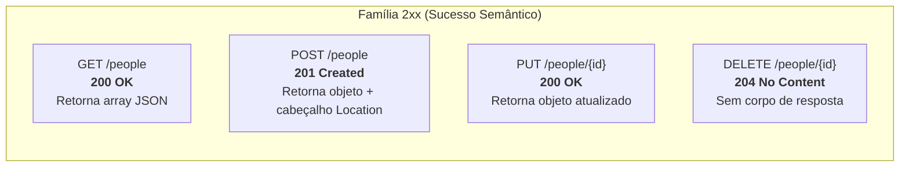
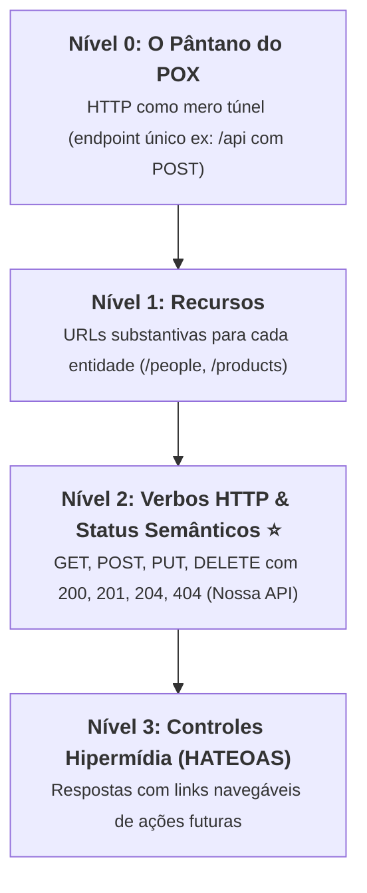

# 03. CRUD RESTful e Respostas Semânticas

Nos capítulos anteriores, você aprendeu a mapear verbos HTTP e a receber
parâmetros com segurança utilizando DTOs em Java Records.

No entanto, uma API REST profissional não se destaca apenas pela forma como
recebe dados, mas principalmente pela precisão com que **comunica seus
resultados**.

Um dos erros mais comuns de quem está começando com desenvolvimento web é
devolver o código de status HTTP `200 OK` para qualquer situação — inclusive
quando um novo registro acabou de ser criado, quando nada precisava ser
retornado ou até mesmo quando ocorreu um erro de negócio ("_200 OK com mensagem
de erro no corpo_"). Essa prática quebra o protocolo HTTP e dificulta a vida de
qualquer aplicativo cliente.

Neste capítulo, você aprenderá a dominar a classe **`ResponseEntity<T>`**,
entenderá os códigos de status HTTP semânticos para cada operação de CRUD e
construirá o controlador REST definitivo da nossa entidade `Person`, testando as
rotas com requisições reais.

## O Papel do `ResponseEntity<T>`

No Spring MVC, quando um método de um `@RestController` retorna um objeto comum
(como `PersonResponse`), o framework assume o código `200 OK` por padrão.

Porém, para ter controle total sobre:

1. O **Código de Status HTTP** (ex.: `201 Created`, `204 No Content`, `404 Not
Found`);
2. Os **Cabeçalhos de Resposta** (_Response Headers_, como `Location`,
   `Cache-Control`);
3. O **Corpo da Resposta** (_Response Body_);

Utilizamos a classe genérica **`ResponseEntity<T>`**
(`org.springframework.http.ResponseEntity`).

Ela utiliza o padrão de projeto _Fluent Builder_, permitindo construir respostas
expressivas e legíveis:

```java
// 200 OK com corpo
return ResponseEntity.ok(personResponse);

// 204 No Content (sem corpo)
return ResponseEntity.noContent().build();

// 404 Not Found (sem corpo)
return ResponseEntity.notFound().build();
```

## Os Códigos HTTP Semânticos para um CRUD

Em APIs RESTful idiomáticas, cada operação do CRUD possui um código de resposta
padronizado mundialmente:

| Operação          | Verbo HTTP |   Cenário de Sucesso   | Código HTTP Semântico | Por que usar este código?                                          |
| :---------------- | :--------: | :--------------------: | :-------------------: | :----------------------------------------------------------------- |
| **Listar Todos**  |   `GET`    |   Coleção retornada    |     **`200 OK`**      | Requisição de leitura atendida com sucesso.                        |
| **Buscar por ID** |   `GET`    |  Registro encontrado   |     **`200 OK`**      | Objeto localizado e devolvido no corpo.                            |
| **Buscar por ID** |   `GET`    |    Registro ausente    |  **`404 Not Found`**  | O identificador informado não existe no servidor.                  |
| **Criar Novo**    |   `POST`   |   Criado com sucesso   |   **`201 Created`**   | Um novo recurso foi persistido e possui sua própria URL.           |
| **Atualizar**     |   `PUT`    | Atualizado com sucesso |     **`200 OK`**      | O recurso existente foi modificado e o estado novo é devolvido.    |
| **Excluir**       |  `DELETE`  |  Excluído com sucesso  | **`204 No Content`**  | A exclusão foi realizada com sucesso e não há corpo para devolver. |



## O Cabeçalho `Location` na Criação (`POST`)

De acordo com a especificação do protocolo HTTP (RFC 9110), quando um servidor
responde com **`201 Created`**, ele deve informar no cabeçalho **`Location`** a
URL exata onde o novo recurso recém-criado pode ser acessado.

Para gerar essa URL dinamicamente sem fixar nomes de domínio ou portas no
código, utilizamos o utilitário **`UriComponentsBuilder`**:

```java
@PostMapping
public ResponseEntity<PersonResponse> create(
        @RequestBody PersonRequest request,
        UriComponentsBuilder uriBuilder
) {
    Person personToCreate = new Person(
            null,
            request.name(),
            request.email(),
            request.cpf(),
            request.birthDate()
    );

    Person savedPerson = personService.create(personToCreate);

    // Monta a URI: http://localhost:8080/people/{id}
    URI location = uriBuilder
            .path("/people/{id}")
            .buildAndExpand(savedPerson.getId())
            .toUri();

    // Retorna status 201 Created + Header Location + Body JSON
    return ResponseEntity.created(location).body(PersonResponse.fromEntity(savedPerson));
}
```

Quando o cliente (como um app mobile) envia o cadastro, ele recebe a resposta
`201 Created` com o cabeçalho:

```http
HTTP/1.1 201 Created
Location: http://localhost:8080/people/1
Content-Type: application/json

{
  "id": 1,
  "name": "Alice Silva",
  "email": "alice@email.com",
  "birthDate": "1995-04-12"
}
```

O cliente nem precisa adivinhar onde a pessoa foi salva: basta ler o cabeçalho
`Location` para navegar diretamente até o novo registro!

## O CRUD RESTful Completo: `PersonController`

Vejamos agora a implementação profissional e semântica completa do
`PersonController`, integrando DTOs Records, `PersonService` e `ResponseEntity`:

```java
package br.gov.sp.fatec.springintro.controller;

import br.gov.sp.fatec.springintro.dto.PersonRequest;
import br.gov.sp.fatec.springintro.dto.PersonResponse;
import br.gov.sp.fatec.springintro.model.Person;
import br.gov.sp.fatec.springintro.service.PersonService;
import lombok.RequiredArgsConstructor;
import org.springframework.http.ResponseEntity;
import org.springframework.web.bind.annotation.DeleteMapping;
import org.springframework.web.bind.annotation.GetMapping;
import org.springframework.web.bind.annotation.PathVariable;
import org.springframework.web.bind.annotation.PostMapping;
import org.springframework.web.bind.annotation.PutMapping;
import org.springframework.web.bind.annotation.RequestBody;
import org.springframework.web.bind.annotation.RequestMapping;
import org.springframework.web.bind.annotation.RestController;
import org.springframework.web.util.UriComponentsBuilder;

import java.net.URI;
import java.util.List;

@RestController
@RequestMapping("/people")
@RequiredArgsConstructor
public class PersonController {

    private final PersonService personService;

    // 1. LISTAR TODOS: 200 OK com array JSON
    @GetMapping
    public ResponseEntity<List<PersonResponse>> findAll() {
        List<PersonResponse> people = personService.findAll()
                .stream()
                .map(PersonResponse::fromEntity)
                .toList();

        return ResponseEntity.ok(people);
    }

    // 2. BUSCAR POR ID: 200 OK se encontrado, ou 404 Not Found se ausente
    @GetMapping("/{id}")
    public ResponseEntity<PersonResponse> findById(@PathVariable Long id) {
        return personService.findById(id)
                .map(PersonResponse::fromEntity)
                .map(ResponseEntity::ok)
                .orElseGet(() -> ResponseEntity.notFound().build());
    }

    // 3. CRIAR NOVO: 201 Created + Header Location + Body
    @PostMapping
    public ResponseEntity<PersonResponse> create(
            @RequestBody PersonRequest request,
            UriComponentsBuilder uriBuilder
    ) {
        Person entity = new Person(
                null,
                request.name(),
                request.email(),
                request.cpf(),
                request.birthDate()
        );

        Person saved = personService.create(entity);

        URI location = uriBuilder
                .path("/people/{id}")
                .buildAndExpand(saved.getId())
                .toUri();

        return ResponseEntity.created(location).body(PersonResponse.fromEntity(saved));
    }

    // 4. ATUALIZAR: 200 OK com os dados atualizados
    @PutMapping("/{id}")
    public ResponseEntity<PersonResponse> update(
            @PathVariable Long id,
            @RequestBody PersonRequest request
    ) {
        Person updatedData = new Person(
                null,
                request.name(),
                request.email(),
                request.cpf(),
                request.birthDate()
        );

        Person updated = personService.update(id, updatedData);
        return ResponseEntity.ok(PersonResponse.fromEntity(updated));
    }

    // 5. EXCLUIR: 204 No Content (operação bem-sucedida, sem corpo)
    @DeleteMapping("/{id}")
    public ResponseEntity<Void> delete(@PathVariable Long id) {
        personService.delete(id);
        return ResponseEntity.noContent().build();
    }
}
```

## Testando a API na Prática

Com o Spring Boot em execução (porta padrão `8080`), você pode testar todos os
endpoints utilizando a extensão **Thunder Client** (ou **REST Client**) no VS
Code, o **Postman** ou o terminal com o comando `curl`.

### 1. Cadastrando uma Nova Pessoa (`POST`)

```bash
curl -i -X POST http://localhost:8080/people \
  -H "Content-Type: application/json" \
  -d '{
    "name": "Carlos Eduardo",
    "email": "carlos@email.com",
    "cpf": "123.456.789-00",
    "birthDate": "1998-07-21"
  }'
```

_Resposta esperada:_

```http
HTTP/1.1 201 Created
Location: http://localhost:8080/people/1
Content-Type: application/json

{"id":1,"name":"Carlos Eduardo","email":"carlos@email.com","birthDate":"1998-07-21"}
```

### 2. Consultando por ID (`GET`)

```bash
curl -i http://localhost:8080/people/1
```

_Resposta esperada:_

```http
HTTP/1.1 200 OK
Content-Type: application/json

{"id":1,"name":"Carlos Eduardo","email":"carlos@email.com","birthDate":"1998-07-21"}
```

E se você buscar um ID inexistente (`GET /people/999`), receberá:

```http
HTTP/1.1 404 Not Found
```

### 3. Excluindo uma Pessoa (`DELETE`)

```bash
curl -i -X DELETE http://localhost:8080/people/1
```

_Resposta esperada:_

```http
HTTP/1.1 204 No Content
```

<details>
<summary>🔍 Aprofundamento: O Modelo de Maturidade de Richardson para APIs REST</summary>

Em 2008, o arquiteto Leonard Richardson propôs um modelo de maturidade para
classificar o quão aderente uma API é aos princípios originais da Web:



1. **Nível 0:** Utiliza o HTTP apenas como túnel de transporte (estilo SOAP ou
   XML-RPC). Há apenas uma URL e todas as ações trafegam por `POST`.
2. **Nível 1 (Recursos):** A API divide os dados em URLs substantivas
   (`/people`, `/products`), mas ainda pode usar verbos HTTP de forma ingênua.
3. **Nível 2 (Verbos HTTP & Status):** A API adota `GET`, `POST`, `PUT`,
   `DELETE` com rigor e responde com códigos semânticos (`200`, `201`, `204`,
   `404`). **Este é o padrão de excelência corporativo adotado por 95% do
   mercado.**
4. **Nível 3 (HATEOAS - _Hypermedia As The Engine Of Application State_):** Além
   dos dados, a API inclui links navegáveis dentro da própria resposta JSON
   ensinando o cliente quais ações ele pode tomar em seguida (ex.: `"_links": {
"cancel": { "href": "/orders/1/cancel" } }`).

O Spring possui o projeto **Spring HATEOAS** dedicado a atingir o Nível 3 caso o
sistema exija descoberta dinâmica de ações!

</details>

---

<a href="02-parametros-de-rota-e-payloads.md">← 02. Parâmetros de Rota e
Payloads</a>

<p align="right"><a href="../04-tratamento-de-erros/01-excecoes-em-apis-e-respostas-padronizadas.md">Próximo: 01. Exceções em APIs e Respostas Padronizadas →</a></p>
