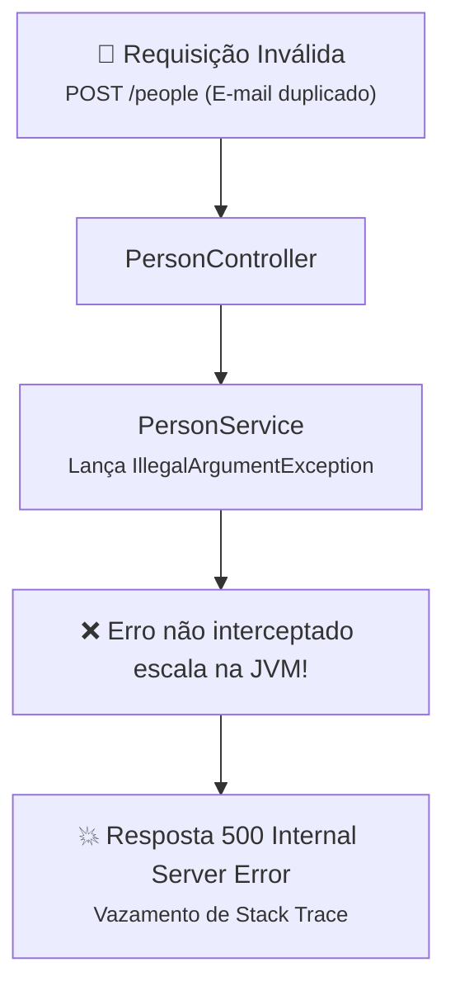

# 01. Exceções em APIs e Respostas Padronizadas

No submódulo anterior, construímos uma API RESTful completa e semântica com
`@RestController` e `ResponseEntity`. No cenário ideal (o chamado _"caminho
feliz"_), nossos endpoints recebem requisições válidas, persistem dados no MySQL
e devolvem status semânticos de sucesso.

No entanto, no mundo real da computação distribuída e da Web, **as coisas dão
errado o tempo todo**:

- O usuário tenta cadastrar uma pessoa com um e-mail que já existe no banco;
- O cliente envia uma data de nascimento com formato inválido;
- A requisição solicita a exclusão de um identificador inexistente;
- O banco de dados cai ou atinge tempo limite de conexão.

Se a sua aplicação não estiver preparada para tratar essas falhas de forma
profissional, o Spring Boot reagirá com páginas de erro genéricas ou vazamentos
de dados internos da aplicação.

Neste capítulo, você entenderá os riscos de segurança e usabilidade causados por
erros mal tratados, conhecerá a especificação global da indústria **RFC 7807
(Problem Details)** e aprenderá a utilizar a ferramenta nativa do Spring Boot 3+
para padronizar respostas de falha: a classe **`ProblemDetail`**.

## O Que Acontece Quando Ocorre um Erro Não Tratado?

Imagine que um cliente tenta cadastrar uma nova pessoa enviando um e-mail já
existente no banco. No nosso `PersonService`, temos a validação:

```java
if (personRepository.existsByEmail(person.getEmail())) {
    throw new IllegalArgumentException("E-mail já cadastrado: " + person.getEmail());
}
```

Se o Controller não interceptar essa `IllegalArgumentException`, a exceção
escalará pela pilha de execução da JVM até a camada do Spring Web, que por
padrão devolverá uma resposta de status **`500 Internal Server Error`**
acompanhada da infame página _"Whitelabel Error Page"_ ou de um JSON bruto.



### Os Dois Grandes Perigos de Erros Mal Tratados

#### 1. Risco de Segurança (_Information Disclosure_)

Quando uma exceção não tratada sobe até o cliente, ela frequentemente carrega o
**stack trace** da JVM. Isso expõe para qualquer pessoa na internet:

- A versão exata do Java e do Spring Boot utilizada;
- A estrutura de pacotes e nomes de classes internas do seu código;
- O dialeto e as mensagens de erro do banco de dados (revelando nomes de
  tabelas, colunas e constraints do MySQL).

Essas informações são ouro para invasores, pois facilitam a exploração de
vulnerabilidades conhecidas no ecossistema.

#### 2. Péssima Experiência de Integração (_Developer Experience - DX_)

Aplicativos modernos (front-ends em React, apps mobile iOS/Android ou outros
microsserviços) dependem de **contratos de erro previsíveis**.

Se cada endpoint devolver o erro de um jeito diferente (às vezes uma string
pura, às vezes um HTML de erro, às vezes um JSON desestruturado), o
desenvolvedor do front-end precisará encher o código cliente de `try/catch`
frágeis e gambiarras para tentar descobrir o que deu errado.

## O Padrão da Indústria: RFC 7807 (Problem Details for HTTP APIs)

Historicamente, cada empresa criava seu próprio formato caseiro de erro (campos
como `timestamp`, `errorMessage`, `code`). Para acabar com essa fragmentação, a
**IETF** (_Internet Engineering Task Force_) formalizou a especificação **RFC
7807** (atualizada pela **RFC 9457**), chamada **Problem Details for HTTP
APIs**.

Essa especificação estabelece um padrão internacional para formatos de erro na
Web, definindo o cabeçalho HTTP:

```http
Content-Type: application/problem+json
```

### A Anatomia de um `Problem Details`

Um documento RFC 7807 padroniza os seguintes campos fundamentais:

| Campo          | Tipo      | Significado                                                            | Exemplo                                            |
| :------------- | :-------- | :--------------------------------------------------------------------- | :------------------------------------------------- |
| **`status`**   | `Integer` | O código de status HTTP numérico gerado pelo servidor                  | `400` ou `404`                                     |
| **`title`**    | `String`  | Um resumo curto e legível para humanos sobre o tipo do problema        | `"Regra de Negócio Violada"`                       |
| **`detail`**   | `String`  | Uma explicação detalhada e contextualizada da ocorrência específica    | `"E-mail já cadastrado: alice@email.com"`          |
| **`instance`** | `URI`     | O endpoint URI relativo que originou a requisição com erro             | `"/people"`                                        |
| **`type`**     | `URI`     | Um link de documentação sobre a classe de erro (padrão: `about:blank`) | `"https://api.fatec.sp.gov.br/errors/bad-request"` |

Além desses campos canônicos, a RFC permite estender o JSON com propriedades
adicionais (como `timestamp` ou listas de validação de campos).

### Exemplo de Resposta RFC 7807 na Prática

```http
HTTP/1.1 400 Bad Request
Content-Type: application/problem+json

{
  "type": "https://api.fatec.sp.gov.br/errors/bad-request",
  "title": "Regra de Negócio Violada",
  "status": 400,
  "detail": "E-mail já cadastrado: alice@email.com",
  "instance": "/people",
  "timestamp": "2026-09-23T15:30:00Z"
}
```

## A Ferramenta Nativa do Spring: `ProblemDetail`

A partir do **Spring Boot 3.0** (Spring Framework 6), o framework adotou a RFC
7807 como cidadã de primeira classe através da classe **`ProblemDetail`**
(`org.springframework.http.ProblemDetail`).

Você não precisa criar classes ou records manuais para envelopar erros. A classe
`ProblemDetail` já vem pronta, com métodos estáticos e suporte a propriedades
customizadas:

```java
import org.springframework.http.HttpStatus;
import org.springframework.http.ProblemDetail;
import java.net.URI;
import java.time.Instant;

// 1. Cria o erro com o status HTTP e a mensagem detalhada
ProblemDetail problem = ProblemDetail.forStatusAndDetail(
        HttpStatus.BAD_REQUEST,
        "E-mail já cadastrado: alice@email.com"
);

// 2. Define o título amigável e a URI do tipo
problem.setTitle("Regra de Negócio Violada");
problem.setType(URI.create("https://api.fatec.sp.gov.br/errors/bad-request"));

// 3. Adiciona propriedades extras personalizadas (extensões da RFC 7807)
problem.setProperty("timestamp", Instant.now());
```

Quando o Spring devolve um `ProblemDetail`, ele automaticamente configura o
status HTTP correspondente e define o cabeçalho `Content-Type:
application/problem+json`.

## Geração 100% Automática via `application.properties`

O Spring Boot possui uma funcionalidade nativa que ativa a geração automática de
erros RFC 7807 para **todas as falhas internas do framework** (rotas
inexistentes, verbos não permitidos, payloads malformatados, parâmetros de tipo
inválido).

Basta adicionar uma única linha no seu `application.properties`:

```properties
spring.mvc.problemdetails.enabled=true
```

### O Que Acontece ao Ligar Essa Propriedade?

Se um cliente fizer uma requisição para uma rota inexistente (`GET /usuarios`)
ou enviar um texto onde se esperava um número (`GET /people/abc`), você não
receberá mais páginas HTML feias ou JSONs genéricos. O próprio Spring responderá
automaticamente:

```http
HTTP/1.1 404 Not Found
Content-Type: application/problem+json

{
  "type": "about:blank",
  "title": "Not Found",
  "status": 404,
  "detail": "No static resource people/abc.",
  "instance": "/people/abc"
}
```

Isso padroniza toda a camada de infraestrutura da sua API sem você precisar
escrever uma única linha de código Java!

## Como NÃO Tratar Exceções: O Anti-Padrão do `try-catch` no Controller

Sabendo que devemos devolver respostas no formato `ProblemDetail`, um impulso
comum de quem está começando é envolver cada método de cada controlador com
blocos `try-catch`:

```java
// ❌ Anti-padrão: Código poluído, repetitivo e de altíssimo custo de manutenção
@RestController
@RequestMapping("/people")
@RequiredArgsConstructor
public class PersonController {

    private final PersonService personService;

    @PostMapping
    public ResponseEntity<?> create(@RequestBody PersonRequest request) {
        try {
            Person entity = new Person(null, request.name(), request.email(), request.cpf(), request.birthDate());
            Person saved = personService.create(entity);
            return ResponseEntity.ok(PersonResponse.fromEntity(saved));
        } catch (IllegalArgumentException ex) {
            // Código duplicado em dezenas de endpoints!
            ProblemDetail problem = ProblemDetail.forStatusAndDetail(HttpStatus.BAD_REQUEST, ex.getMessage());
            problem.setTitle("Regra de Negócio Violada");
            return ResponseEntity.badRequest().body(problem);
        }
    }
}
```

### Por Que Esse Estilo é Inaceitável?

1. **Violação do Princípio DRY (_Don't Repeat Yourself_):** Se a aplicação tiver
   15 controladores com 5 endpoints cada, teremos 75 blocos `try-catch`
   duplicando a mesma lógica de captura e montagem de erro.
2. **Poluição do Fluxo Principal:** O controlador deixa de ser conciso e
   declarativo, misturando o transporte web com manipulação defensiva de erros.
3. **Fragilidade:** Basta um colega esquecer o `try-catch` em um método novo
   para que a API volte a vazar stack traces e status 500 desordenados.

No próximo capítulo, você aprenderá a solução arquitetural ideal do Spring:
centralizar **100% da interceptação de exceções em uma única classe global**
utilizando **`@RestControllerAdvice`** e **`@ExceptionHandler`**, devolvendo
instâncias de `ProblemDetail` de forma limpa e transparente!

---

<a href="../03-web-e-controllers/03-crud-restful-e-respostas-semanticas.md">← 03. CRUD RESTful e Respostas Semânticas</a>

<p align="right"><a href="02-rest-controller-advice-e-exception-handlers.md">Próximo: 02. Rest Controller Advice e Exception Handlers →</a></p>
