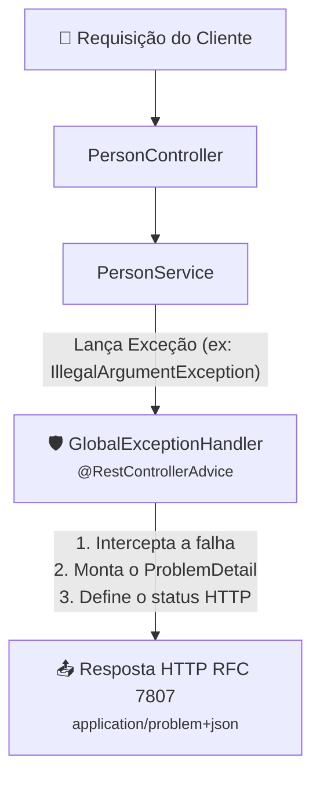

# 02. Rest Controller Advice e Exception Handlers

No capítulo anterior, você conheceu a especificação **RFC 7807 (Problem
Details)** e viu como a classe nativa `ProblemDetail` do Spring Boot 3+
padroniza o formato de respostas de erro na Web. Você também compreendeu por que
espalhar blocos `try-catch` em cada método de cada controlador é um anti-padrão
frágil e repetitivo.

A pergunta natural que surge é: **como desacoplar os controladores das regras de
tratamento de falha e garantir que 100% das exceções sejam tratadas de forma
idêntica em toda a aplicação?**

A resposta do Spring é a centralização global através das anotações
**`@RestControllerAdvice`** e **`@ExceptionHandler`**.

Neste capítulo, você construirá um interceptador global de erros profissional,
mapeará exceções de domínio e banco de dados para códigos semânticos (`400`,
`404`, `409`) e blindará o sistema contra falhas inesperadas com um fallback
seguro para status `500`.

## O Mecanismo do `@RestControllerAdvice`

O `@RestControllerAdvice` é uma anotação especializada do Spring que combina
`@ControllerAdvice` com `@ResponseBody`.

Ele funciona como um **filtro interceptador transversal** (_Cross-Cutting
Concern_) que envolve todos os `@RestController` da aplicação:



### Por Que Esse Padrão é Tão Poderoso?

1. **Controladores 100% Focados no Caminho Feliz:** Seus métodos de API não
   precisam de um único `try-catch`. Se uma validação falhar, o serviço
   simplesmente lança a exceção e o Spring entrega a resposta de erro
   automaticamente.
2. **Ponto Único de Manutenção:** Se a equipe decidir adicionar um campo novo a
   todas as mensagens de erro ou mudar o padrão de logs da empresa, você altera
   apenas uma classe.
3. **Imunidade a Falhas Silenciosas:** Qualquer novo desenvolvedor que criar um
   endpoint amanhã já terá todas as suas exceções interceptadas e formatadas
   automaticamente.

## A Anotação `@ExceptionHandler`

Dentro da classe anotada com `@RestControllerAdvice`, criamos métodos decorados
com **`@ExceptionHandler`**.

Essa anotação informa ao Spring **qual classe de exceção** aquele método sabe
tratar:

```java
@ExceptionHandler(IllegalArgumentException.class)
public ProblemDetail handleIllegalArgument(IllegalArgumentException ex) {
    // Código executado automaticamente sempre que qualquer controller disparar IllegalArgumentException!
}
```

O Spring injeta a própria instância da exceção capturada como parâmetro do
método, permitindo que você extraia a mensagem original (`ex.getMessage()`).

## Construindo o `GlobalExceptionHandler` Passo a Passo

Vamos criar uma classe chamada `GlobalExceptionHandler` no pacote `exception` do
nosso projeto.

### 1. Tratando Erros de Regra de Negócio (`400 Bad Request`)

No nosso `PersonService`, lançamos `IllegalArgumentException` quando o cliente
tenta cadastrar uma pessoa com ID predefinido ou dados inválidos:

```java
@ExceptionHandler(IllegalArgumentException.class)
public ProblemDetail handleIllegalArgument(IllegalArgumentException ex, HttpServletRequest request) {
    ProblemDetail problem = ProblemDetail.forStatusAndDetail(
            HttpStatus.BAD_REQUEST,
            ex.getMessage()
    );
    problem.setTitle("Regra de Negócio Violada");
    problem.setType(URI.create("https://api.fatec.sp.gov.br/errors/bad-request"));
    problem.setInstance(URI.create(request.getRequestURI()));
    problem.setProperty("timestamp", Instant.now());

    return problem;
}
```

### 2. Tratando Conflitos de Banco de Dados (`409 Conflict`)

Imagine que dois usuários tentem cadastrar simultaneamente uma pessoa com o
mesmo CPF. Mesmo que a validação do serviço passe no mesmo milissegundo, a
constraint `uk_people_cpf` do MySQL rejeitará a gravação, disparando uma
**`DataIntegrityViolationException`** do Spring Data JPA.

Se não tratarmos essa exceção, ela vazará o SQL bruto do Hibernate para o
cliente. Em vez disso, nós a capturamos e devolvemos um status semântico **`409
Conflict`**:

```java
@ExceptionHandler(DataIntegrityViolationException.class)
public ProblemDetail handleDataIntegrity(DataIntegrityViolationException ex, HttpServletRequest request) {
    ProblemDetail problem = ProblemDetail.forStatusAndDetail(
            HttpStatus.CONFLICT,
            "Não foi possível processar a operação: violação de integridade de dados (e-mail ou CPF duplicado)."
    );
    problem.setTitle("Conflito de Integridade");
    problem.setType(URI.create("https://api.fatec.sp.gov.br/errors/conflict"));
    problem.setInstance(URI.create(request.getRequestURI()));
    problem.setProperty("timestamp", Instant.now());

    return problem;
}
```

Observe a boa prática: **nunca repassamos `ex.getMessage()` de exceções de banco
de dados para o cliente externo**, pois elas contêm detalhes de schema e sintaxe
SQL. Fornecemos uma mensagem amigável e segura.

### 3. Criando uma Exceção Customizada para Recursos Ausentes (`404 Not Found`)

Para operações de exclusão ou busca onde um recurso não é localizado, é uma boa
prática de design criar uma exceção de domínio dedicada:

```java
package br.gov.sp.fatec.springintro.exception;

public class ResourceNotFoundException extends RuntimeException {
    public ResourceNotFoundException(String message) {
        super(message);
    }
}
```

E no `GlobalExceptionHandler`:

```java
@ExceptionHandler(ResourceNotFoundException.class)
public ProblemDetail handleResourceNotFound(ResourceNotFoundException ex, HttpServletRequest request) {
    ProblemDetail problem = ProblemDetail.forStatusAndDetail(
            HttpStatus.NOT_FOUND,
            ex.getMessage()
    );
    problem.setTitle("Recurso Não Encontrado");
    problem.setType(URI.create("https://api.fatec.sp.gov.br/errors/not-found"));
    problem.setInstance(URI.create(request.getRequestURI()));
    problem.setProperty("timestamp", Instant.now());

    return problem;
}
```

### 4. O Fallback de Segurança contra Falhas Inesperadas (`500 Internal Server Error`)

O que acontece se ocorrer um `NullPointerException`, uma pane na conexão com o
MySQL ou qualquer erro que ninguém previu?

Para que o stack trace nunca vaze, criamos um handler genérico capturando
`Exception.class` (a raiz de todas as exceções):

```java
@ExceptionHandler(Exception.class)
public ProblemDetail handleUncaughtException(Exception ex, HttpServletRequest request) {
    // 1. Registra o stack trace completo no log interno do servidor para a equipe de desenvolvimento
    log.error("Erro interno não tratado ao processar requisição: " + request.getRequestURI(), ex);

    // 2. Devolve uma resposta genérica e blindada para o cliente externo
    ProblemDetail problem = ProblemDetail.forStatusAndDetail(
            HttpStatus.INTERNAL_SERVER_ERROR,
            "Ocorreu um erro interno inesperado no servidor. Nossa equipe foi notificada."
    );
    problem.setTitle("Erro Interno do Servidor");
    problem.setType(URI.create("https://api.fatec.sp.gov.br/errors/internal-server-error"));
    problem.setInstance(URI.create(request.getRequestURI()));
    problem.setProperty("timestamp", Instant.now());

    return problem;
}
```

## O Interceptador Global Completo: `GlobalExceptionHandler`

Veja como fica a implementação completa da classe utilizando o Lombok para log
com `@Slf4j`:

```java
package br.gov.sp.fatec.springintro.exception;

import jakarta.servlet.http.HttpServletRequest;
import lombok.extern.slf4j.Slf4j;
import org.springframework.dao.DataIntegrityViolationException;
import org.springframework.http.HttpStatus;
import org.springframework.http.ProblemDetail;
import org.springframework.web.bind.annotation.ExceptionHandler;
import org.springframework.web.bind.annotation.RestControllerAdvice;

import java.net.URI;
import java.time.Instant;

@Slf4j
@RestControllerAdvice
public class GlobalExceptionHandler {

    // 1. REGRAS DE NEGÓCIO: 400 Bad Request
    @ExceptionHandler(IllegalArgumentException.class)
    public ProblemDetail handleIllegalArgument(IllegalArgumentException ex, HttpServletRequest request) {
        return buildProblem(HttpStatus.BAD_REQUEST, "Regra de Negócio Violada", ex.getMessage(), request, "bad-request");
    }

    // 2. RECURSO NÃO ENCONTRADO: 404 Not Found
    @ExceptionHandler(ResourceNotFoundException.class)
    public ProblemDetail handleResourceNotFound(ResourceNotFoundException ex, HttpServletRequest request) {
        return buildProblem(HttpStatus.NOT_FOUND, "Recurso Não Encontrado", ex.getMessage(), request, "not-found");
    }

    // 3. CONFLITO DE BANCO (UNIQUE KEYS): 409 Conflict
    @ExceptionHandler(DataIntegrityViolationException.class)
    public ProblemDetail handleDataIntegrity(DataIntegrityViolationException ex, HttpServletRequest request) {
        log.warn("Violação de integridade no banco: {}", ex.getMessage());
        return buildProblem(
                HttpStatus.CONFLICT,
                "Conflito de Integridade",
                "Não foi possível processar a operação: e-mail ou CPF já cadastrado no sistema.",
                request,
                "conflict"
        );
    }

    // 4. FALLBACK GLOBAL: 500 Internal Server Error
    @ExceptionHandler(Exception.class)
    public ProblemDetail handleUncaught(Exception ex, HttpServletRequest request) {
        log.error("Erro crítico não tratado na rota {}: ", request.getRequestURI(), ex);
        return buildProblem(
                HttpStatus.INTERNAL_SERVER_ERROR,
                "Erro Interno do Servidor",
                "Ocorreu um erro interno inesperado no servidor. Tente novamente mais tarde.",
                request,
                "internal-error"
        );
    }

    // Método utilitário privado para evitar repetição na montagem do ProblemDetail
    private ProblemDetail buildProblem(
            HttpStatus status,
            String title,
            String detail,
            HttpServletRequest request,
            String errorTypeSlug
    ) {
        ProblemDetail problem = ProblemDetail.forStatusAndDetail(status, detail);
        problem.setTitle(title);
        problem.setType(URI.create("https://api.fatec.sp.gov.br/errors/" + errorTypeSlug));
        problem.setInstance(URI.create(request.getRequestURI()));
        problem.setProperty("timestamp", Instant.now());
        return problem;
    }
}
```

## Testando a Interceptação na Prática

Com o `GlobalExceptionHandler` ativo, veja o que acontece ao testar cenários de
erro via terminal:

### 1. Testando E-mail Duplicado (`POST /people`)

```bash
curl -i -X POST http://localhost:8080/people \
  -H "Content-Type: application/json" \
  -d '{
    "name": "Alice Silva",
    "email": "carlos@email.com",
    "cpf": "999.888.777-66",
    "birthDate": "1990-01-01"
  }'
```

_Resposta interceptada e formatada como RFC 7807:_

```http
HTTP/1.1 400 Bad Request
Content-Type: application/problem+json

{
  "type": "https://api.fatec.sp.gov.br/errors/bad-request",
  "title": "Regra de Negócio Violada",
  "status": 400,
  "detail": "E-mail já cadastrado: carlos@email.com",
  "instance": "/people",
  "timestamp": "2026-09-23T15:45:12.789123Z"
}
```

Nenhum stack trace foi exposto. O status HTTP é perfeitamente semântico (`400
Bad Request`) e o contrato JSON é 100% previsível para o front-end.

<details>
<summary>🔍 Aprofundamento: Herdando de ResponseEntityExceptionHandler</summary>

Além de criar handlers para as suas exceções customizadas, você pode fazer o
`GlobalExceptionHandler` estender a classe base oficial do Spring:

```java
@RestControllerAdvice
public class GlobalExceptionHandler extends ResponseEntityExceptionHandler {
    // ...
}
```

#### O Que o `ResponseEntityExceptionHandler` Oferece?

Ele já contém métodos prontos interceptando mais de 15 exceções internas do
Spring Web, como:

- `HttpRequestMethodNotSupportedException` (quando o cliente envia um `POST`
  onde só existe `GET`);
- `HttpMediaTypeNotSupportedException` (quando o cliente envia XML em vez de
  JSON);
- `MethodArgumentNotValidException` (quando falham validações de Bean Validation
  com anotações `@NotNull`, `@Email`, etc.).

Ao estender essa classe, você pode sobrescrever métodos como
`handleMethodArgumentNotValid` para personalizar exatamente como erros de campo
aparecem dentro do campo `properties` do seu `ProblemDetail`.

</details>

---

<a href="01-excecoes-em-apis-e-respostas-padronizadas.md">← 01. Exceções em APIs
e Respostas Padronizadas</a>

<p align="right"><a href="../05-mvc-e-views/01-o-padrao-mvc-classico-no-spring.md">Próximo: 01. O Padrão MVC Clássico no Spring →</a></p>
