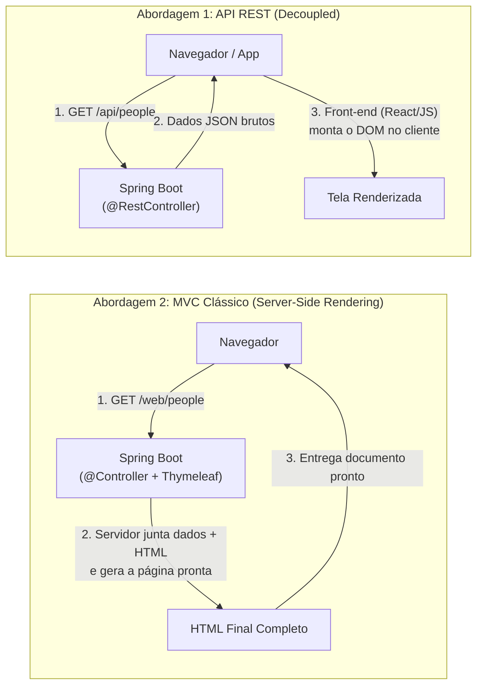
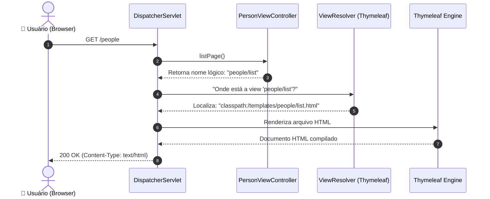

# 01. O Padrão MVC Clássico no Spring

Nos módulos anteriores, você construiu uma API RESTful completa: controladores
anotados com `@RestController`, serialização automática de objetos Java para
JSON e tratamento global de erros com o padrão RFC 7807.

Nesse modelo moderno de arquitetura desacoplada, o backend funciona como um
fornecedor puro de dados via HTTP, delegando a construção visual das telas para
um aplicativo móvel ou para uma aplicação front-end (como React, Angular ou
Vue).

No entanto, em milhares de sistemas corporativos, painéis administrativos,
portais governamentais e intranets empresariais, existe outra abordagem muito
utilizada: **o Server-Side Rendering (SSR) clássico com o padrão MVC
(Model-View-Controller)**.

Neste capítulo, você compreenderá as diferenças entre APIs de dados e SSR,
configurará o motor de templates **Thymeleaf** e aprenderá como o Spring utiliza
a anotação **`@Controller`** para orquestrar e entregar páginas HTML completas
diretamente ao navegador.

## Server-Side Rendering (SSR) vs. APIs Desacopladas

Antes de escrever qualquer linha de código, é crucial entender a diferença de
responsabilidade entre os dois mundos:



### Comparativo Arquitetural

| Critério                      | API REST (`@RestController`)                                       | MVC Clássico (`@Controller` + Thymeleaf)                                     |
| :---------------------------- | :----------------------------------------------------------------- | :--------------------------------------------------------------------------- |
| **O que o servidor entrega?** | Dados puros em JSON / XML                                          | Documentos HTML prontos com CSS embutido                                     |
| **Onde a página é montada?**  | No dispositivo do cliente (navegador/app)                          | No próprio servidor                                                          |
| **Complexidade da pilha**     | Exige manter duas aplicações (back e front)                        | Aplicação única monolítica em Java                                           |
| **Ideal para**                | Aplicações ricas, apps mobile, ecossistemas com múltiplos clientes | Painéis internos, CRMs, portais com foco em SEO e CRUDs corporativos rápidos |

## A Anatomia do MVC no Spring Web

O Spring Web foi concebido desde suas primeiras versões em torno do padrão de
projeto arquitetural **Model-View-Controller**:

- **Controller (`@Controller`):** Recebe as requisições HTTP do navegador, chama
  a camada de serviço (`PersonService`) e decide qual tela deve ser exibida.
- **Model (`org.springframework.ui.Model`):** Um mapa de dados gerenciado pelo
  Spring. O Controller deposita objetos nele (ex.: uma lista de
  `PersonResponse`) para que a tela possa exibi-los.
- **View (Templates HTML):** O arquivo de marcação visual que contém o layout e
  as diretivas que serão preenchidas com os dados do Model.

## Adicionando o Starter do Thymeleaf

Para que o Spring consiga ler arquivos HTML e preencher variáveis dinâmicas em
tempo de execução, adicionamos a dependência oficial do motor de templates
**Thymeleaf** no `pom.xml`:

```xml
<dependency>
    <groupId>org.springframework.boot</groupId>
    <artifactId>spring-boot-starter-thymeleaf</artifactId>
</dependency>
```

### A Convenção de Diretórios do Spring Boot

Assim que o starter do Thymeleaf entra no projeto, o Spring Boot ativa regras de
autoconfiguração baseadas em convenção sobre configuração:

```text
src/
└── main/
    └── resources/
        ├── static/       <-- Arquivos públicos estáticos (CSS, JS, imagens, favicon)
        └── templates/    <-- Arquivos de template (páginas .html processadas pelo Thymeleaf)
```

> Arquivos colocados em `src/main/resources/templates/` **não são acessíveis
> diretamente pelo navegador** via URL pública. Eles só podem ser exibidos se um
> `@Controller` os invocar expressamente. Já os arquivos em `static/` são
> servidos diretamente como arquivos estáticos puros.

## O Erro Clássico: `@Controller` vs. `@RestController`

Este é o engano mais comum entre desenvolvedores que aprenderam APIs REST e
começam a construir telas no Spring:

```java
// ❌ INCORRETO: @RestController sempre serializa o retorno como corpo HTTP (JSON ou String pura)
@RestController
@RequestMapping("/people")
public class PersonViewController {

    @GetMapping
    public String listPage() {
        return "people/list"; // O navegador exibirá a palavra literal "people/list" na tela!
    }
}
```

```java
// ✅ CORRETO: @Controller instrui o ViewResolver a procurar o arquivo HTML correspondente
@Controller
@RequestMapping("/people")
public class PersonViewController {

    @GetMapping
    public String listPage() {
        return "people/list"; // O Spring renderiza o arquivo: src/main/resources/templates/people/list.html
    }
}
```

### Por Que Isso Acontece?

A anotação `@RestController` é uma anotação composta no Spring: ela equivale a
colocar `@Controller` + `@ResponseBody`.

Quando o Spring detecta `@ResponseBody`, ele pula todo o mecanismo de busca de
telas e envia o valor retornado diretamente no corpo da resposta HTTP. Ao usar a
anotação clássica **`@Controller`** (sem `@ResponseBody`), o Spring entende que
a `String` retornada pelo método não é o conteúdo, mas sim o **nome lógico da
View**!

## Criando Nosso Primeiro Template

Vamos criar a estrutura em `src/main/resources/templates/people/list.html`:

```html
<!DOCTYPE html>
<html lang="pt-BR" xmlns:th="http://www.thymeleaf.org">
  <head>
    <meta charset="UTF-8" />
    <meta name="viewport" content="width=device-width, initial-scale=1.0" />
    <title>Gestão de Pessoas - FATEC</title>
  </head>
  <body>
    <header>
      <h1>Sistema Integrado de Gestão Acadêmica</h1>
      <p>Visão Clássica Server-Side Rendering (SSR)</p>
    </header>

    <main>
      <h2>Catálogo de Pessoas</h2>
      <p>
        Seja bem-vindo ao portal administrativo renderizado via Spring MVC e
        Thymeleaf.
      </p>
    </main>
  </body>
</html>
```

Observe a declaração `xmlns:th="http://www.thymeleaf.org"`. Ela informa à sua
IDE e aos validadores HTML que todas as tags iniciadas com `th:` pertencem à
gramática do Thymeleaf.

## O Fluxo Completo da Resposta MVC

Entender o caminho que uma requisição percorre internamente no Spring MVC ajuda
a depurar qualquer problema de template ausente:



1. O navegador dispara a requisição `GET /people`.
2. O **`DispatcherServlet`** (controlador frontal do Spring) localiza o
   `PersonViewController`.
3. O método executa e retorna a string `"people/list"`.
4. O **`ViewResolver`** do Thymeleaf adiciona automaticamente o prefixo
   `classpath:/templates/` e o sufixo `.html`, encontrando o arquivo físico em
   disco.
5. O motor do Thymeleaf compila o HTML e gera a resposta HTTP com `Content-Type:
text/html;charset=UTF-8`.

> **Dica:** Em ambiente de desenvolvimento local, você pode desativar o cache de
> templates com `spring.thymeleaf.cache=false`. Assim, ao alterar qualquer
> arquivo `.html`, basta dar `F5` no navegador para ver o novo layout
> imediatamente, sem precisar reiniciar a aplicação Spring Boot!

<details>
<summary>🔍 Aprofundamento: Como o ViewResolver Resolve Prefixos e Sufixos</summary>

O Spring Boot configura automaticamente o bean `ThymeleafViewResolver` com as
seguintes propriedades padrão no `application.properties`:

```properties
# Padrões aplicados automaticamente pelo spring-boot-starter-thymeleaf:
spring.thymeleaf.prefix=classpath:/templates/
spring.thymeleaf.suffix=.html
spring.thymeleaf.mode=HTML
spring.thymeleaf.encoding=UTF-8
spring.thymeleaf.cache=true
```

Isso significa que quando seu método faz `return "admin/dashboard";`, o Spring
concatena: $$\text{prefix} + \text{"admin/dashboard"} + \text{suffix} =
\text{"classpath:/templates/admin/dashboard.html"}$$

</details>

---

<a
href="../04-tratamento-de-erros/02-rest-controller-advice-e-exception-handlers.md">← 02. Rest Controller Advice e Exception Handlers</a>

<p align="right"><a href="02-renderizacao-com-thymeleaf-e-model.md">Próximo: 02. Renderização com Thymeleaf e Model →</a></p>
