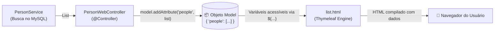
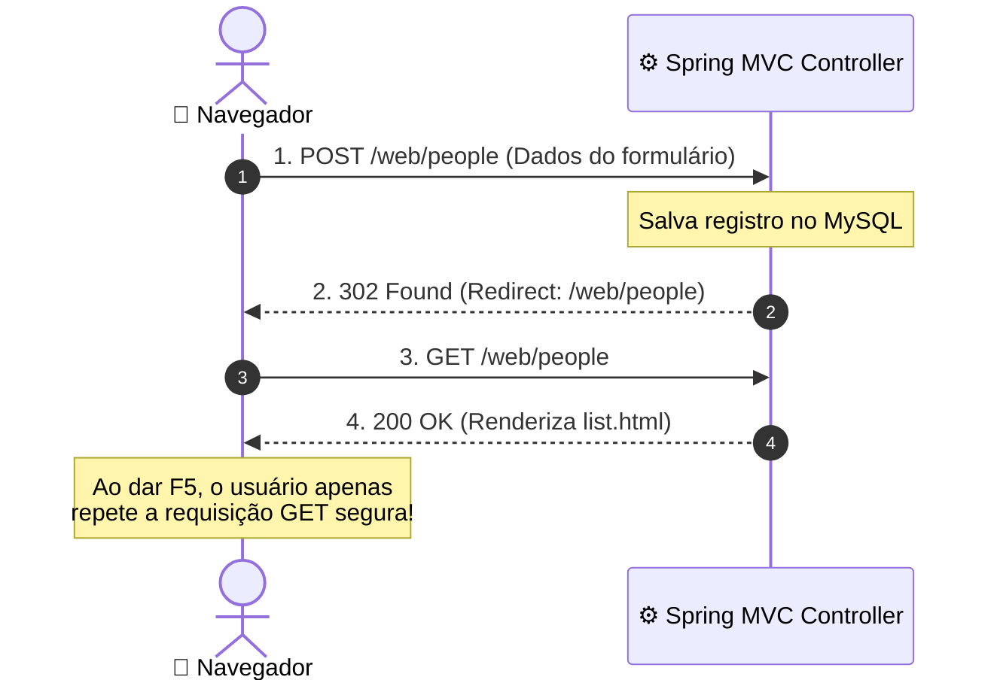

# 02. Renderização com Thymeleaf e Model

No capítulo anterior, você conheceu a arquitetura clássica do Server-Side
Rendering (SSR) e aprendeu como o `@Controller` localiza templates HTML através
do `ViewResolver`. Porém, a página exibida era completamente estática.

Em sistemas do mundo real, o papel primordial da View é refletir o estado do
banco de dados: exibir tabelas de usuários, listas de produtos, extratos e
notificações em tempo real.

Neste capítulo, você aprenderá a transportar dados do backend para a interface
utilizando a abstração **`Model`**, dominará as diretivas fundamentais do
**Thymeleaf** (`th:text`, `th:each`, `th:if`, `th:href`) e implementará o padrão
arquitetural **PRG (Post/Redirect/Get)** para processamento seguro de
formulários.

## O Objeto `Model`: A Ponte de Dados

Para que o HTML tenha acesso aos dados que estão no banco de dados, o Spring MVC
fornece a interface **`org.springframework.ui.Model`**.

O `Model` atua como uma sacola ou mapa de dados chave-valor gerenciado pelo
framework. Quando você declara `Model model` na assinatura de um método do
controlador, o Spring injeta essa instância vazia automaticamente:



### O Controlador Web: `PersonWebController`

Veja como o controlador busca os dados na camada de serviço e alimenta o
`Model`:

```java
package br.gov.sp.fatec.springintro.controller.web;

import br.gov.sp.fatec.springintro.dto.PersonResponse;
import br.gov.sp.fatec.springintro.service.PersonService;
import lombok.RequiredArgsConstructor;
import org.springframework.stereotype.Controller;
import org.springframework.ui.Model;
import org.springframework.web.bind.annotation.GetMapping;
import org.springframework.web.bind.annotation.RequestMapping;

import java.util.List;

@Controller
@RequestMapping("/web/people")
@RequiredArgsConstructor
public class PersonWebController {

    private final PersonService personService;

    @GetMapping
    public String listPeople(Model model) {
        // 1. Busca os dados no serviço e transforma na lista de DTOs imutáveis
        List<PersonResponse> people = personService.findAll()
                .stream()
                .map(PersonResponse::fromEntity)
                .toList();

        // 2. Deposita a lista dentro do Model com a chave "people"
        model.addAttribute("people", people);
        model.addAttribute("totalRecords", people.size());

        // 3. Retorna o nome do template em src/main/resources/templates/people/list.html
        return "people/list";
    }
}
```

## A Gramática Essencial do Thymeleaf

O Thymeleaf utiliza atributos HTML customizados que iniciam com o prefixo `th:`.
Sua grande vantagem sobre JSP ou ASP clássico é que ele é um **Natural
Template**: o arquivo `.html` continua sendo um HTML válido que pode ser aberto
e inspecionado diretamente no navegador sem precisar de um servidor ativo.

### 1. `th:text` — Interpolação e Substituição de Conteúdo

O atributo `th:text` avalia uma expressão e substitui o texto interno da tag. Se
o Spring não estiver rodando, o texto estático padrão será exibido no editor:

```html
<!-- Se totalRecords for 15, o navegador exibirá: "Total de cadastros: 15" -->
<p>Total de cadastros: <span th:text="${totalRecords}">0</span></p>
```

A sintaxe `${nomeDaVariavel}` acessa qualquer objeto colocado no `Model`. Para
chamar métodos ou getters (ou componentes de um Java Record), basta usar o nome
da propriedade: `${person.name()}` ou `${person.email()}`.

### 2. `th:each` — Laços de Repetição em Coleções

Para iterar sobre listas, sets ou arrays, utilizamos `th:each="item :
${colecao}"`. O elemento HTML que contém a diretiva será repetido para cada
registro:

```html
<tbody>
  <!-- A tag <tr> inteira se repete para cada pessoa presente na lista -->
  <tr th:each="person : ${people}">
    <td th:text="${person.id()}">1</td>
    <td th:text="${person.name()}">Nome de Exemplo</td>
    <td th:text="${person.email()}">email@exemplo.com</td>
    <td th:text="${person.birthDate()}">2000-01-01</td>
  </tr>
</tbody>
```

### 3. `th:if` e `th:unless` — Renderização Condicional

Para exibir ou ocultar elementos com base em regras booleanas:

```html
<!-- Exibido apenas se a lista NÃO estiver vazia -->
<div th:if="${!people.isEmpty()}">
  <p>Registros carregados com sucesso.</p>
</div>

<!-- Exibido apenas se a lista ESTIVER vazia -->
<div th:if="${people.isEmpty()}" class="alert-empty">
  <p>Nenhuma pessoa foi cadastrada no sistema até o momento.</p>
</div>
```

O `th:unless` funciona como o inverso de `th:if` (equivalente a "se não").

### 4. `th:href` e Expressões de Link `@{|...|}`

Para construir links e rotas dinâmicas, utilizamos o operador de URL `@{...}`.
Para concatenar parâmetros de rota com variáveis do objeto, utilizamos a sintaxe
pipe `@{|/web/people/${person.id()}|}`:

```html
<a th:href="@{|/web/people/${person.id()}|}">Ver Detalhes</a>
```

## O Template Completo: `people/list.html`

Veja como fica a página completa em
`src/main/resources/templates/people/list.html`, com estilização moderna e
limpa:

```html
<!DOCTYPE html>
<html lang="pt-BR" xmlns:th="http://www.thymeleaf.org">
  <head>
    <meta charset="UTF-8" />
    <meta name="viewport" content="width=device-width, initial-scale=1.0" />
    <title>Catálogo de Pessoas - FATEC</title>
    <style>
      body {
        font-family:
          -apple-system, BlinkMacSystemFont, "Segoe UI", Roboto, sans-serif;
        margin: 2rem;
        background: #f8fafc;
        color: #1e293b;
      }
      .card {
        background: white;
        border-radius: 8px;
        padding: 1.5rem;
        box-shadow: 0 1px 3px rgba(0, 0, 0, 0.1);
      }
      h1 {
        margin-top: 0;
        color: #0f172a;
      }
      .btn {
        display: inline-block;
        padding: 0.5rem 1rem;
        background: #2563eb;
        color: white;
        border-radius: 4px;
        text-decoration: none;
        font-weight: 500;
      }
      .btn:hover {
        background: #1d4ed8;
      }
      table {
        width: 100%;
        border-collapse: collapse;
        margin-top: 1rem;
      }
      th,
      td {
        text-align: left;
        padding: 0.75rem;
        border-bottom: 1px solid #e2e8f0;
      }
      th {
        background: #f1f5f9;
        font-weight: 600;
      }
      .empty-state {
        padding: 2rem;
        text-align: center;
        color: #64748b;
      }
    </style>
  </head>
  <body>
    <div class="card">
      <header
        style="display: flex; justify-content: space-between; align-items: center;"
      >
        <div>
          <h1>Gestão Acadêmica de Pessoas</h1>
          <p>
            Total de registros: <strong th:text="${totalRecords}">0</strong>
          </p>
        </div>
        <a th:href="@{/web/people/new}" class="btn">+ Nova Pessoa</a>
      </header>

      <!-- Tabela exibida apenas quando há pessoas cadastradas -->
      <table th:if="${!people.isEmpty()}">
        <thead>
          <tr>
            <th>ID</th>
            <th>Nome</th>
            <th>E-mail</th>
            <th>Data de Nascimento</th>
          </tr>
        </thead>
        <tbody>
          <tr th:each="person : ${people}">
            <td th:text="${person.id()}">1</td>
            <td th:text="${person.name()}">Nome Teste</td>
            <td th:text="${person.email()}">email@teste.com</td>
            <td th:text="${person.birthDate()}">1995-05-20</td>
          </tr>
        </tbody>
      </table>

      <!-- Mensagem de estado vazio (Empty State) -->
      <div th:if="${people.isEmpty()}" class="empty-state">
        <p>Nenhuma pessoa encontrada no banco de dados.</p>
      </div>
    </div>
  </body>
</html>
```

## Processamento de Formulários e o Padrão PRG (Post/Redirect/Get)

Quando construímos formulários web tradicionais, o usuário preenche os campos e
clica em "Salvar". O formulário envia uma requisição `POST` para o servidor.

Aqui reside uma regra de ouro da engenharia de software web: **nunca renderize
um template HTML diretamente como resposta de uma requisição `POST` com
sucesso.**

Se você fizer isso e o usuário apertar `F5` (atualizar a página), o navegador
reemitirá o `POST`, inserindo o mesmo registro duas vezes no banco de dados!

Para solucionar esse problema, aplicamos o padrão **PRG (Post/Redirect/Get)**:



### Implementando o Formulário e o Redirecionamento

No `PersonWebController`, criamos a rota do formulário (`GET`) e o receptor da
gravação (`POST`):

```java
// 1. Exibe a tela em branco para cadastro
@GetMapping("/new")
public String showCreateForm(Model model) {
    model.addAttribute("personRequest", new PersonRequest("", "", "", null));
    return "people/form";
}

// 2. Recebe os dados do formulário e redireciona (PRG)
@PostMapping
public String createPerson(PersonRequest request) {
    personService.create(request);

    // O prefixo "redirect:" instrui o Spring a devolver um status HTTP 302 com o cabeçalho Location
    return "redirect:/web/people";
}
```

O prefixo especial **`redirect:`** no retorno do controlador faz o Spring MVC
enviar uma resposta `302 Found` para o navegador, orientando-o a disparar
imediatamente um `GET /web/people`. Isso blinda a aplicação contra submissões
duplicadas acidentais.

<details>
<summary>🔍 Aprofundamento: Proteção Nativa Contra XSS no Thymeleaf</summary>

Uma das maiores vulnerabilidades em aplicações web que renderizam HTML no
servidor é o ataque de **Cross-Site Scripting (XSS)**, onde um atacante cadastra
um nome contendo código malicioso:

```html
<script>
  stealSessionCookies();
</script>
```

Se o motor de templates injetar essa string diretamente no documento HTML, o
script será executado no navegador de todos os usuários que visitarem a página.

Por padrão, a diretiva **`th:text`** do Thymeleaf aplica escape HTML estrito em
todos os caracteres perigosos (`<` vira `&lt;`, `>` vira `&gt;`, `"` vira
`&quot;`). O script é tratado como mero texto inofensivo.

> **Atenção:** Existe a diretiva `th:utext` (_unescaped text_) que injeta o HTML
> cru sem escapar. **Nunca use `th:utext` com dados fornecidos pelo usuário**,
> pois isso abre uma brecha direta de segurança na sua aplicação.

</details>

---

<a href="01-o-padrao-mvc-classico-no-spring.md">← 01. O Padrão MVC Clássico no
Spring</a>
