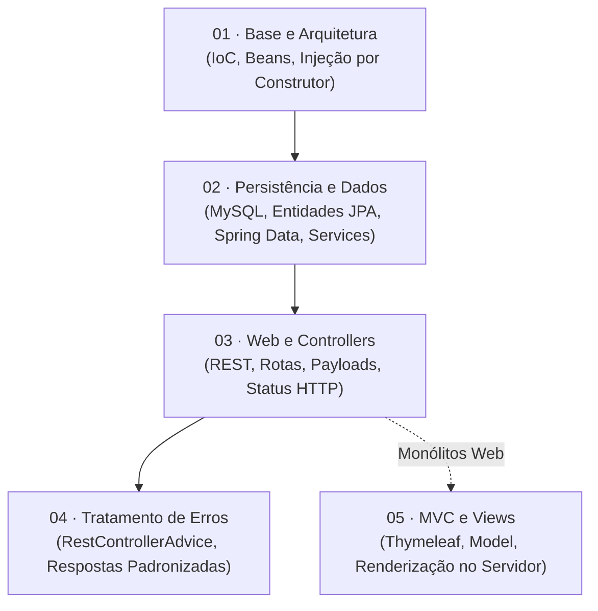

# 🍃 Spring Boot — Do Zero à Persistência e APIs REST

Bem-vindo ao módulo de **Spring Boot** do curso de Programação Orientada a Objetos da FATEC.

O Spring Boot é o padrão da indústria global para desenvolvimento de back-end moderno e microsserviços em Java. Neste guia completo, você aprenderá desde a arquitetura de Inversão de Controle (*IoC*) e Injeção de Dependências (*DI*) até a persistência relacional com MySQL e Spring Data JPA, construção de APIs RESTful semânticas e renderização de interfaces web com Thymeleaf.

---

## 🗺️ Mapa da Trilha de Aprendizado

---

## 🧭 Índice do Módulo

### 📦 01 · Base e Arquitetura (`01-base-e-arquitetura/`)

Compreenda a filosofia do Spring Boot, a eliminação de servidores externos de aplicação e o funcionamento do container de Injeção de Dependências.

| Cap | Arquivo | Assunto |
| :-: | :--- | :--- |
| 01 | [01-introducao-e-filosofia-spring.md](01-base-e-arquitetura/01-introducao-e-filosofia-spring.md) | O que é Spring vs Spring Boot, *Convention over Configuration* e servidor embutido |
| 02 | [02-setup-e-spring-initializr.md](01-base-e-arquitetura/02-setup-e-spring-initializr.md) | Setup no VS Code, Spring Initializr, versões GA, convenções e JAR vs WAR |
| 03 | [03-injecao-de-dependencia-e-ioc.md](01-base-e-arquitetura/03-injecao-de-dependencia-e-ioc.md) | Ciclo de vida de *Beans*, estereótipos (`@Service`, `@Repository`) e injeção por construtor |

### 🗄️ 02 · Persistência e Dados (`02-persistencia-e-dados/`)

Integre seu banco de dados relacional (MySQL) com a facilidade declarativa do Spring Data JPA e isole suas regras de negócio na camada de serviço.

| Cap | Arquivo | Assunto |
| :-: | :--- | :--- |
| 01 | [01-configuracao-datasource-mysql.md](02-persistencia-e-dados/01-configuracao-datasource-mysql.md) | Parametrização em `application.properties`, conexão MySQL, dialeto e auto-DDL |
| 02 | [02-o-conceito-de-model-e-entidades.md](02-persistencia-e-dados/02-o-conceito-de-model-e-entidades.md) | Mapeamento JPA (`@Entity`, `@Table`), chaves com `@Id` e integração segura com Lombok |
| 03 | [03-spring-data-jpa-e-repositories.md](02-persistencia-e-dados/03-spring-data-jpa-e-repositories.md) | A interface `JpaRepository`, operações CRUD automáticas e consultas derivadas |
| 04 | [04-camada-de-servico-e-regras-de-negocio.md](02-persistencia-e-dados/04-camada-de-servico-e-regras-de-negocio.md) | A camada `@Service`, orquestração de operações e uso funcional de `Optional` |

### 🌐 03 · Web e Controllers (`03-web-e-controllers/`)

Construa pontos de entrada HTTP profissionais para expor seus recursos através do protocolo RESTful com serialização JSON automática.

| Cap | Arquivo | Assunto |
| :-: | :--- | :--- |
| 01 | [01-rest-controllers-e-verbos-http.md](03-web-e-controllers/01-rest-controllers-e-verbos-http.md) | `@RestController`, prefixo `@RequestMapping` e mapeamento de verbos HTTP |
| 02 | [02-parametros-de-rota-e-payloads.md](03-web-e-controllers/02-parametros-de-rota-e-payloads.md) | Variáveis de URL com `@PathVariable` e corpos de requisição com `@RequestBody` |
| 03 | [03-crud-restful-e-respostas-semanticas.md](03-web-e-controllers/03-crud-restful-e-respostas-semanticas.md) | `ResponseEntity`, status semânticos (200, 201, 204, 404) e testes com clientes HTTP |

### 🛡️ 04 · Tratamento de Erros (`04-tratamento-de-erros/`)

Proteja sua aplicação contra vazamento de detalhes internos do banco de dados e padronize o formato de erro retornado aos clientes da API.

| Cap | Arquivo | Assunto |
| :-: | :--- | :--- |
| 01 | [01-excecoes-em-apis-e-respostas-padronizadas.md](04-tratamento-de-erros/01-excecoes-em-apis-e-respostas-padronizadas.md) | Perigos de stack trace e especificação de um contrato JSON de erro consistente |
| 02 | [02-rest-controller-advice-e-exception-handlers.md](04-tratamento-de-erros/02-rest-controller-advice-e-exception-handlers.md) | Interceptação global com `@RestControllerAdvice` e handlers especializados |

### 🖥️ 05 · MVC e Views (`05-mvc-e-views/`)

Aprenda como o padrão MVC clássico funciona com renderização de páginas HTML no servidor (*Server-Side Rendering*) utilizando o motor de templates Thymeleaf.

| Cap | Arquivo | Assunto |
| :-: | :--- | :--- |
| 01 | [01-o-padrao-mvc-classico-no-spring.md](05-mvc-e-views/01-o-padrao-mvc-classico-no-spring.md) | O ecossistema MVC, `@Controller` de view e estrutura de templates |
| 02 | [02-renderizacao-com-thymeleaf-e-model.md](05-mvc-e-views/02-renderizacao-com-thymeleaf-e-model.md) | Injeção de `Model`, passagem de dados e sintaxe `th:text`, `th:each`, `th:if` |

---

## 🚀 Como Iniciar

Recomendamos que você comece pelo primeiro capítulo da Trilha de Base:

👉 **[Começar: 01. Introdução e Filosofia Spring](01-base-e-arquitetura/01-introducao-e-filosofia-spring.md)**
