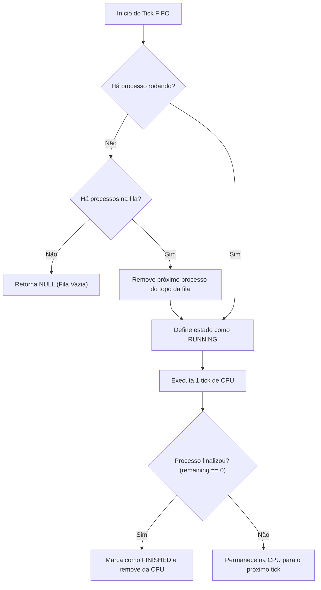
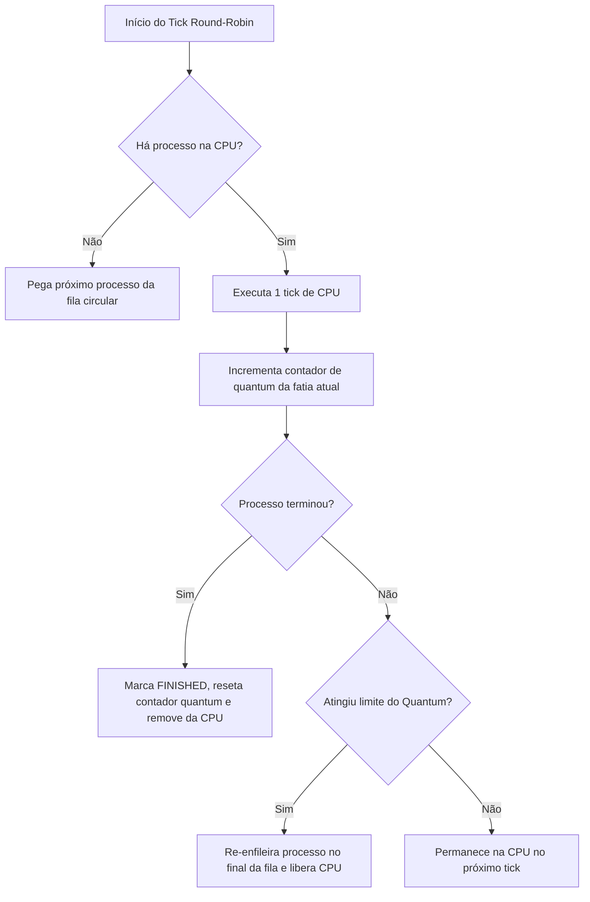
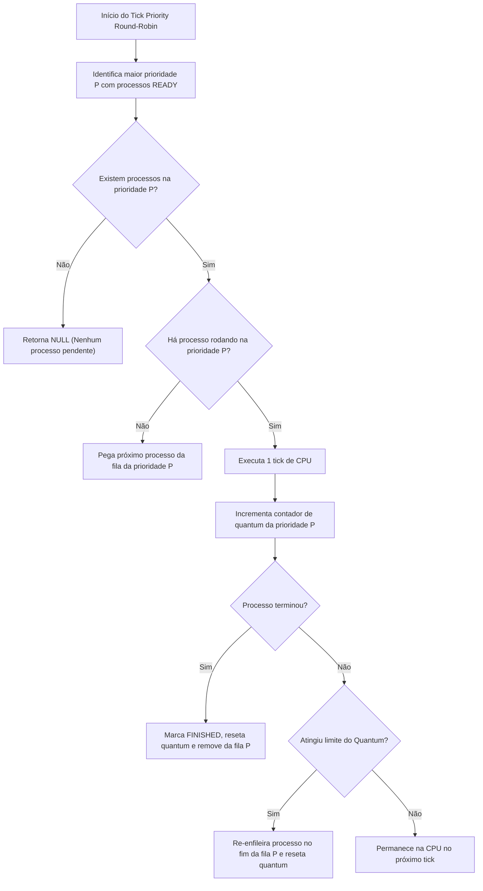
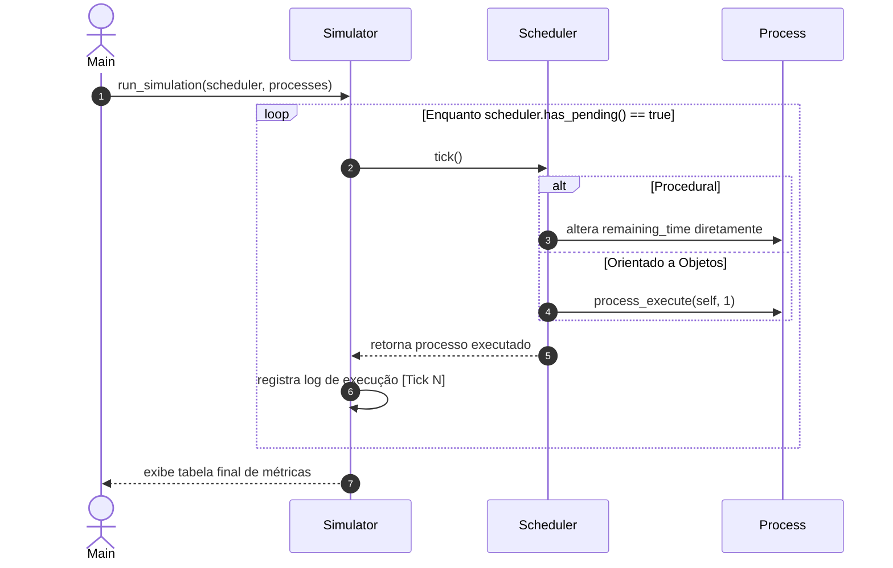

# Especificação do Sistema: Simulador de Escalonamento de Processos

## 1. Visão Geral

Este documento especifica o domínio, os modelos de dados e o fluxo de execução
do **Simulador de Escalonamento de Processos de Sistema Operacional**, que
servirá como projeto demonstrativo para comparar o design **Procedural Modular**
e o **Orientado a Objetos** no Módulo 3.

O objetivo do sistema é simular a alocação de tempo de CPU para uma lista de
processos utilizando dois algoritmos clássicos de escalonamento:

1. **FIFO (First-In, First-Out / FCFS):** Escalonamento não-preemptivo por ordem
   de chegada.
2. **Round-Robin (RR):** Escalonamento preemptivo por fatia de tempo
   (_quantum_).

## 2. Modelos de Domínio e Estruturas de Dados

### 2.1 Processo (`Process`)

Representa uma unidade de trabalho a ser executada pela CPU.

#### 2.1.1 Versão Procedural

Na versão procedural, a estrutura `Process` é uma estrutura de dados **passiva e
transparente**. Seus atributos são abertos e manipulados diretamente pelo
escalonador.

##### 2.1.1.1 Atributos (`struct Process`)

- `pid` (`uint32_t`): Identificador único do processo.
- `name` (`char[32]`): Nome legível do programa (ex: `"Compiler"`).
- `burst_time` (`uint32_t`): Tempo total de CPU necessário.
- `remaining_time` (`uint32_t`): Tempo restante de CPU.
- `state` (`ProcessState`): Estado (`READY`, `RUNNING`, `FINISHED`).

##### 2.1.1.2 Operações

- **N/A (Nenhuma):** Não há funções dedicadas de comportamento. O `Scheduler`
  altera diretamente `remaining_time` e `state` durante o tick.

> **Ponto de Atenção Pedagógico:** Demonstra a ausência de encapsulamento —
> qualquer código externo pode alterar o estado do processo arbitrariamente sem
> validação de invariantes.

#### 2.1.2 Versão Orientada a Objetos

Na versão OO, o `Process` é um **objeto autônomo e protegido**. Seus dados são
privados e as transições de estado ocorrem apenas por métodos comportamentais.

##### 2.1.2.1 Atributos (Encapsulados)

- `pid` (`uint32_t`) [Privado]
- `name` (`char[32]`) [Privado]
- `burst_time` (`uint32_t`) [Privado]
- `remaining_time` (`uint32_t`) [Privado]
- `state` (`ProcessState`) [Privado]
- `priority` (`uint32_t`) [Privado - opcional para algoritmos com prioridade]

##### 2.1.2.2 Operações de Contrato

- `process_create(pid, name, burst_time)`: Construtor que garante inicialização
  válida.
- `process_execute(self, time_slice)`: Decrementa o tempo restante e transita o
  estado de forma segura.
- `process_is_finished(self)`: Consulta o estado sem expor campos internos.
- `process_get_pid(self)`, `process_get_name(self)`: Getters somente-leitura.
- `process_destroy(self)`: Destrutor responsável pela liberação de memória.

### 2.2 Escalonador (`Scheduler`)

Gerencia a fila de processos e aplica a regra de escalonamento.

#### 2.2.1 Versão Procedural

##### 2.2.1.1 Atributos (`struct Scheduler` Universal)

Conforme discutido no design procedural, uma única estrutura agrupa **todos os
campos necessários por qualquer algoritmo suportado**:

```c
typedef struct {
    SchedulerType type;           // SCHEDULER_FIFO ou SCHEDULER_ROUND_ROBIN
    Process processes[MAX_PROC];  // Fila estática de processos
    size_t count;                 // Total de processos
    size_t current_index;         // Índice do processo em execução

    /* Atributos específicos do Round-Robin (OCIOSOS quando em modo FIFO) */
    uint32_t quantum;             // Fatia de tempo (ex: 2 ticks)
    size_t time_slice_counter;    // Contador de ticks do processo atual
} Scheduler;
```

##### 2.2.1.2 Operações

- `procedural_scheduler_init(scheduler, type, quantum)`: Inicializa a estrutura
  universal.
- `procedural_scheduler_tick(scheduler)`: Executa um ciclo utilizando um bloco
  `switch(scheduler->type)` interno.

#### 2.2.2 Versão Orientada a Objetos

##### 2.2.2.1 Contrato de Interface (`Scheduler` + `SchedulerVTable`)

O contrato público desacoplado é composto por uma tabela de métodos virtuais
(`vtable`):

```c
typedef struct SchedulerVTable {
    void (*add_process)(void* self, Process* process);
    Process* (*tick)(void* self);
    bool (*has_pending)(void* self);
    void (*destroy)(void* self);
} SchedulerVTable;

typedef struct {
    const SchedulerVTable* vtable;
} Scheduler;
```

##### 2.2.2.2 Implementações Concretas

- **`FifoScheduler`:** Encapsula internamente uma fila FIFO (`head`, `tail`,
  array/lista de `Process*`). Não possui atributo `quantum`.
- **`RoundRobinScheduler`:** Encapsula internamente uma fila circular, índice
  atual e o atributo `quantum`.

## 3. Algoritmos de Escalonamento

### 3.1 FIFO (First-In, First-Out / FCFS)

#### 3.1.1 Descrição Textual

O algoritmo FIFO executa os processos rigorosamente na ordem de chegada. O
processo que ocupa o topo da fila permanece em execução contínua até zerar seu
`remaining_time`. Não há preempção por tempo.

#### 3.1.2 Fluxo em Diagrama Mermaid



#### 3.1.3 Pseudocódigo

```text
função fifo_tick(scheduler):
    se processo_atual for NULO:
        se fila_vazia(scheduler):
            retornar NULO
        processo_atual = desempilhar_topo(scheduler)

    executar_cpu(processo_atual, 1_tick)

    se terminou(processo_atual):
        marcar_como_finished(processo_atual)
        retornar_e_limpar(processo_atual)

    retornar processo_atual
```

### 3.2 Round-Robin (RR)

#### 3.2.1 Descrição Textual

O algoritmo Round-Robin concede a cada processo uma fatia de tempo limite
(_quantum_). Se o processo não concluir dentro dessa fatia, é interrompido
(preempção), retorna ao final da fila de prontos e o próximo processo é
selecionado.

#### 3.2.2 Fluxo em Diagrama Mermaid



#### 3.2.3 Pseudocódigo

```text
função round_robin_tick(scheduler):
    se processo_atual for NULO:
        processo_atual = proximo_fila_circular(scheduler)
        contador_quantum = 0

    executar_cpu(processo_atual, 1_tick)
    contador_quantum++

    se terminou(processo_atual):
        marcar_como_finished(processo_atual)
        processo_atual = NULO
    senao se contador_quantum >= scheduler.quantum:
        reenfileirar_no_fim(scheduler, processo_atual)
        processo_atual = NULO

    retornar processo_executado
```

### 3.3 Priority Round-Robin (Estudo de Caso Extensivo)

#### 3.3.1 Descrição Textual

O algoritmo Priority Round-Robin combina o conceito de prioridades estáticas de
processos com o revezamento por fatia de tempo (_quantum_).

1. Cada processo possui um nível de prioridade (ex: 1 a 5, onde 5 representa a
   maior prioridade).
2. O escalonador sempre seleciona os processos com a **maior prioridade ativa**
   na fila de prontos.
3. Caso existam múltiplos processos compartilhando a mesma prioridade mais alta,
   o escalonador executa um alternância no estilo **Round-Robin** entre eles,
   concedendo o limite de tempo do _quantum_.
4. Processos com prioridade menor só recebem tempo de CPU quando não houver
   nenhum processo de prioridade maior no estado `READY`.
5. **Critério de Desempate (FIFO):** Para processos que possuem o mesmo nível de
   prioridade, a ordem de inclusão na fila daquela prioridade segue o critério
   FIFO (ordem de chegada).

#### 3.3.2 Requisitos de Estado e Tipos

- **No Processo (`Process`):**
  - Requer o campo `priority` (`uint32_t`).
- **No Escalonador (`Scheduler`):**
  - **Requisito Procedural:** Exige que a `struct Scheduler` universal seja
    alterada para adicionar uma matriz/vetor de filas por nível de prioridade
    (`Process* priority_queues[MAX_PRIORITIES][MAX_PROC]`), contadores para cada
    nível e a flag `SCHEDULER_PRIORITY_RR` no `enum SchedulerType`.
  - **Requisito Orientado a Objetos:** Exige a criação de um novo tipo concreto
    `PriorityRoundRobinScheduler` que encapsula suas próprias filas internas e
    implementa o contrato `SchedulerVTable`, sem alterar o código existente de
    `FifoScheduler` ou `RoundRobinScheduler`.

#### 3.3.3 Fluxo em Diagrama Mermaid



#### 3.3.4 Pseudocódigo

```text
função priority_rr_tick(scheduler):
    prio_max = buscar_maior_prioridade_ativa(scheduler)
    se prio_max == NULO:
        retornar NULO

    processo_atual = scheduler.processo_atual_prio[prio_max]
    se processo_atual for NULO:
        processo_atual = proximo_fila_prioridade(scheduler, prio_max)
        scheduler.contador_quantum = 0

    executar_cpu(processo_atual, 1_tick)
    scheduler.contador_quantum++

    se terminou(processo_atual):
        marcar_como_finished(processo_atual)
        scheduler.processo_atual_prio[prio_max] = NULO
    senao se scheduler.contador_quantum >= scheduler.quantum:
        reenfileirar_no_fim_da_prioridade(scheduler, prio_max, processo_atual)
        scheduler.processo_atual_prio[prio_max] = NULO

    retornar processo_executado
```

#### 3.3.5 Nota Metodológica para a Documentação Comparativa

> **Nota para o README Final:** Este algoritmo será utilizado como estudo de
> caso prático para comparar o **diff de código** necessário para adicionar uma
> nova funcionalidade em ambos os paradigmas:
>
> - **No Procedural:** Exibir os blocos de código com as alterações invasivas na
>   `struct Scheduler` universal e nos blocos `switch` existentes.
> - **No OO:** Exibir a criação do novo arquivo `priority_rr_scheduler.c` e sua
>   integração direta no simulador via `vtable` sem modificação de linhas
>   pré-existentes.

## 4. Fluxo de Execução do Simulador (`Simulator` / `Main`)

### 4.1 Descrição Textual

1. O programa principal (`main`) cria um conjunto fixo de 3 processos com fatias
   de tempo conhecidas.
2. O simulador é invocado passando o escalonador desejado.
3. O simulador executa um loop contínuo de relógio (`ticks`), solicitando ao
   escalonador que processe o ciclo atual até que todos os processos terminem.
4. Ao final da execução, o simulador imprime o relatório consolidado de
   turnaround time (tempo total desde a chegada até a conclusão).

### 4.2 Diagrama Mermaid do Simulador



### 4.3 Pseudocódigo do Loop de Simulação

```text
função run_simulation(scheduler):
    tick_count = 0
    imprimir_cabecalho_log()

    enquanto scheduler_possui_pendencias(scheduler):
        proc_executado = scheduler_tick(scheduler)
        se proc_executado nao for NULO:
            imprimir_log_tick(tick_count, proc_executado.pid, proc_executado.remaining_time)
        tick_count++

    imprimir_tabela_metricas_finais()
```

### 4.4 Exemplo de Tabela Final de Métricas (Saída Esperada no Terminal)

```text
================================================================================
                      RESULTADO DA SIMULAÇÃO (ROUND-ROBIN)
================================================================================
PID   Nome do Processo     Burst Time   Turnaround Time   Tempo de Espera
--------------------------------------------------------------------------------
101   Compiler             5 ticks      12 ticks          7 ticks
102   TextEditor           2 ticks      4 ticks           2 ticks
103   Database             8 ticks      15 ticks          7 ticks
--------------------------------------------------------------------------------
Tempo Total de Execução: 15 ticks
Turnaround Médio: 10.33 ticks
================================================================================
```

## 5. Abordagem de Arquitetura (Comparativo Técnico)

Pontos fundamentais a serem explorados no `README.md` final:

1. **Fragilidade do Encapsulamento Procedural:** Como a falta de proteção aos
   atributos de `Process` permite mutações acidentais por qualquer parte do
   código, sem validação de invariantes.
2. **Acoplamento por `switch` vs. Polymorphism (_Late Binding_):** A necessidade
   de editar funções centrais procedurais a cada novo algoritmo vs. a
   extensibilidade limpa via `vtable` no OO (_Open/Closed Principle_).
3. **Inchaço de Estado (_State Bloat_):** Como a estrutura procedural agrupa
   campos ociosos de algoritmos distintos, enquanto a OO aloca estritamente o
   estado necessário para cada classe concreta.
