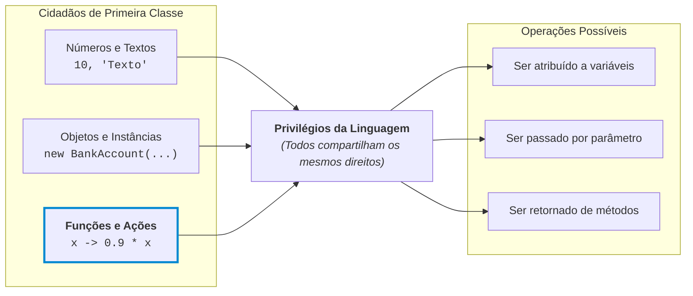
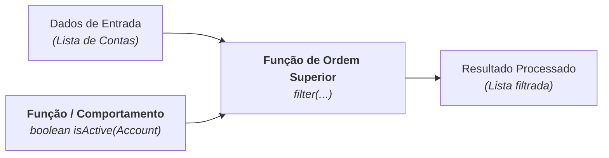

# 1. O Pensamento Funcional

No [Módulo 00, Capítulo 05 (Classificação dos
Paradigmas)](../../00-fundamentos/05-classificacao-de-paradigmas.md), vimos que
as linguagens e estilos de programação podem ser divididos em duas grandes
famílias:

- **Imperativo:** você descreve passo a passo _como_ o computador deve chegar ao
  resultado (controlando loops, variáveis contadoras e mutações de estado).
- **Declarativo:** você descreve _o quê_ deseja obter como resultado, delegando
  para a linguagem ou biblioteca o controle de como executar esse processo.

A **Programação Funcional** (_Functional Programming_ ou _FP_) é um dos pilares
mais importantes da família declarativa. Ela modela a computação como a
avaliação de funções matemáticas, tratando dados e regras de transformação de
forma limpa, direta e previsível.

Neste capítulo, não vamos nos preocupar com sintaxes específicas do Java. Nosso
objetivo é **construir o modelo mental funcional**: entender os conceitos que
revolucionaram o desenvolvimento de software e que transformaram o Java a partir
da versão 8.

## 1. Funções de Primeira Classe (_First-Class Functions_)

Em linguagens procedurais tradicionais e nas primeiras versões do Java, existia
uma separação rígida entre dois mundos:

1. **Dados:** números (`int`, `double`), textos (`String`) e objetos
   (`BankAccount`) podiam ser criados, guardados em variáveis, passados como
   argumentos para métodos e devolvidos em um `return`.
2. **Ações (Código/Métodos):** blocos de instrução que só podiam existir
   "presos" dentro de classes, sendo executados no local onde foram chamados.

Dizemos que uma linguagem possui **Funções de Primeira Classe** quando **as
funções são tratadas exatamente como qualquer outro valor**.



Na prática, isso significa que uma função pode:

- Ser atribuída a uma variável

  ```java
  Function<Double, Double> discountRule = x -> 0.9 * x;
  ```

- Ser guardada dentro de uma lista ou mapa de regras

  ```java
  List<Function<Double, Double>> discountRules = List.of(
    x -> 0.9 * x,
    x -> x - 10.0
  );
  ```

- Ser enviada por parâmetro para outro método como se fosse um dado qualquer

  ```java
  product.applyDiscount(r -> r * 0.9);
  ```

- Ser construída e devolvida dinamicamente por outro método

  ```java
  Function<Double, Double> makePercentageDiscountRule(double percentage) {
    return value -> value * (1 - percentage);
  }

  Function<Double, Double> rule10 = makePercentageDiscountRule(0.1);
  Function<Double, Double> rule20 = makePercentageDiscountRule(0.2);
  ```

Não se preocupe se não entender exatamente o que significa ou como funciona o
código acima. O importante é entender o conceito: podemos tratar funções como
valores da mesma forma que outros tipos de dados com que trabalhamos desde o
início do curso.

> **A Mudança de Perspectiva:**
>
> Em vez de passar apenas os **dados** para um método processar, passamos também
> o **comportamento** (a receita da operação) que ele deve aplicar sobre esses
> dados.

## 2. Funções de Ordem Superior (_Higher-Order Functions_)

Se as funções agora podem viajar pelo código como valores, chegamos naturalmente
ao conceito mais poderoso da programação funcional: as **Funções de Ordem
Superior** (_Higher-Order Functions_).

Uma função é dita de ordem superior se ela cumpre pelo menos um destes dois
critérios:

1. **Recebe uma ou mais funções como argumento.**
2. **Retorna uma função como resultado.**



### Por Que Isso Muda Tudo? (A Separação entre "Navegar" e "Fazer")

Pense no estilo imperativo clássico: se você precisa filtrar contas bancárias
ativas e depois filtrar contas com saldo negativo, você costuma escrever dois
laços `for` quase idênticos, duplicando toda a lógica de iteração:

```java
// ❌ Abordagem imperativa clássica: repetição da mecânica de navegação
List<Account> activeAccounts = new ArrayList<>();
for (Account acc : accounts) {
    if (acc.isActive()) {
        activeAccounts.add(acc);
    }
}

List<Account> negativeAccounts = new ArrayList<>();
for (Account acc : accounts) {
    if (acc.getBalance() < 0) {
        negativeAccounts.add(acc);
    }
}
```

Com Funções de Ordem Superior, dividimos a responsabilidade em duas partes
independentes:

1. **A mecânica do processo (o mecanismo):** Uma função genérica que sabe como
   percorrer a lista com segurança e acumular o resultado.
2. **A regra de negócio (o critério):** Uma função pequena e específica que diz
   apenas se uma conta individual atende ou não ao critério.

Veja uma prévia de como essa separação funciona:

```java
// ✅ Função de Ordem Superior: encapsula a navegação e recebe a regra por parâmetro
List<Account> filter(List<Account> list, Condition<Account> rule) {
    List<Account> result = new ArrayList<>();

    // Faz o trabalho pesado de navegar pela lista
    for (Account item : list) {

        // Aplica a regra recebida dinamicamente
        if (rule.test(item)) {
            result.add(item);
        }

    }

    return result;
}

// No uso, você expressa apenas a sua intenção:
List<Account> activeAccounts   = filter(accounts, acc -> acc.isActive());
List<Account> negativeAccounts = filter(accounts, acc -> acc.getBalance() < 0);
```

A função `filter` é uma **função de ordem superior**: ela não se importa com
qual critério você inventará amanhã; ela apenas recebe a sua regra por parâmetro
e a aplica para cada elemento. Mais adiante, veremos que o Java já traz essa
mecânica pronta e otimizada por meio da **Streams API**.

## 3. O Casamento OO + Funcional no Java Moderno

Java não é uma linguagem puramente funcional (como Haskell ou Clojure), e isso é
intencional. Java é uma linguagem **multiparadigma pragmática**:

- A **Orientação a Objetos** continua sendo a espinha dorsal para modelar o
  domínio, definir contratos de arquitetura
  ([Interfaces](../../02-oo/05-abstracao.md)), proteger invariantes de dados
  ([Encapsulamento](../../02-oo/06-encapsulamento.md)) e estruturar sistemas
  grandes.
- O **Paradigma Funcional** entra como uma ferramenta de alta produtividade para
  manipulação e transformação de dados, regras de negócio dinâmicas, validações
  e concorrência segura.

Nos próximos capítulos, veremos como a linguagem adaptou suas regras de tipos
estáticos para abraçar funções de primeira classe e funções de ordem superior
com elegância.

---

<details>
<summary>🔍 <b>Aprofundando no Paradigma Funcional Puro (Opcional)</b></summary>

Para quem tiver curiosidade em conhecer os conceitos teóricos mais rigorosos da
programação funcional clássica, destacam-se quatro pilares:

### 1. Funções Puras (_Pure Functions_)

Uma função é dita **pura** quando satisfaz duas condições:

- **Determinismo:** Para os mesmos argumentos de entrada, ela sempre retorna
  exatamente o mesmo resultado (como uma função matemática $f(x) = x \times 2$).
- **Livre de Efeitos Colaterais (_No Side Effects_):** Ela não altera variáveis
  globais, não modifica os parâmetros recebidos, não altera arquivos no disco e
  não depende de estados externos mutáveis (como relógio do sistema ou variáveis
  estáticas mutáveis).

### 2. Transparência Referencial (_Referential Transparency_)

Uma expressão possui transparência referencial se puder ser substituída
diretamente pelo seu valor resultante em qualquer lugar do programa sem alterar
o comportamento do sistema. Por exemplo, se `sum(2, 3)` sempre resulta em `5`,
substituir a chamada pelo número `5` não causa nenhum impacto oculto.

### 3. Imutabilidade e Estruturas Persistentes

Em linguagens funcionais puras, variáveis nunca mudam de valor após serem
criadas (_dados são imutáveis_). Se você deseja "alterar" um dado, você cria uma
nova versão com a modificação necessária. Isso elimina bugs clássicos de
concorrência onde duas threads tentam alterar a mesma memória ao mesmo tempo.

### 4. Avaliação Estrita (_Eager_) vs Avaliação Preguiçosa (_Lazy_)

- **Avaliação Estrita (_Eager_):** Uma expressão é calculada no exato momento em
  que é declarada ou atribuída.
- **Avaliação Preguiçosa (_Lazy_):** O cálculo é adiado até o último momento
  possível — quando o valor é de fato exigido por um consumidor final. Se o
  resultado nunca for lido, a computação sequer é executada. Veremos que esse é
  exatamente o segredo da performance da **Streams API** no Java!

</details>

---

> **Checkpoint:**
>
> Pense em um sistema de e-commerce que precisa calcular o frete de um pedido.
> Como você explicaria a diferença entre:
>
> 1. Passar um valor numérico fixo de desconto como parâmetro.
> 2. Passar uma **função de cálculo de desconto** como parâmetro?
>
> Qual das duas abordagens torna o sistema mais aberto para novos tipos de
> promoções no futuro?

---

<p align="right"><a href="02-interfaces-funcionais-e-classes-anonimas.md">Próximo: Interfaces Funcionais e Classes Anônimas →</a></p>
