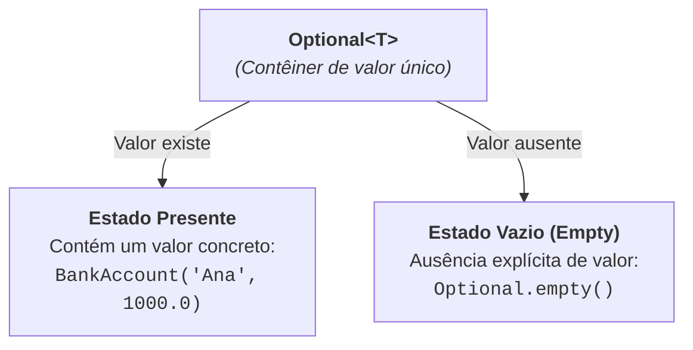

# 4. Tratamento de Ausência com Optional

Em quase todas as linguagens de programação tradicionais, o valor `null`
representa a ausência de um objeto. No entanto, `null` é uma das fontes mais
frequentes de erros em software, levando ao temido **`NullPointerException`
(NPE)**.

O próprio criador do conceito de referência nula, Sir Tony Hoare, declarou
publicamente em 2009 que a criação do `null` foi o seu _"erro de um bilhão de
dólares"_, devido à quantidade imensa de falhas, vulnerabilidades e código
defensivo desnecessário gerado ao longo das décadas.

Com o Java 8, a linguagem introduziu uma abordagem muito mais segura, explícita
e funcional para lidar com valores ausentes: a classe **`Optional<T>`** (no
pacote `java.util`).

## 1. O Problema do `null` no Dia a Dia

Imagine um repositório que busca uma conta bancária pelo seu número de
identificação:

```java
// Estilo clássico (retornando null quando não encontra):
public BankAccount findById(String id) {
    if (database.containsKey(id)) {
        return database.get(id);
    }

    return null; // O perigo silencioso mora aqui
}
```

Ao consumir esse método, o desenvolvedor é obrigado a lembrar de fazer checagens
defensivas manuais em todos os lugares:

```java
BankAccount account = accountRepository.findById("999");

// Se esquecer este 'if', o sistema quebra em produção com NullPointerException!
if (account != null) {
    System.out.println("Saldo: " + account.getBalance());
} else {
    System.out.println("Conta não encontrada.");
}
```

O grande problema do `null` é a **falta de expressividade**: a assinatura do
método `BankAccount findById(String id)` promete que devolve um `BankAccount`,
mas o compilador não ajuda a lembrar que o resultado pode ser nulo.

## 2. O Que É o `Optional<T>`?

O **`Optional<T>`** é um contêiner (uma "caixa") que pode conter **exatamente um
valor do tipo `T`** ou estar **vazio**.



Ao mudar o retorno do método para `Optional<BankAccount>`, comunicamos com
clareza para quem consome a API:

```java
// O tipo avisa expressamente: o retorno pode ou não existir!
public Optional<BankAccount> findById(String id) {
    BankAccount account = database.get(id);
    return Optional.ofNullable(account);
}
```

Agora, quem chama o método não pode acessar a conta diretamente sem antes lidar
com a possibilidade de ela estar vazia.

## 3. Criando Instâncias de `Optional`

Existem três métodos estáticos de fábrica para criar um `Optional`:

### 1. `Optional.ofNullable(valor)` (O Mais Utilizado)

Cria um `Optional` contendo o valor se ele não for nulo, ou retorna um
`Optional.empty()` se o valor for `null`:

```java
String possibleName = database.findName(); // pode ser "Carlos" ou null
Optional<String> optName = Optional.ofNullable(possibleName);
```

### 2. `Optional.of(valor)`

Cria um `Optional` garantindo que o valor **não é nulo**. Se você passar `null`
para `Optional.of()`, ele lançará um `NullPointerException` imediatamente no
ponto de criação:

```java
// Use quando tiver certeza absoluta de que o valor nunca será nulo:
Optional<String> guaranteedName = Optional.of("Ana");
```

### 3. `Optional.empty()`

Cria explicitamente uma "caixa vazia":

```java
Optional<BankAccount> notFound = Optional.empty();
```

## 4. Operações Fluentes e Estilo Funcional

O grande poder do `Optional` não está em fazer `if (opt.isPresent())`, mas sim
em utilizar seus **métodos funcionais encadeados** com Expressões Lambda.

### 1. Executando Ações Condicionais (`ifPresent` e `ifPresentOrElse`)

Em vez de escrever um bloco `if`, passe um `Consumer` que só será executado se o
valor existir:

```java
Optional<BankAccount> optAccount = accountRepository.findById("001");

// Executa a ação somente se a conta estiver presente:
optAccount.ifPresent(acc -> System.out.println("Titular: " + acc.getHolder()));

// Com ifPresentOrElse (Java 9+): ação se presente + ação se ausente (Runnable)
optAccount.ifPresentOrElse(
    acc -> System.out.println("Saldo: " + acc.getBalance()),
    () -> System.out.println("Conta não localizada!")
);
```

### 2. Transformando Valores com `map` e `filter`

Você pode transformar ou filtrar o conteúdo interno do `Optional` sem precisar
desempacotá-lo manualmente:

```java
// 1. Extraindo apenas o saldo da conta (se ela existir):
Optional<Double> balance = accountRepository.findById("001")
    .map(BankAccount::getBalance);

// 2. Filtrando apenas contas que atendem a um critério:
Optional<BankAccount> vipAccount = accountRepository.findById("001")
    .filter(acc -> acc.getBalance() >= 10_000.0);
```

Se o `Optional` original estiver vazio, ou se o `filter` reprovar o item, o
resultado final será simplesmente um `Optional.empty()`, sem disparar nenhum
erro.

### 3. Evitando Optionals Aninhados com `flatMap`

Se a transformação que você aplicar já retornar outro `Optional`, usar `map`
resultaria em um `Optional<Optional<T>>` aninhado. Para "achatar" a estrutura em
um único nível, usamos `flatMap`:

```java
public Optional<String> getCardNumber(BankAccount account) {
    // Retorna Optional<String>
    return Optional.ofNullable(account.getCardNumber());
}

// Com flatMap: evita Optional<Optional<String>>
Optional<String> cardNumber = accountRepository.findById("001")
    .flatMap(getCardNumber);
```

## 5. Extraindo Valores com Segurança

Quando você finalmente precisa do dado bruto encapsulado dentro do `Optional`,
existem três alternativas seguras:

### 1. `orElse(valorPadrao)`

Retorna o valor presente ou um valor padrão pré-definido:

```java
String holder = accountRepository.findById("999")
    .map(BankAccount::getHolder)
    .orElse("Titular Desconhecido");
```

### 2. `orElseGet(Supplier)` (Avaliação Sob Demanda / _Lazy_)

Use `orElseGet` quando o valor padrão envolver uma computação pesada ou uma nova
instanciação. O `Supplier` só será executado se o `Optional` estiver vazio:

```java
// A nova conta só é instanciada se a busca no banco falhar:
BankAccount account = accountRepository.findById("001")
    .orElseGet(() -> new BankAccount("Conta Temporária", "000", 0.0));
```

### 3. `orElseThrow(Supplier<Exception>)`

Se a ausência do valor representar um erro de negócio ou violação de regra,
lance uma exceção de domínio personalizada:

```java
BankAccount account = accountRepository.findById("001")
    .orElseThrow(() -> new AccountNotFoundException("Conta 001 inexistente!"));
```

---

## 6. Boas Práticas e Anti-patterns com `Optional`

Para aproveitar o `Optional` com excelência em projetos reais, siga estas regras
de design:

| Prática                            | Recomendação      | Por Quê?                                                                                                                                                                       |
| :--------------------------------- | :---------------- | :----------------------------------------------------------------------------------------------------------------------------------------------------------------------------- |
| **Chamar `.get()` diretamente**    | ❌ **Evite!**     | Se o `Optional` estiver vazio, `.get()` lança `NoSuchElementException`, recriando o mesmo problema do NPE. Prefira `orElse`, `orElseGet` ou `orElseThrow`.                     |
| **Campos de classe / Atributos**   | ❌ **Evite!**     | `Optional` não é serializável (`Serializable`) e adiciona sobrecarga de memória em entidades gravadas no banco de dados.                                                       |
| **Parâmetros de métodos**          | ❌ **Evite!**     | Obriga quem chama o método a embrulhar parâmetros em `Optional.ofNullable()`, poluindo o código cliente. Em vez disso, use sobrecarga de métodos se um parâmetro for opcional. |
| **Retorno de métodos de consulta** | ✅ **Uso ideal!** | O objetivo primordial do `Optional` é sinalizar explicitamente que uma consulta ou busca pode não encontrar o registro.                                                        |

---

<a href="03-expressoes-lambda-e-method-references.md">← 3. Expressões Lambda e
Method References</a>

<p align="right"><a href="05-streams-fundamentos.md">Próximo: Streams API — Fundamentos e Intuição →</a></p>
