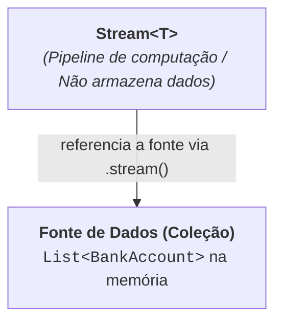
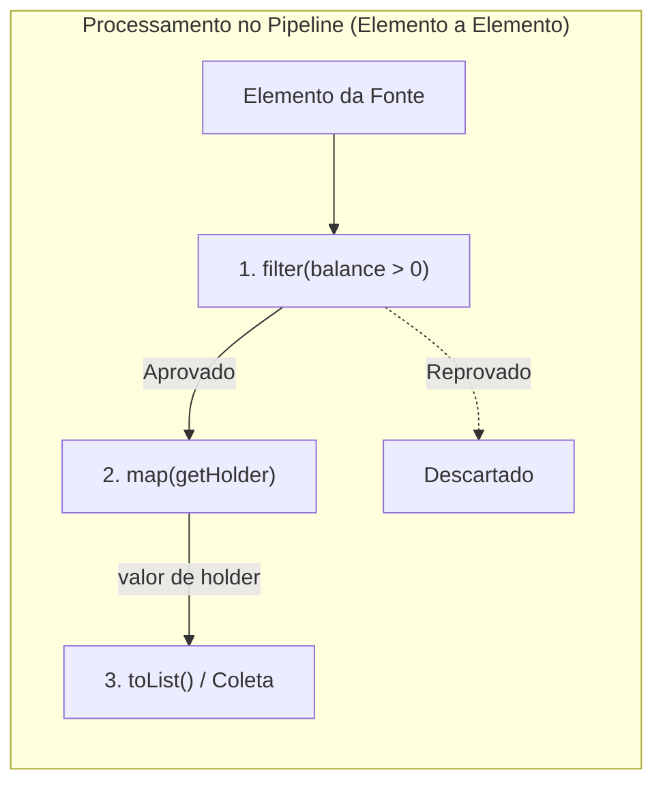
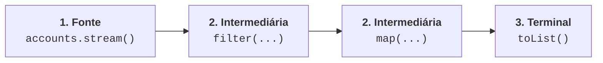

# 5. Streams API: Intuição e Fundamentos

Até aqui, aprendemos a tratar funções como valores ([Capítulo
01](01-o-pensamento-funcional.md)), a utilizar interfaces funcionais ([Capítulo
02](02-interfaces-funcionais-e-classes-anonimas.md)), a escrever expressões
lambda enxutas ([Capítulo 03](03-expressoes-lambda-e-method-references.md)) e a
tratar ausência de dados de forma segura com `Optional` ([Capítulo
04](04-optional.md)).

Agora, vamos unir todas essas peças no recurso mais poderoso e expressivo do
Java moderno: a **Streams API** (no pacote `java.util.stream`).

Streams costumam causar confusão em quem está tendo o primeiro contato com o
paradigma funcional, pois representam um conceito altamente abstrato. Por isso,
antes de escrever código, vamos construir uma **intuição visual e prática** do
que é uma Stream.

## 1. O Que É uma Stream?

Para entender o que é uma Stream, a melhor abordagem é compará-la com o que você
já conhece muito bem: as **Coleções** (`List`, `Set`, `Map`).

### Analogia: A Gaveta vs A Esteira Rolante

- **Uma Coleção (`List`, `Set`) é como uma gaveta cheia de peças:** todas as
  peças já estão fisicamente guardadas na memória ao mesmo tempo. O foco da
  coleção é o **armazenamento estático** de dados.
- **Uma Stream (`Stream<T>`) é como uma esteira rolante de fábrica:** ela não
  guarda peças. Ela é um **fluxo contínuo de trabalho** por onde os itens passam
  um a um, sofrendo etapas de inspeção, pintura e montagem conforme se movem em
  direção ao fim da linha.

Uma Stream não armazena dados próprios: ela **se conecta e referencia uma fonte
de dados** (como uma `List` ou `Set`), funcionando como um pipeline de
instruções sobre essa fonte:



### O Processamento Elemento por Elemento

Quando o pipeline é acionado, cada item da coleção fonte é puxado
individualmente e passa pelas etapas de processamento:



### A Diferença Fundamental: Coleção vs Stream

| Aspecto            | Coleção (`List`, `Set`)                                                          | Stream (`Stream<T>`)                                                                       |
| :----------------- | :------------------------------------------------------------------------------- | :----------------------------------------------------------------------------------------- |
| **Objetivo**       | **Armazenar** dados na memória.                                                  | **Computar / transformar** dados sob demanda.                                              |
| **Uso de Memória** | Ocupa espaço proporcional à quantidade total de itens.                           | Não armazena itens; é um canal de processamento temporário.                                |
| **Mutabilidade**   | Permite adicionar (`add`) e remover (`remove`) elementos da própria estrutura.   | **Não altera a fonte original**; produz novos resultados de forma imutável.                |
| **Reutilização**   | Pode ser percorrida quantas vezes você quiser.                                   | **Consumida uma única vez:** após chegar ao fim da esteira, a Stream é fechada.            |
| **Avaliação**      | **Estrita (_Eager_):** todos os elementos já existem e estão prontos na memória. | **Preguiçosa (_Lazy_):** o processamento só acontece quando o resultado final for exigido. |

## 2. A Anatomia do Pipeline de Streams

Todo processamento com Streams em Java é estruturado como um **pipeline** (duto
de operações) composto por três etapas obrigatórias:

$$
\text{1. Fonte (Source)} \longrightarrow \text{2. Operações Intermediárias (0
ou mais)} \longrightarrow \text{3. Operação Terminal (1)}
$$

<div align="center">



</div>

1. **A Fonte (_Source_):** De onde os dados vêm (uma lista, um conjunto, um
   array ou gerador numérico).
2. **Operações Intermediárias:** Transformam uma Stream em outra Stream
   (encadeamento). Elas definem **o que** deve ser feito, mas **não executam o
   trabalho imediatamente**.
3. **Operação Terminal:** Dispara a execução de toda a esteira e fecha o fluxo,
   produzindo um resultado final (uma nova `List`, um número somado, um valor
   booleano ou um efeito colateral).

## 3. Avaliação Preguiçosa (_Lazy Evaluation_) na Prática

Uma das maiores vantagens da Streams API é que as operações intermediárias são
**preguiçosas** (_lazy_).

Pense em uma torneira com um encanamento cheio de filtros: mesmo que você monte
dez filtros sofisticados ao longo do tubo, a água só começa a se mover quando
você **abre a torneira na ponta** (a operação terminal).

Veja este exemplo:

```java
List<String> names = List.of("Ana", "Bruno", "Carlos", "Beatriz");

// Montando o pipeline (NENHUM processamento ocorre aqui ainda!):
Stream<String> stream = names.stream()
    .filter(name -> {
        System.out.println("Filtrando: " + name);
        return name.startsWith("B");
    });

System.out.println("Pipeline criado. Chamando a operação terminal...");

// Agora sim! A operação terminal toList() abre a torneira e processa os dados:
List<String> result = stream.toList();
System.out.println("Resultado: " + result);
```

**Saída no console:**

```text
Pipeline criado. Chamando a operação terminal...
Filtrando: Ana
Filtrando: Bruno
Filtrando: Carlos
Filtrando: Beatriz
Resultado: [Bruno, Beatriz]
```

### Otimização Interna: Execução em Passagem Única (Vertical vs Horizontal)

Para entender a eficiência das Streams, compare duas formas de encadear
operações:

#### 1. Abordagem Ineficiente (Criando listas intermediárias a cada etapa)

```java
List<String> names = List.of("Ana", "Bruno", "Carlos", "Beatriz");

// 1. Cria uma lista inteira intermediária na memória apenas para o filtro:
List<String> filtered = names.stream()
    .filter(name -> name.startsWith("B"))
    .toList(); // [Bruno, Beatriz]

// 2. Cria outra lista inteira na memória apenas para a transformação:
List<String> result = filtered.stream()
    .map(String::toUpperCase)
    .toList(); // [BRUNO, BEATRIZ]
```

Nessa abordagem "horizontal", todos os 4 elementos da lista precisam ser
processados primeiro pelo filtro (alocando uma nova lista na memória), e somente
depois a segunda lista é percorrida para transformar os elementos que passaram
no filtro.

#### 2. Abordagem Otimizada (Pipeline Único em Execução Vertical):

```java
// Um único pipeline: sem nenhuma lista intermediária alocada na memória
List<String> result = names.stream()
    .filter(name -> {
        System.out.println("filter: " + name);
        return name.startsWith("B");
    })
    .map(name -> {
        System.out.println("map: " + name);
        return name.toUpperCase();
    })
    .toList();
```

**Saída no console:**

```text
filter: Ana
filter: Bruno
map: Bruno
filter: Carlos
filter: Beatriz
map: Beatriz
```

Observe a sequência no console: assim que `"Bruno"` é aprovado pelo `filter`,
ele já avança **imediatamente** para o `map`, antes mesmo de `"Carlos"` ou
`"Beatriz"` serem avaliados.

Cada elemento percorre o pipeline de ponta a ponta em uma **única passagem**,
economizando memória e ciclos de CPU.

## 4. Operações Intermediárias Essenciais

As operações intermediárias retornam um novo `Stream<T>`, permitindo encadear
múltiplas etapas de processamento:

### 1. `filter(Predicate<T>)`

Filtra os elementos da Stream mantendo apenas aqueles que satisfazem a condição
booleana:

```java
List<BankAccount> positiveAccounts = accounts.stream()
    .filter(acc -> acc.getBalance() > 0)
    .toList();
```

### 2. `map(Function<T, R>)`

Transforma cada elemento de entrada do tipo `T` em um elemento de saída do tipo
`R` (mapeamento 1 para 1):

```java
// Converte uma Stream<BankAccount> em uma Stream<String> com os nomes dos titulares:
List<String> holders = accounts.stream()
    .map(BankAccount::getHolder)
    .toList();
```

### 3. `sorted()` e `sorted(Comparator<T>)`

Ordena os elementos de forma declarativa. Você pode usar
`Comparator.comparing()` para definir o critério de ordenação com clareza:

```java
// Ordena as contas pelo saldo em ordem crescente:
List<BankAccount> sortedByBalance = accounts.stream()
    .sorted(Comparator.comparing(BankAccount::getBalance))
    .toList();
```

### 4. `distinct()`

Remove itens duplicados da Stream, utilizando os métodos `equals()` e
`hashCode()` dos objetos:

```java
List<Integer> numbers = List.of(1, 2, 2, 3, 4, 4, 5);

List<Integer> unique = numbers.stream()
    .distinct()
    .toList(); // [1, 2, 3, 4, 5]
```

### 5. `limit(n)` e `skip(n)`

Permitem controlar a quantidade de dados processados, excelente para implementar
paginação:

```java
List<BankAccount> top3Accounts = accounts.stream()
    .sorted(Comparator.comparing(BankAccount::getBalance).reversed())
    .limit(3) // Pega apenas os 3 primeiros
    .toList();

List<BankAccount> page2 = accounts.stream()
    .skip(10)  // Pula os 10 primeiros
    .limit(10) // Pega os próximos 10
    .toList();
```

### 6. `flatMap(Function<T, Stream<R>>)`

Usado quando cada elemento contém uma coleção interna e você deseja **achatar**
(_flatten_) todas as subcoleções em um único fluxo contínuo de itens:

```java
// Cada cliente possui uma List<BankAccount>:
List<Client> clients = getClients();

// flatMap extrai as contas de todos os clientes e une em uma única Stream<BankAccount>:
List<BankAccount> allAccounts = clients.stream()
    .flatMap(client -> client.getAccounts().stream())
    .toList();
```

---

## 5. O Poder do Encadeamento: Construindo Pipelines Reais

O verdadeiro poder das Streams se revela quando combinamos várias operações
intermediárias em uma sequência fluente e declarativa.

Imagine o seguinte requisito de negócio:

> _"Obter os nomes (em letras maiúsculas) dos 3 titulares de contas ativas com
> os maiores saldos do banco."_

### A Solução Imperativa Tradicional (Cheia de Cerimônia e Variáveis Temporárias)

```java
// ❌ Abordagem imperativa: misturando navegação, filtros, ordenação e mutação
List<BankAccount> activeAccounts = new ArrayList<>();
for (BankAccount acc : accounts) {
    if (acc.isActive()) {
        activeAccounts.add(acc);
    }
}

activeAccounts.sort(new Comparator<BankAccount>() {
    @Override
    public int compare(BankAccount a, BankAccount b) {
        return Double.compare(b.getBalance(), a.getBalance()); // decrescente
    }
});

List<String> top3Holders = new ArrayList<>();
for (int i = 0; i < Math.min(3, activeAccounts.size()); i++) {
    top3Holders.add(activeAccounts.get(i).getHolder().toUpperCase());
}
```

### A Solução Funcional Elegante com Streams Encadeadas

```java
// ✅ Abordagem funcional: cada linha expressa exatamente uma intenção de negócio
List<String> top3Holders = accounts.stream()
    .filter(BankAccount::isActive)                                     // 1. Apenas contas ativas
    .sorted(Comparator.comparing(BankAccount::getBalance).reversed())  // 2. Ordenadas do maior para o menor saldo
    .map(BankAccount::getHolder)                                       // 3. Extrai apenas o nome do titular
    .map(String::toUpperCase)                                          // 4. Converte para letras maiúsculas
    .limit(3)                                                          // 5. Pega os 3 primeiros
    .toList();                                                         // 6. Coleta na lista final
```

Observe a diferença:

- O código em Streams se lê quase como uma frase em linguagem natural: **"Das
  contas, pegue as ativas, ordene pelo saldo decrescente, extraia o titular em
  maiúsculas, limite em 3 e gere a lista"**.
- Não criamos nenhuma lista intermediária na memória.
- Não controlamos contadores manuais (`i = 0`, `i < 3`).
- O risco de erros de índice (_IndexOutOfBoundsException_) é eliminado.

## O Próximo Passo

Agora você já compreende o que é uma Stream, como funciona a avaliação
preguiçosa e como transformar dados com as principais operações intermediárias.

No próximo capítulo, vamos focar no encerramento do pipeline: aprenderemos as
**Operações Terminais**, a operação de **Redução (`reduce`)** e o poderoso
conjunto de **Coletores (`Collectors`)** para agrupar, particionar e sumarizar
dados em relatórios sofisticados.

---

<a href="04-optional.md">← 4. Tratamento de Ausência com Optional</a>

<p align="right"><a href="06-streams-coletores-e-reducao.md">Próximo: Streams API — Redução e Coletores →</a></p>
