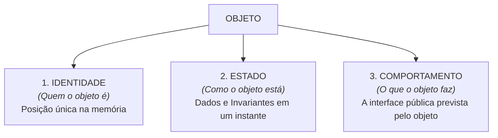
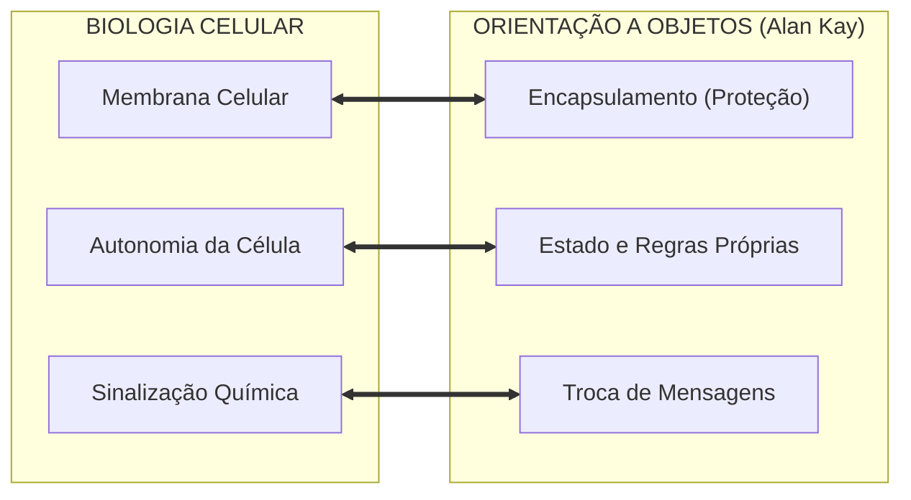
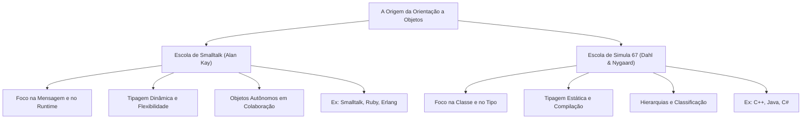

# Módulo 2 — O que é um Objeto? Identidade, Estado e a Essência da OO

## Introdução: Além do "A Classe é o Molde e o Objeto é a Casa"

A grande maioria dos materiais introdutórios ensina Orientação a Objetos
partindo de uma metáfora totalmente centrada na sintaxe de classes: _"A classe é
a planta baixa ou o molde, e o objeto é a casa ou a instância criada por esse
molde"_.

Embora essa metáfora ajude a escrever a primeira linha de código em linguagens
como Java ou C#, ela esconde a filosofia fundamental que deu origem ao
paradigma. Segundo uma leitura comum da história, **os objetos vieram antes das
classes**.

Para compreender a essência do que é um objeto, precisamos nos libertar do vício
de olhar apenas para as palavras-chave do compilador e entender a sua anatomia,
o seu comportamento na memória e a visão dos pioneiros da computação.

## 1. A Tríplice Anatomia de um Objeto

Em termos conceituais e estruturais, um objeto não é apenas um agrupamento de
variáveis. Ele é uma entidade autônoma na memória do computador definida por
três características fundamentais: **Identidade, Estado e Comportamento**.



### Identidade

A **identidade** é o atributo que torna um objeto único no sistema,
independentemente dos dados que ele armazena em um determinado momento. Em
implementações convencionais, a identidade manifesta-se por meio da referência
que identifica unicamente aquele objeto em memória, ainda que sua posição física
possa mudar durante a execução.

É a identidade que nos permite diferenciar duas entidades mesmo que elas possuam
exatamente os mesmos dados internos.

Considere o seguinte exemplo em Java:

```java
public class Person {
    private String name;
    private int age;

    public Person(String name, int age) {
        this.name = name;
        this.age = age;
    }
}

// No código principal:
Person personA = new Person("Alice", 25);
Person personB = new Person("Alice", 25);

System.out.println(personA == personB); // Imprime: false
```

Por que o operador `==` resulta em `false` se ambas as instâncias possuem o nome
`"Alice"` e a idade `25`?

Porque o operador `==` em Java (para tipos de referência) compara a **identidade
física na memória**. `personA` e `personB` apontam para dois blocos de memória
RAM inteiramente distintos. Mudar a idade de `personA` não terá qualquer impacto
em `personB`, pois identidade e estado são conceitos distintos: dois objetos
podem compartilhar exatamente o mesmo estado sem deixar de ser entidades
diferentes.

#### Identidade em Memória vs. Critérios de Igualdade

Entender a identidade exige distinguir a **existência física do objeto** da
forma como avaliamos a sua **igualdade no domínio do problema**. Na prática,
existem três formas de comparar duas entidades:

##### 1. Identidade Física em Memória (Endereço)

É o local exato onde o objeto reside na memória RAM. Dois objetos são
fisicamente idênticos apenas se forem, na verdade, a mesmíssima referência na
memória (`personA == personA`).

##### 2. Igualdade Semântica por Valor (Value Objects)

Existem dados cuja essência não é _quem_ eles são na memória, mas sim o _valor_
que carregam.

- **Exemplo:** A nota de R$ 50,00 que está na sua carteira tem um número de
  série único (identidade física), mas quando você compra um lanche, o
  comerciante só se importa com o **valor** de R$ 50,00.
- Em código, quando lidamos com números, datas, strings ou conceitos como moeda,
  não queremos saber se duas variáveis apontam para o mesmo endereço de memória,
  mas se os seus conteúdos são equivalentes. É por isso que em Java utilizamos
  `.equals()` em vez de `==` para comparar o valor de duas `Strings`.

##### 3. Identificador de Negócio (Chaves de Banco de Dados)

Na maioria dos sistemas comerciais, utilizamos identificadores de negócio (como
um `ID` numérico auto-incremental ou um `UUID`) para mapear registros
persistidos em um banco de dados.

Contudo, é preciso ter extremo cuidado: **não confunda o ID do banco de dados
com a identidade do objeto na memória RAM.**

Imagine a seguinte situação:

1. Uma thread busca o cliente `ID = 42` no banco de dados e carrega na memória a
   instância `A`.
2. Em outro ponto do sistema, outra thread busca o mesmo cliente `ID = 42` e
   carrega a instância `B`.
3. A instância `A` altera o e-mail do cliente, enquanto a instância `B`
   permanece com o e-mail antigo.

Neste instante, você tem dois objetos com o **mesmo ID de negócio**, mas que
residem em **endereços de memória diferentes** e possuem **estados
divergentes**. Comparar apenas o ID do banco pode mascarar o fato de que você
está manipulando instâncias dessincronizadas na memória.

### Estado

O **estado** representa o conjunto de dados, informações e referências
armazenadas pelo objeto em um determinado instante no tempo.

O estado não é apenas um "saco de variáveis". Ele representa a memória interna
do objeto e está diretamente atrelado à **preservação de invariantes** (as
regras do negócio que nunca podem ser violadas, como "o saldo de uma conta não
pode ficar negativo sem limite aprovado").

### Comportamento

O **comportamento** define o conjunto de ações, operações e reações que o objeto
é capaz de executar.

Ele representa a **interface pública prevista pelo objeto** para operar sobre o
estado do objeto. Em vez de permitir que o código externo altere as variáveis
internas diretamente, o objeto expõe métodos que executam ações de negócio,
garantindo que o seu estado transite apenas entre instâncias válidas e
consistentes.

## 2. Objeto != Classe: O Conceito vs. O Mecanismo

Uma das confusões mais persistentes no aprendizado sobre Orientação a Objetos é
assumir que "Orientação a Objetos é escrever classes".

- **Objeto:** É o **conceito fundamental do paradigma** — uma entidade autônoma
  na memória que agrupa estado e comportamento.
- **Classe:** É apenas um **mecanismo de construção** adotado por diversas
  linguagens para descrever e fabricar objetos.

Existem linguagens orientadas a objetos que **não possuem o conceito de
classes**. Nelas, os objetos são criados diretamente ou clonados a partir de
outros objetos (mecanismo conhecido como _Orientação a Objetos Baseada em
Protótipos_).

Veja como o mesmo conceito de "objeto com dados e comportamento" se manifesta em
diferentes linguagens:

**Em Java (Baseado em Classes):**

```java
// A classe funciona como um gabarito para instanciar o objeto
public class BankAccount {
    private double balance = 100.0;

    public void deposit(double amount) {
        if (amount > 0) this.balance += amount;
    }
}

BankAccount account = new BankAccount();
```

**Em JavaScript (Criação Direta de Objeto Literal):**

```javascript
// O objeto é criado diretamente na memória, sem declarar uma classe!
const account = {
  balance: 100.0,

  deposit(amount) {
    if (amount > 0) this.balance += amount;
  },
};
```

**Em Lua (Orientação a Objetos via Tabelas):**

```lua
-- Lua utiliza tabelas para representar objetos e seus métodos
account = { balance = 100.0 }

function account:deposit(amount)
    if amount > 0 then self.balance = self.balance + amount end
end
```

Em linguagens históricas como **Self**, os objetos eram clonados e modificados
em tempo de execução sem que jamais existisse uma "classe" no código. Entender
essa diferença é libertador: **classes são apenas uma das ferramentas possíveis
para se criar objetos**.

## 3. A Visão de Alan Kay: Inspiração Biológica e Redes

Para compreender a verdadeira intenção da Orientação a Objetos, precisamos
recorrer a quem cunhou o termo. **Alan Kay**, um dos cientistas da computação
mais influentes da história e idealizador da linguagem **Smalltalk** no Xerox
PARC, tinha formação acadêmica em Biologia e Matemática.

Sua inspiração para os objetos não veio de formulários de cadastro ou tabelas de
banco de dados, mas sim da **biologia celular** e do funcionamento das **redes
de computadores (ARPANET)**.



Kay imaginou o software como um organismo vivo composto por milhares de
"células" (objetos) individuais:

1. **Membrana Celular (Encapsulamento):** Cada célula possui uma membrana que
   protege seu interior. Nada de fora pode tocar diretamente no seu núcleo.
2. **Autonomia (Memória e Comportamento Próprios):** Cada célula é um pequeno
   computador completo, com sua própria memória e suas próprias regras de
   sobrevivência.
3. **Sinalização Química (Troca de Mensagens):** Uma célula não altera os órgãos
   de outra célula diretamente. Elas trocam mensagens químicas. A célula
   receptora analisa o sinal e decide autonomamente como reagir.

### "The Big Idea is Messaging"

Em 1998, ao refletir sobre como a indústria havia interpretado a sua criação,
Alan Kay escreveu uma frase antológica que se tornou um marco da Ciência da
Computação:

> _"I'm sorry that I long ago used the term 'objects' for this concept because
> it gets many people to focus on the lesser idea. The big idea is
> 'messaging'."_  
> — **Alan Kay**  
> _(Sinto muito ter usado o termo 'objetos' há muito tempo para este conceito,
> porque isso faz com que as pessoas se concentrem na ideia secundária. A grande
> ideia é a 'troca de mensagens'.)_

Na visão original de Kay, o foco da Orientação a Objetos **nunca foram as
classes ou as hierarquias estáticas**, mas sim o **desacoplamento e a
colaboração entre componentes autônomos por meio de mensagens**.

Ao programar, a mentalidade não deve ser _"como eu estruturo minhas classes"_,
mas sim _"como meus objetos autônomos colaboram enviando mensagens uns aos
outros"_.

## 4. A Bifurcação Histórica: A Escola de Smalltalk vs. A Escola de Simula 67

Se a visão de Alan Kay focava em mensagens e dinamicidade, por que as linguagens
que usamos hoje na indústria (Java, C#, C++) se parecem tanto com estruturas de
tipos rígidas?

A resposta está em uma bifurcação histórica. A Orientação a Objetos
desenvolveu-se a partir de duas escolas de pensamento principais:



Embora ambas sejam linguagens orientadas a objetos, **elas enfatizam aspectos
diferentes do paradigma**:

### 1. A Escola de Smalltalk (Alan Kay)

- **Filosofia:** Extrema flexibilidade, dinamismo em tempo de execução
  (_runtime_) e foco na comunicação por mensagens.
- **Mecanismo:** Você envia uma mensagem para um objeto. Se o objeto souber o
  que fazer com ela em tempo de execução, ele responde. Se não souber, pode
  tratar o evento dinamicamente ou redirecioná-lo.
- **Linguagens influenciadas:** Smalltalk, Ruby, Python, Erlang (que aplica o
  modelo de atores de forma muito próxima às células de Kay).

### 2. A Escola de Simula 67 (Ole-Johan Dahl e Kristen Nygaard)

- **Filosofia:** Classificação rigorosa, hierarquias de tipos, segurança no
  tempo de compilação e desempenho.
- **Mecanismo:** O Simula foi criado para simular sistemas físicos (como o
  tráfego de navios ou filas de banco). Ele introduziu o conceito formal de
  **Classes** para categorizar objetos semelhantes, permitindo que o compilador
  verifique os tipos antes de executar o programa.
- **Linguagens influenciadas:** C++, Java, C#, Delphi.

### O Mercado Escolheu a Linhagem do Simula 67

O sucesso comercial de linguagens como C++, Java e C# consolidou no mercado uma
visão de Orientação a Objetos fortemente baseada em **tipos estáticos, classes e
verificação em tempo de compilação**.

Como consequência histórica, gerações de desenvolvedores passaram a associar a
Orientação a Objetos principalmente a classes, herança e tipos, enquanto a
perspectiva de Alan Kay sobre objetos autônomos colaborando por mensagens ficou
em segundo plano nas salas de aula.

Entender ambas as escolas nos permite aproveitar o melhor dos dois mundos: a
**segurança de tipos** oferecida pelo compilador do Java/C# e a **filosofia de
desacoplamento** proposta por Alan Kay.

## 5. Ideias Fundamentais da Visão de Objetos Autônomos

Para organizar pedagogicamente a essência do que vimos neste capítulo, podemos
sintetizar a visão de um sistema orientado a objetos em cinco ideias
fundamentais:

1. **O Objeto é a Unidade de Execução:** Tudo o que ocorre no domínio do
   software é resultado da ação ou da colaboração entre objetos.
2. **Encapsulamento é Proteção de Invariantes:** O estado interno de um objeto é
   estritamente privado. Nenhuma entidade externa pode alterar seus dados
   diretamente sem passar por suas validações.
3. **Comunicação por Mensagens:** A única forma de interagir com um objeto é
   enviando-lhe uma solicitação (invocando um método público), cabendo ao
   destinatário decidir como processá-la.
4. **Identidade Independente:** Um objeto é uma entidade única na memória,
   distinta de qualquer outro objeto, mesmo que ambos compartilhem os mesmos
   dados internos em determinado momento.
5. **Autonomia de Resposta:** Cada objeto guarda a responsabilidade de manter
   seu próprio estado consistente antes, durante e depois de responder a
   qualquer mensagem.
