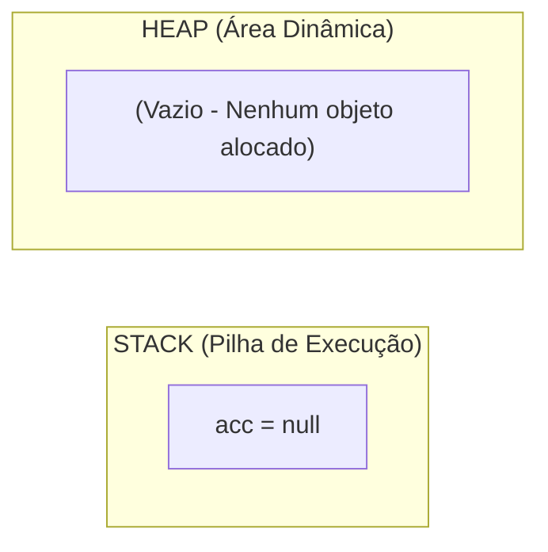
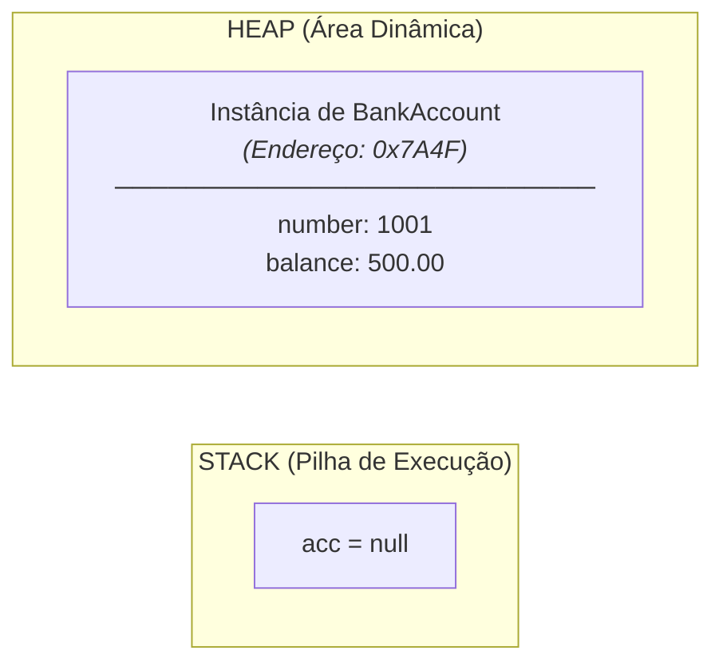
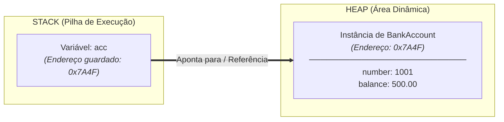
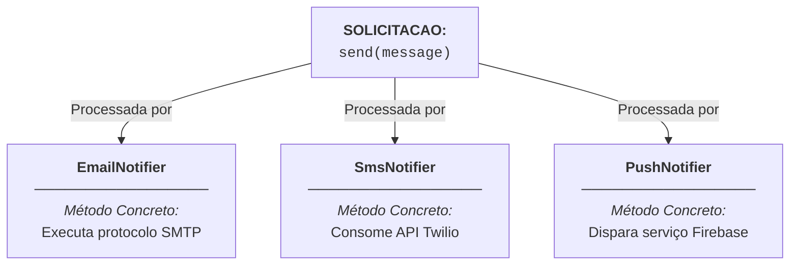
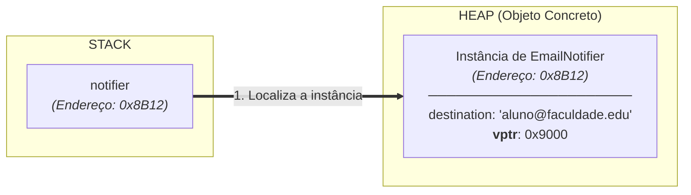
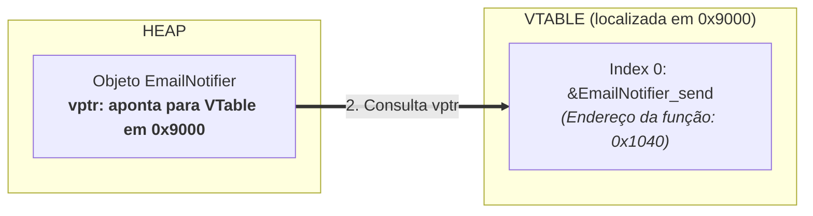
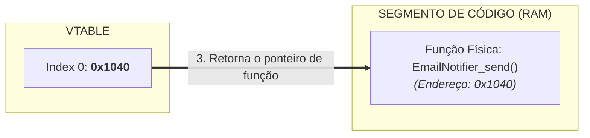
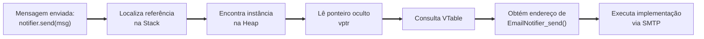
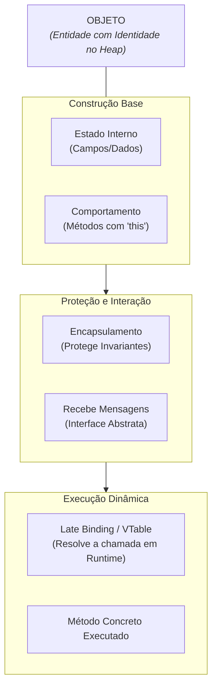

# Módulo 3 — A Mecânica dos Objetos: Da Disciplina de Design à Automação das Linguagens

## Introdução: OO é uma Disciplina de Design Antes de Ser uma Ferramenta

Se a Orientação a Objetos fosse apenas uma lista de palavras-chave (`class`,
`private`, `interface`), seria impossível programar orientado a objetos em
linguagens que não foram pensadas para suportar esse paradigma, como o C. No
entanto, sistemas de grande porte e altíssima complexidade — como o Kernel do
Linux, bancos de dados relacionais e sistemas operacionais inteiros — aplicam
rotineiramente os princípios de encapsulamento, polimorfismo e abstração.

Isso revela uma tese central: **a Orientação a Objetos é, antes de tudo, uma
disciplina de design de software**.

A palavra-chave `class` não cria a Orientação a Objetos. O modificador `private`
não inventou o encapsulamento. A palavra `interface` não criou a abstração.
Todos esses recursos são **mecanismos de linguagem** criados para automatizar e
proteger princípios que já existiam conceitualmente.

Neste capítulo, a nossa pergunta condutora não será _"como Java funciona por
dentro"_, mas sim: **se tivéssemos que construir uma linguagem orientada a
objetos do zero usando apenas C, quais mecanismos precisaríamos implementar?**

## 1. Construindo um Objeto Passo a Passo

No Módulo 2, estabelecemos que um objeto é definido por três propriedades
fundamentais: **Estado, Comportamento e Identidade**. Vamos agora observar o
nascimento de um objeto na máquina construindo cada uma dessas três propriedades
em sequência.

### Passo 1: Estado (Armazenando os Dados da Entidade)

Para representar o estado interno de uma entidade, utilizamos uma estrutura de
dados agrupada (`struct` em C):

```c
typedef struct {
    int number;
    double balance;
} BankAccount;
```

Neste momento, temos um bloco contíguo de memória capaz de armazenar os dados de
uma conta bancária. Contudo, essa estrutura é **passiva e vulnerável**. Qualquer
função externa pode fazer:

```c
my_account.balance = -999999.0; // Estado alterado diretamente sem validação!
```

Entretanto, **armazenar dados não é suficiente para caracterizar um objeto**.
Também é necessário definir como ele pode agir sobre esse estado.

### Passo 2: Comportamento (Atribuindo Responsabilidade)

Para transformar a estrutura de dados passiva em uma entidade ativa, associamos
comportamentos a ela. Em C, fazemos isso criando funções que recebem
explicitamente uma referência da própria estrutura como seu primeiro parâmetro
(o ponteiro `self` ou `this`):

```c
// Em C: O método é uma função que recebe o objeto alvo como primeiro parâmetro
void account_deposit(BankAccount* self, double amount) {
    if (self != NULL && amount > 0) {
        self->balance += amount;
    }
}
```

Para compreender o "clique" de como a Orientação a Objetos funciona, observe a
correspondência direta entre o código procedural e o orientado a objetos:

```text
1. COMO ESCREVEMOS EM C:
   account_deposit(&myAccount, 100.0);

2. COMO ESCREVEMOS EM JAVA:
   myAccount.deposit(100.0);

3. COMO A MÁQUINA EXECUTA AMBOS CONCEITUALMENTE:
   deposit(&myAccount, 100.0);
             ▲
             └── A referência 'myAccount' é injetada como o parâmetro 'this'!
```

Observe que, embora a sintaxe mude, a ideia essencial permanece a mesma: **quem
recebe a responsabilidade pela operação é sempre o próprio objeto**. A função
não opera sobre dados soltos; ela recebe a referência da instância `self` e
opera especificamente sobre a memória daquele indivíduo.

### Passo 3: Identidade e Memória (Onde o Objeto Habita)

Imagine duas contas bancárias com exatamente o mesmo número e o mesmo saldo de
R$ 500,00. Embora seus estados sejam idênticos, elas ainda representam clientes
diferentes do domínio. Em uma implementação baseada em referências, como a que
estamos construindo em C, essa identidade é materializada pelo endereço de
memória utilizado como referência. Linguagens modernas escondem esse detalhe
atrás de referências gerenciadas.

Para que um objeto exista na memória RAM de forma independente de escopos locais
de funções, a linguagem aloca a instância na memória dinâmica (**Heap**),
enquanto a pilha de execução (**Stack**) guarda apenas a referência para esse
endereço.

Podemos visualizar o nascimento da identidade de um objeto em **três etapas
causais**:

#### Etapa 1 — Antes da Instanciação (Nenhum objeto existe)

Antes da instrução de criação, nenhuma instância de `BankAccount` existe no
Heap. A variável local na Stack ainda não aponta para lugar nenhum.



#### Etapa 2 — O Objeto Nasce no Heap

A instrução `new BankAccount()` solicita ao runtime a criação de um novo objeto.
A instância passa a existir fisicamente na memória RAM (no endereço `0x7A4F`).



#### Etapa 3 — A Referência é Armazenada na Stack

A variável `acc` na Stack recebe o endereço de memória `0x7A4F`. O objeto
continua vivendo no Heap; o que mudou foi apenas a Stack, que agora guarda a
**referência de identidade** para aquela instância.



O objeto vive no Heap. O que a variável `acc` guarda é apenas o ponteiro que nos
permite localizar essa identidade.

## 2. Do Método à Mensagem: Separando Interface de Implementação

Até agora, vimos que um objeto possui comportamento implementado por métodos.
Mas, do ponto de vista de quem usa esse objeto, pouco importa _como_ esse
comportamento foi implementado internamente. O que realmente interessa é que
exista uma forma de solicitar determinada responsabilidade.

É justamente essa perspectiva que levou Alan Kay a tratar a interação entre
objetos como **troca de mensagens**, e não como simples chamadas de métodos.

Essa separação estabelece os papéis no sistema:

- **A Mensagem representa O QUE está sendo solicitado:** É a intenção abstrata
  enviada a um objeto (_"Deposite 100 reais"_ ou _"Notifique o usuário"_).
- **O Método representa COMO o objeto responde:** É a instrução concreta que o
  objeto destinatário executa para atender àquela solicitação.



Tratar "invocar um método" como "enviar uma mensagem" nos ensina a pensar em
**contratos de colaboração**: quem envia a mensagem passa a depender apenas da
responsabilidade da abstração, e não da sua implementação concreta. É justamente
esse desacoplamento que tornará possível o polimorfismo.

## 3. Encapsulamento: Protegendo a Autonomia do Objeto

Agora temos um objeto completo: ele possui estado, possui comportamento, possui
identidade na memória e recebe mensagens.

**Mas ainda existe um problema crítico.**

Da forma como está construído em C, nada impede que um programador desatento
ignore as mensagens de comportamento e altere os campos do objeto diretamente de
fora (`my_account.balance = -999999.0;`). Se isso acontecer, o comportamento
deixa de ser a única forma de modificar o objeto, e a autonomia que construímos
é destruída.

Para proteger essa autonomia, surge a necessidade do **Encapsulamento**.

Em C, alcançamos o encapsulamento real separando a declaração da implementação
por meio de **Ponteiros Opacos (_Opaque Pointers_)**:

### A Interface Pública (`bank_account.h`)

O arquivo de cabeçalho expõe apenas o tipo e as funções públicas, **ocultando
completamente os campos internos**:

```c
// bank_account.h
#ifndef BANK_ACCOUNT_H
#define BANK_ACCOUNT_H

// Tipo Opaco: O mundo externo sabe que 'BankAccount' existe, mas não conhece seus campos!
typedef struct BankAccount BankAccount;

BankAccount* account_create(int number, double initial_balance);
void account_deposit(BankAccount* self, double amount);
double account_get_balance(const BankAccount* self);

#endif
```

### A Implementação Privada (`bank_account.c`)

A estrutura real do tipo é revelada exclusivamente dentro do arquivo privado de
implementação:

```c
// bank_account.c
#include <stdlib.h>
#include "bank_account.h"

// A estrutura só é definida AQUI dentro!
struct BankAccount {
    int number;
    double balance; // Inacessível fora deste arquivo
};

void account_deposit(BankAccount* self, double amount) {
    if (self != NULL && amount > 0) {
        self->balance += amount; // O próprio objeto controla suas regras
    }
}
```

Se qualquer código externo tentar fazer `account->balance = -999;`, **o
compilador C gerará um erro de compilação**, pois a estrutura é opaca fora de
`bank_account.c`.

Observe a progressão: primeiro demos comportamento ao objeto; depois impedimos
que esse comportamento fosse contornado. Encapsulamento não cria comportamento —
ele garante que o comportamento seja respeitado.

## 4. Polimorfismo e Late Binding: Escolhendo o Comportamento em Runtime

Até aqui, cada mensagem que enviamos possui exatamente uma implementação fixa
associada. No entanto, essa rigidez limita a reutilização do código.

Seria muito mais interessante se **diferentes objetos pudessem responder à mesma
mensagem de maneiras distintas**. É a essa capacidade que damos o nome de
**Polimorfismo**.

O principal benefício do polimorfismo não é apenas evitar duplicação de código,
mas sim **reduzir o acoplamento**: quem envia uma mensagem passa a depender
apenas de um contrato de intenção, e não da implementação concreta que irá
executá-la.

Para decidir qual implementação deve responder a uma mensagem, as linguagens
utilizam dois mecanismos clássicos de resolução de chamadas:

### 1. Ligação Precoce (_Early Binding_)

- **Como funciona:** A decisão de qual função executar é gravada de forma fixa
  pelo compilador em tempo de compilação.
- **Limitação:** Como o endereço da função é estático no binário, o código **não
  consegue adaptar sua resposta** com base no tipo do objeto que recebe a
  mensagem.

### 2. Ligação Tardia (_Late Binding_)

- **Como funciona:** A decisão de qual código responderá à mensagem é
  **postergada para o tempo de execução (_runtime_)**.
- **Como viabiliza o Polimorfismo:** O programa inspeciona o objeto real em
  memória no momento em que a mensagem chega e descobre dinamicamente qual
  função acionar.

### O Caminho Percorrido por `notifier.send(msg)`

Para visualizar o _Late Binding_ em ação sem abstrações nebulosas, acompanhe a
jornada que a CPU e o runtime realizam na memória em **5 passos sequenciais**
utilizando uma **VTable (Tabela de Despacho Dinâmico)**:

> **Nota sobre o Modelo de VTable:** A estrutura `vptr` + VTable descrita a
> seguir é o modelo clássico de implementação de despacho dinâmico utilizado em
> C++ e runtimes similares. A JVM (Java HotSpot) utiliza internamente uma
> arquitetura diferente — ponteiros de `Klass`, `itables` para interfaces e
> _inline caches_ para otimização. O modelo apresentado aqui é um **recurso
> didático** para tornar o conceito de _Late Binding_ concreto e visualizável;
> ele captura a essência do mecanismo, mas não descreve a implementação literal
> da JVM.

#### Passo 1 — A Chamada é Emitida no Código

O programa executa a instrução `notifier.send(msg)`. O chamador não sabe qual
função concreta irá rodar; ele possui apenas a referência da mensagem.

```text
CÓDIGO: notifier.send("Sua nota foi publicada!");
```

#### Passo 2 — O Programa Acessa a Variável `notifier` na Stack

O programa lê a variável `notifier` na Stack e recupera o endereço de memória
que aponta para o Heap (endereço `0x8B12`).



#### Passo 3 — O Runtime Acessa o Objeto e Lê o Ponteiro `vptr`

Ao acessar a memória do objeto no Heap, o runtime lê o ponteiro oculto
**`vptr`** (guardado no endereço `0x9000`), que aponta para a tabela de funções
da classe `EmailNotifier`.



#### Passo 4 — A VTable Entrega o Endereço Físico do Método (O Momento do Late Binding)

O programa consulta o índice correspondente à mensagem `send` dentro da VTable e
descobre o endereço real da função na memória RAM (`0x1040`).



#### Passo 5 — A Execução Chega ao Método Concreto

A resolução dinâmica percorreu todo o caminho necessário para descobrir qual
implementação deve responder. Agora, com o endereço da função em mãos, a
execução simplesmente continua naquele ponto do código.



Em uma visão simplificada: **Mensagem $\rightarrow$ Objeto $\rightarrow$ VTable
$\rightarrow$ Código Concreto**

Se `notifier` apontasse para um objeto `SmsNotifier`, exatamente a mesma
mensagem percorreria esse fluxo, mas encontraria outra VTable e,
consequentemente, outro endereço de função. O código chamador permaneceria
idêntico; apenas o objeto concreto mudaria.

Essa é a essência do polimorfismo: o código que envia a mensagem não precisa
conhecer qual implementação responderá; essa decisão é delegada ao objeto em
tempo de execução.

## 5. C vs. Linguagens OO: Poder de Design vs. Automação

Ao longo deste capítulo, construímos manualmente em C cada mecanismo fundamental
da Orientação a Objetos. A tabela abaixo mostra como esses mecanismos aparecem
quando uma linguagem como Java ou C# decide automatizá-los.

| Conceito de OO     | Construção Manual (Mecânica em C)                      | Automação na Linguagem OO (Java / C#)                                      |
| :----------------- | :----------------------------------------------------- | :------------------------------------------------------------------------- |
| **Estado**         | Estrutura de dados agrupada (`struct`).                | Campos/Atributos declarados dentro da `class`.                             |
| **Comportamento**  | Funções recebendo a referência `self` no 1º parâmetro. | Métodos declarados na classe com injeção automática do `this`.             |
| **Identidade**     | Endereço de memória alocado no Heap.                   | Referência gerenciada apontando para a instância no Heap.                  |
| **Encapsulamento** | Divisão manual `.h` / `.c` com _Ponteiros Opacos_.     | Modificadores de acesso (`private`, `protected`) checados pelo compilador. |
| **Mensagem**       | Invocação de funções sobre um contrato.                | Invocação de métodos públicos (`obj.metodo()`).                            |
| **Polimorfismo**   | Ponteiros de função e tabelas de despacho (_VTables_). | Métodos virtuais, interfaces e resolução por _Late Binding_.               |

## Conclusão

Ao longo deste capítulo, construímos manualmente praticamente todos os
mecanismos fundamentais da Orientação a Objetos:

- reunimos estado e comportamento em uma única entidade;
- atribuímos responsabilidades por meio de métodos que manipulam a própria
  instância (`self`/`this`);
- demos identidade a essa entidade por meio de referências no Heap;
- desacoplamos a solicitação da execução através do conceito de mensagem;
- protegemos seu estado contra alterações indevidas via encapsulamento opaco;
- permitimos múltiplas implementações para a mesma mensagem usando despacho
  dinâmico.

O diagrama a seguir sintetiza a arquitetura conceitual e mecânica desenvolvida:



Nada do que vimos dependeu das palavras-chave `class`, `private` ou `interface`.
Essas palavras-chave não criam a Orientação a Objetos; elas apenas automatizam
mecanismos que poderiam ser implementados manualmente.

Em outras palavras, **a Orientação a Objetos continua sendo uma disciplina de
design. As linguagens apenas transformaram essa disciplina em regras verificadas
automaticamente pelo compilador e pelo runtime.**
