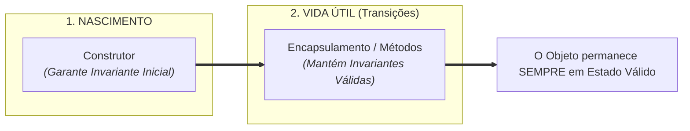
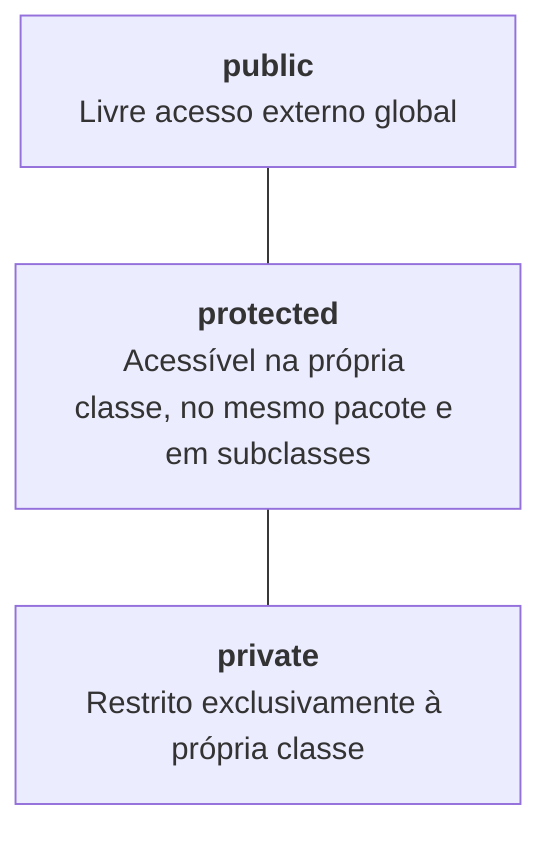
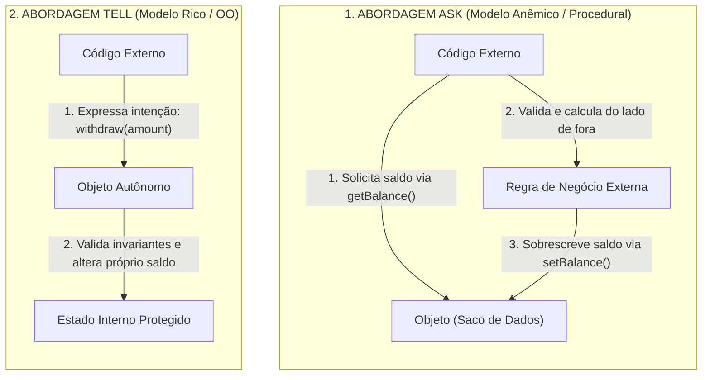

# Módulo 5 — Pilar 1: Encapsulamento e a Preservação de Invariantes

## Introdução: A Ilusão do Falso Encapsulamento

Nas salas de aula e nos primeiros anos de desenvolvimento, o Encapsulamento
costuma ser ensinado por meio de uma receita de bolo mecânica: _"marque todos os
seus atributos como `private` e gere métodos `get` e `set` para cada um deles"_.

Entretanto, esse hábito gera um dos antipadrões mais comuns no software
comercial: **o falso encapsulamento**.

Considere a seguinte classe em Java:

```java
// Exemplo de "Falso Encapsulamento"
public class BankAccount {
    private String number;
    private double balance;

    public String getNumber() {
        return number;
    }

    public void setNumber(String number) {
        this.number = number;
    }

    public double getBalance() {
        return balance;
    }

    public void setBalance(double balance) {
        this.balance = balance; // Aceita qualquer valor de fora sem validações!
    }
}
```

Embora o atributo `balance` esteja marcado com o modificador `private`, qualquer
código externo pode executar a instrução:

```java
account.setBalance(-5000.00); // Invariante violada! O saldo tornou-se inconsistente.
```

Escrever `account.setBalance(-5000.00)` destrói a autonomia do objeto exatamente
da mesma forma que declarar `public double balance`. A única diferença real é a
sintaxe da chamada. O estado continua desprotegido e exposto a alterações
arbitrárias.

O problema não está na existência pontual de métodos de leitura (como
`getName()`), mas em **transformar todos os atributos internos em propriedades
públicas disfarçadas**.

Encapsulamento não é sobre esconder variáveis por burocracia sintática; é sobre
**impor uma fronteira de proteção rigorosa para garantir a integridade do objeto
e a preservação das suas invariantes**.

## 1. Invariantes: A Razão de Existir do Encapsulamento

Uma **Invariante** é uma regra de negócio ou uma condição de consistência que
precisa permanecer **sempre verdadeira** durante todo o ciclo de vida do objeto.

### Exemplos de Invariantes de Negócio

- O saldo de uma conta bancária não pode ser menor do que o limite de crédito
  aprovado.
- A quantidade de itens em um pedido de compra precisa ser maior do que zero.
- A data final de uma reserva de hotel não pode ser anterior à data de início.
- O status de um pedido enviado não pode transitar diretamente de volta para "Em
  Rascunho".

Se o código externo puder alterar a memória do objeto sem restrições, uma
invariante pode ser quebrada em silêncio, fazendo a aplicação entrar em um
estado corrompido e imprevisível.

### A Conexão com o Ciclo de Vida do Objeto

No Módulo 4, aprendemos que o papel primário do **construtor** é garantir que o
objeto nasça em um estado consistente. O Encapsulamento é a continuação direta
dessa responsabilidade:

> **O construtor protege o nascimento do objeto; o encapsulamento protege todas
> as mudanças de estado que acontecem depois.**



O encapsulamento atua como o mecanismo que impede qualquer alteração direta do
estado, forçando que toda transição ocorra obrigatoriamente por meio de
operações que validem e respeitem as regras do negócio.

## 2. Modificadores de Acesso: Construindo Barreiras de Proteção

Para implementar o encapsulamento de forma conveniente, as linguagens fornecem
**Modificadores de Acesso**. Eles não existem por capricho de sintaxe; existem
para controlar a visibilidade e proteger as fronteiras de responsabilidade do
software.

A necessidade dos modificadores nasce de um fluxo de causa e efeito:

```text
Estado Exposto  ──►  Qualquer Código Altera  ──►  Invariantes Quebradas  ──►  Necessidade de Barreiras
```



- **`private`:** O nível máximo de proteção. O membro é visível **apenas no
  corpo da própria classe**. É a escolha padrão absoluta para os atributos que
  compõem o estado do objeto.
- **`public`:** O membro é visível para qualquer outra parte da aplicação. Deve
  ser reservado para expor a interface de métodos públicos que representam as
  ações do domínio.
- **`protected`:** Torna o membro visível para a própria classe, para **qualquer
  classe do mesmo pacote** e para **todas as suas subclasses**.

> **Desambiguação Importante: `private` é por Classe, não por Instância**
>
> Em linguagens como Java, C# e C++, o modificador `private` restringe o acesso
> ao **código da classe**, e não ao indivíduo em execução. Isso significa que
> _uma instância de `BankAccount` pode acessar diretamente os atributos privados
> de OUTRA instância de `BankAccount`_, desde que esse acesso ocorra dentro dos
> métodos da própria classe:
>
> ```java
> public class BankAccount {
>     private double balance;
>
>     // Uma instância (this) acessa diretamente o 'balance' privado de OUTRA instância (other)!
>     public void transferTo(BankAccount other, double amount) {
>         if (this.balance >= amount) {
>             this.balance -= amount;
>             other.balance += amount; // Válido! Ambos são do tipo BankAccount.
>         }
>     }
> }
> ```
>
> Entender essa distinção evita a falsa impressão de que o `private` impede a
> colaboração direta entre objetos da mesma espécie.

### O Perigo dos Campos `protected` e o Acoplamento Rígido

O modificador `protected` costuma ser visto por iniciantes como um meio-termo
conveniente. Contudo, declarar **atributos** como `protected` gera uma quebra
sutil de encapsulamento.

Ao expor um campo como `protected`, transformamos todas as subclasses presentes
e futuras em participantes diretos da representação interna da classe pai,
criando um acoplamento rígido que dificulta preservar suas invariantes ao longo
da evolução da hierarquia:

```java
// VULNERÁVEL: Atributo protected exposto para subclasses
public class Account {
    protected double balance; // As subclasses dependem diretamente do tipo 'double'
}
```

O grande problema aqui não é apenas a subclasse poder colocar um valor negativo.
O problema maior é a **perda de liberdade de refatoração**: se no futuro
decidirmos mudar a representação interna de `double balance` para `BigDecimal
balance` ou para um objeto de domínio `Money balance`, **todas as subclasses do
sistema serão quebradas**. A classe pai perde a autonomia sobre como armazena
seus dados.

#### O Uso Legítimo do `protected`: Contratos Internos de Extensão

Em um design saudável, o `protected` não deve ser utilizado para expor
atributos, mas sim para definir **métodos que atuam como contratos internos de
extensão** (padrão conhecido como _Template Method_).

> **O método `protected` não existe para dar poder irrestrito às subclasses; ele
> existe para permitir que a classe base defina pontos onde subclasses podem
> colaborar.**

Em vez de permitir que a subclasse altere o estado interno, a classe pai mantém
o controle rígido do fluxo e chama métodos `protected` para delegar etapas
específicas do algoritmo:

```java
public abstract class ReportGenerator {

    // O método público é FINAL (não pode ser alterado pelas subclasses).
    // A classe pai retém o controle absoluto do fluxo e das invariantes.
    public final void generateReport() {
        collectData();
        formatContent(); // Ponto de extensão OBRIGATÓRIO (abstract)
        saveToDisk();    // Ponto de extensão OPCIONAL (método com corpo padrão)
    }

    private void collectData() {
        System.out.println("Coletando dados do banco...");
    }

    // Ponto de extensão OBRIGATÓRIO: 'abstract' força as subclasses a definirem
    // a formatação específica (aprofundaremos isso no capítulo sobre Abstração).
    protected abstract void formatContent();

    // Ponto de extensão OPCIONAL (Hook): fornece uma implementação padrão,
    // mas permite que subclasses alterem a forma de gravação se desejarem.
    protected void saveToDisk() {
        System.out.println("Gravando no disco local por padrão...");
    }
}
```

A diferença filosófica de design é clara:

- **Campo `protected`:** _"Subclasses podem mexer diretamente na minha estrutura
  física de dados."_
- **Método `protected`:** _"Subclasses podem participar de uma etapa específica
  de uma operação que eu controlo."_

E também demonstra a flexibilidade de contratos internos:

- **`protected abstract`:** Força a subclasse a fornecer uma implementação
  personalizada para aquela etapa.
- **`protected` (com corpo):** Fornece um comportamento padrão seguro,
  concedendo à subclasse o direito de sobrescrevê-lo apenas se necessário.

## 3. O Princípio _Tell, Don't Ask_ (Diga, Não Pergunte)

O encapsulamento atinge sua plenitude quando mudamos a forma como pensamos a
interação entre os objetos. Esse princípio é conhecido como **Tell, Don't Ask**
(_Diga, Não Pergunte_).

Para compreender este princípio, vale contextualizar dois modelos mentais de
arquitetura:

- **Modelo Anêmico (_Anemic Domain Model_):** As classes de objetos funcionam
  como meras estruturas de dados passivas (apenas atributos `private` com
  `getters` e `setters` genéricos). Na prática, esse modelo faz com que os
  objetos **regridam à natureza das estruturas de dados do paradigma
  procedural** — funcionando como meros "sacos de dados burros" que armazenam
  valores, mas delegam toda a inteligência, validações e regras de negócio para
  classes de serviço externas.
- **Modelo Rico (_Rich Domain Model_):** Os objetos combinam dados e
  comportamentos no mesmo lugar. O objeto retém a responsabilidade de executar
  suas regras de negócio e proteger seu próprio estado, agindo como uma entidade
  autônoma.

### A Diferença entre Abordagens

- **Ask (Abordagem Anêmica / Procedural):** O código externo pede os dados ao
  objeto via `get`, executa os cálculos e a validação do lado de fora, e depois
  injeta o novo valor de volta via `set`. O objeto é um mero depósito passivo de
  dados.
- **Tell (Abordagem Encapsulada / OO):** O código externo informa uma intenção
  de negócio ao objeto (`withdraw(amount)`). O próprio objeto valida suas regras
  e atualiza seu estado interno.



### Refatorando do Modelo Anêmico para o Modelo Rico

Veja a comparação no código Java:

**Modelo Anêmico (Dados passivos e regras espalhadas):**

```java
// O código externo é forçado a controlar as invariantes da conta
if (account.getBalance() >= amount) {
    double newBalance = account.getBalance() - amount;
    account.setBalance(newBalance);
} else {
    throw new IllegalStateException("Saldo insuficiente.");
}
```

**Modelo Encapsulado Rico (Estado protegido e regras centralizadas):**

```java
public class BankAccount {
    private String number;
    private double balance;

    public BankAccount(String number, double initialBalance) {
        if (initialBalance < 0) {
            throw new IllegalArgumentException("Saldo inicial inválido.");
        }
        this.number = number;
        this.balance = initialBalance;
    }

    // Getters apenas de LEITURA (Sem setters públicos!)
    public String getNumber() { return number; }
    public double getBalance() { return balance; }

    // Comportamentos expressivos que protegem o estado
    public void deposit(double amount) {
        if (amount <= 0) {
            throw new IllegalArgumentException("O valor do depósito deve ser positivo.");
        }
        this.balance += amount;
    }

    public void withdraw(double amount) {
        if (amount <= 0) {
            throw new IllegalArgumentException("O valor do saque deve ser positivo.");
        }
        if (amount > this.balance) {
            throw new IllegalStateException("Saldo insuficiente para realizar o saque.");
        }
        this.balance -= amount;
    }
}
```

No modelo rico, **as únicas transições possíveis são aquelas conhecidas pelo
próprio objeto, que passa a ser o guardião central das suas invariantes**. Toda
transição passa por métodos expressivos do domínio que contêm as validações
necessárias.

## 4. Vazamento de Encapsulamento: Referências Mutáveis e Exposição de Estado

Declarar um atributo como `private` e remover os `setters` públicos não garante,
por si só, um encapsulamento perfeito. Existe um bug silencioso em sistemas
orientados a objetos conhecido como **Vazamento de Referência (_Leaky
Encapsulation_)**.

Conectando com o que vimos no Módulo 3, **o endereço de memória de um objeto
mutável também faz parte da fronteira de encapsulamento**. Uma referência não é
apenas um valor; ela é a _autoridade_ para modificar a entidade apontada na
Heap.

Considere a classe a seguir:

```java
import java.util.ArrayList;
import java.util.List;

public class CustomerOrder {
    private final List<String> items = new ArrayList<>();

    public void addItem(String item) {
        if (item == null || item.isBlank()) {
            throw new IllegalArgumentException("Item inválido.");
        }
        this.items.add(item);
    }

    // Getter que devolve a referência direta da lista interna!
    public List<String> getItems() {
        return this.items;
    }
}
```

À primeira vista, o atributo `items` é `private` e não existe um método
`setItems()`. No entanto, observe o que um código externo pode fazer:

```java
CustomerOrder order = new CustomerOrder();
order.addItem("Notebook");

// O código externo pede a lista e obtém a REFERÊNCIA DIRETA do Heap!
List<String> externalList = order.getItems();

// A lista é limpa por fora, burlando todas as validações da classe!
externalList.clear();

System.out.println(order.getItems().size()); // Resultado: 0! O estado foi corrompido!
```

### O Conceito: Encapsulamento de Referências

> **Encapsulamento não protege apenas valores primitivos; protege também quem
> possui autoridade para modificar coleções e objetos mutáveis internos.**

Como o método `getItems()` devolveu a referência física da lista que residia na
Heap, o código chamador ganhou permissão para alterar o estado interno do objeto
sem passar pelo método `addItem()`.

### Como Corrigir Vazamentos de Referência

Para impedir o vazamento de coleções ou objetos mutáveis, utilizamos duas
estratégias fundamentais:

#### 1. Retorno de Visões Não-Modificáveis (_Unmodifiable Views_)

Em vez de retornar a coleção interna direta, devolvemos um _wrapper_ que impede
operações de escrita por terceiros:

```java
import java.util.Collections;
import java.util.List;

public class CustomerOrder {
    private final List<String> items = new ArrayList<>();

    // Retorna uma visão somente-leitura. Tentar fazer clear() ou add() externamente disparará uma exceção!
    public List<String> getItems() {
        return Collections.unmodifiableList(this.items);
    }
}
```

#### 2. Cópia Defensiva (_Defensive Copies_ / Cópia Imutável)

Se desejamos entregar um snapshot totalmente desconectado da coleção interna ou
lidar com objetos mutáveis recebidos no construtor, criamos uma cópia
independente (ou uma cópia imutável como `List.copyOf()`):

```java
public class EventPeriod {
    private final Date startDate;

    // Cópia defensiva no nascimento: impede que o chamador altere a Date externa depois
    public EventPeriod(Date startDate) {
        this.startDate = new Date(startDate.getTime());
    }

    // Cópia defensiva na leitura: devolve um novo objeto Date
    public Date getStartDate() {
        return new Date(this.startDate.getTime());
    }
}
```

> **Nota Comparativa: Visão (_View_) vs. Cópia Defensiva (_Copy_)**
>
> - **Visão Não-Modificável (`Collections.unmodifiableList`):** Possui apenas o
>   custo de alocação do _wrapper_ em memória. O código externo fica impedido de
>   chamar `.add()` ou `.clear()`. No entanto, como é uma visão direta, se a
>   própria classe alterar a lista interna via `addItem()`, o código externo
>   enxergará a nova adição refletida em tempo real.
> - **Cópia Defensiva (`List.copyOf` / `new ArrayList`):** Aloca um novo bloco
>   de memória no Heap para duplicar os dados. O código externo recebe um
>   _snapshot_ completamente isolado do tempo. Se a classe alterar a lista
>   interna no futuro, a cópia externa não será afetada.

## 5. Síntese do Módulo: Modelo Anêmico vs. Modelo Encapsulado

A tabela a seguir contrasta o Modelo Anêmico (falso encapsulamento) com o Modelo
Encapsulado Rico:

| Critério                         | Modelo Anêmico (Falso Encapsulamento)                 | Modelo Encapsulado Rico                                               |
| :------------------------------- | :---------------------------------------------------- | :-------------------------------------------------------------------- |
| **Proteção de Estado**           | Dados expostos direta ou indiretamente.               | Estado estritamente privado e protegido.                              |
| **Interface do Objeto**          | `getters` e `setters` genéricos automáticos.          | Métodos de comportamento com significado de negócio.                  |
| **Validação de Regras**          | Regras de negócio espalhadas pelo código externo.     | Regras centralizadas dentro do próprio objeto.                        |
| **Postura do Objeto**            | Passivo (agente manipulado por terceiros).            | Autônomo e responsável (_Tell, Don't Ask_).                           |
| **Comunicação**                  | O código chamador _pergunta_ os dados e calcula fora. | O código chamador _envia intenções_ ao objeto.                        |
| **Gerenciamento de Referências** | Retorna referências mutáveis internas diretamente.    | Protege referências com visões não-modificáveis ou cópias defensivas. |

## Conclusão

Neste módulo, desmistificamos a ideia de que encapsular é apenas marcar
atributos com `private` e criar métodos acessores genéricos:

- compreendemos que o encapsulamento existe para **preservar invariantes** e
  manter o objeto em estado sempre consistente após o seu nascimento;
- analisamos os modificadores de acesso e vimos que o `protected` não é uma
  porta de acesso liberada para filhas, mas sim um contrato de extensão
  controlado (como no _Template Method_);
- aplicamos o princípio **Tell, Don't Ask**, transformando estruturas passivas
  em objetos autônomos que contêm métodos de negócio expressivos;
- identificamos o vazamento de abstração e aprendemos que o endereço de memória
  de coleções e objetos mutáveis também precisa ter sua autoridade protegida.

**Encapsulamento não é esconder dados. É controlar quem pode provocar transições
de estado e garantir que toda mudança preserve as regras do objeto.**

Se cada objeto protege sua própria autonomia e seu estado interno, surge a
pergunta inevitável: _como vários objetos autônomos podem colaborar no sistema
sem conhecer os detalhes internos uns dos outros?_ A resposta nos leva ao
próximo pilar da Orientação a Objetos: o **Pilar 2: Abstração e Contratos**.
