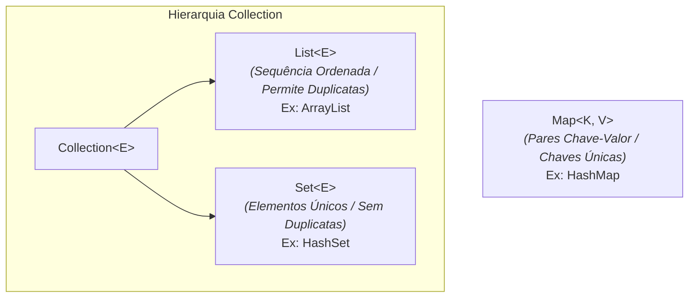

# 06. Bibliotecas Importantes da API Padrão

Guia de referência sobre as principais bibliotecas e utilitários da API padrão
do Java: matemática, manipulação de texto, coleções, data e hora, `Optional` e
entrada/saída de dados (I/O).

## 1. Utilidades Matemáticas e Manipulação de Texto

### A Classe `Math`

Fornece operações matemáticas fundamentais por meio de métodos estáticos:

```java
import java.lang.Math;

double squareRoot = Math.sqrt(25.0); // 5.0 (Raiz quadrada)
double power = Math.pow(2, 3);       // 8.0 (Potência: 2^3)
int max = Math.max(10, 20);          // 20  (Maior entre dois valores)
int min = Math.min(10, 20);          // 10  (Menor entre dois valores)
long rounded = Math.round(5.67);     // 6   (Arredondamento para o inteiro mais próximo)
double random = Math.random();       // Valor aleatório entre 0.0 (inclusivo) e 1.0 (exclusivo)
```

### Manipulação de Texto (`String` vs. `StringBuilder`)

- **`String` (Imutável):**

  Toda operação sobre uma `String` gera uma **nova instância** no Heap.

  ```java
  String text = " Java 25 ";
  String trimmed = text.trim();               // "Java 25" (remove espaços das pontas)
  String upper = trimmed.toUpperCase();       // "JAVA 25"
  boolean hasJava = trimmed.contains("Java"); // true
  String replaced = trimmed.replace("25", "26"); // "Java 26"
  ```

- **`StringBuilder` (Mutável e Eficiente):**

  Utilizado para concatenar ou modificar textos repetidamente em loops, evitando
  a criação desnecessária de milhares de instâncias temporárias de `String` na
  memória:

  ```java
  StringBuilder builder = new StringBuilder();

  for (int i = 0; i < 5; i++) {
      builder.append("Item ").append(i).append("; ");
  }

  String result = builder.toString(); // "Item 0; Item 1; Item 2; Item 3; Item 4; "
  ```

## 2. Framework de Coleções e Generics

### Generics (`<T>`)

O mecanismo de **Generics** permite parametrizar classes, interfaces e coleções
com um ou mais tipos de dados. Ele garante a **segurança de tipos em tempo de
compilação**, eliminando a necessidade de _casting_ manual e prevenindo erros em
tempo de execução (`ClassCastException`).

#### Declaração de Tipos Parametrizados

Você pode criar suas próprias classes e interfaces genéricas definindo os
parâmetros de tipo entre chaves angulares `< >`:

- **Com Um Parâmetro de Tipo:**

  ```java
  // Convenção: 'T' para 'Type' (Tipo) ou 'E' para 'Element' (Elemento)
  public class Box<T> {
      private T content;

      public void setContent(T content) {
          this.content = content;
      }

      public T getContent() {
          return this.content;
      }
  }

  // Uso:
  Box<String> stringBox = new Box<>();
  stringBox.setContent("Texto"); // O compilador garante que apenas Strings são aceitas
  ```

- **Com Múltiplos Parâmetros de Tipo:** É possível parametrizar uma estrutura
  com dois ou mais tipos separados por vírgula (muito comum em pares de dados ou
  mapeamentos chave-valor):

  ```java
  // Convenção: 'K' para 'Key' (Chave) e 'V' para 'Value' (Valor)
  public class Pair<K, V> {
      private final K key;
      private final V value;

      public Pair(K key, V value) {
          this.key = key;
          this.value = value;
      }

      public K getKey() { return key; }
      public V getValue() { return value; }
  }

  // Uso:
  Pair<String, Integer> studentAge = new Pair<>("Alice", 25);
  ```

### As Três Coleções Principais (`List`, `Set`, `Map`)



#### 1. `List<E>` — Coleções que Permitem Duplicatas e Garantem a Ordem

Utilize quando a ordem dos elementos importa e duplicações forem permitidas. A
implementação mais comum é o `ArrayList`:

```java
List<String> names = new ArrayList<>();
names.add("Alice");
names.add("Bob");
names.add("Alice"); // Aceita elementos duplicados!

String first = names.get(0); // Acesso por índice (Alice)
int size = names.size();      // Tamanho da lista (3)
names.remove("Bob");         // Remove por elemento ou índice
```

#### 2. `Set<E>` — Coleções de Elementos Únicos

Utilize quando você precisa garantir que não existam elementos repetidos na
coleção. A implementação padrão é o `HashSet` (que exige a implementação correta
de `equals()` e `hashCode()` no objeto, e não garante que os elementos sejam
mantidos em ordem):

```java
Set<Integer> uniqueIds = new HashSet<>();
uniqueIds.add(1001);
uniqueIds.add(1002);
uniqueIds.add(1001); // Ignorado silenciosamente! Não insere duplicatas.

boolean exists = uniqueIds.contains(1001); // Busca de altíssimo desempenho: true
```

#### 3. `Map<K, V>` — Estrutura de Chave-Valor (_Dicionários_)

Mapeia chaves únicas para seus respectivos valores. A implementação mais comum é
o `HashMap`:

```java
Map<String, Double> grades = new HashMap<>();
grades.put("Alice", 9.5);
grades.put("Bob", 8.0);

double aliceGrade = grades.get("Alice"); // Retorna 9.5
boolean hasBob = grades.containsKey("Bob"); // true

// Iterando sobre as chaves e valores:
for (Map.Entry<String, Double> entry : grades.entrySet()) {
    System.out.println(entry.getKey() + " -> " + entry.getValue());
}
```

### Coleções Imutáveis (`List.of()`, `Set.of()`, `Map.of()`)

O Java fornece métodos fábrica estáticos para instanciar coleções imutáveis de
forma concisa. Tentar chamar `.add()` ou `.remove()` em uma coleção criada por
estes métodos disparará a exceção `UnsupportedOperationException`:

```java
List<String> fixedList = List.of("Alice", "Bob", "Charlie");
Set<Integer> fixedSet = Set.of(1, 2, 3);
Map<String, Integer> fixedMap = Map.of("A", 1, "B", 2);
```

## 3. API de Data e Hora (`java.time.*`)

A API de datas moderna do Java (`java.time`) é **completamente imutável e
thread-safe**, substituindo com vantagem as antigas e vulneráveis classes
`java.util.Date` e `Calendar`.

```java
import java.time.*;
import java.time.format.DateTimeFormatter;

// 1. Apenas Data (Sem hora e sem fuso)
LocalDate today = LocalDate.now();                     // Ex: 2026-08-02
LocalDate birthDate = LocalDate.of(2000, Month.MAY, 15);

// 2. Apenas Hora (Sem data e sem fuso)
LocalTime now = LocalTime.now();                       // Ex: 14:30:00

// 3. Data e Hora Combinadas
LocalDateTime currentDateTime = LocalDateTime.now();   // Ex: 2026-08-02T14:30:00

// 4. Operações Imutáveis (retornam sempre um novo objeto!)
LocalDate nextMonth = today.plusMonths(1);
LocalDate previousWeek = today.minusWeeks(1);

// 5. Cálculos de Intervalo e Duração
Period age = Period.between(birthDate, today);          // Diferença em Anos/Meses/Dias
System.out.println("Idade: " + age.getYears() + " anos");

Instant start = Instant.now(); // Marca de tempo na linha do tempo (UTC)
// ... operação ...
Instant end = Instant.now();
Duration elapsed = Duration.between(start, end);        // Diferença em Milissegundos/Nanos

// 6. Formatação e Parsing de Strings
DateTimeFormatter formatter = DateTimeFormatter.ofPattern("dd/MM/yyyy");
String formattedDate = today.format(formatter);         // "02/08/2026"
LocalDate parsedDate = LocalDate.parse("15/05/2000", formatter);
```

## 4. `Optional<T>`: Evitando a `NullPointerException`

O `Optional<T>` é um _container_ de valor que pode ou não conter um objeto
não-nulo. Ele é utilizado principalmente como **tipo de retorno de métodos de
busca**, deixando explícito na assinatura que o resultado pode estar ausente.

### Criando Instâncias de `Optional`

```java
// Lança NullPointerException se o argumento for null
Optional<String> hasValue = Optional.of("Conteúdo presente");

// Cria um Optional vazio
Optional<String> empty = Optional.empty();

// Cria um Optional vazio se o argumento for null, ou com o valor se não for null
Optional<String> nullable = Optional.ofNullable(variableThatCanBeNull);
```

### Consumindo o `Optional` de Forma Segura

Evite chamar `.get()` diretamente sem checar, pois isso recria o perigo da
`NullPointerException`. Prefira os métodos fluentes e expressivos do `Optional`:

```java
Optional<Customer> customerOpt = findCustomerById(42);

// 1. Executa uma ação apenas se o valor estiver presente:
customerOpt.ifPresent(customer -> System.out.println("Cliente: " + customer.getName()));

// 2. Retorna o valor interno ou um valor padrão caso esteja ausente:
Customer customer1 = customerOpt.orElse(new Customer("Cliente Padrão"));

// 3. Mapeia o valor interno para outro valor caso esteja presente:
String customerName = customerOpt.map(Customer::getName).orElse("Cliente Padrão");

// 4. Retorna o valor interno ou lança uma exceção customizada caso esteja ausente:
Customer customer2 = customerOpt.orElseThrow(() -> new NoSuchElementException("Cliente não encontrado!"));
```

## 5. Entrada e Saída de Dados (I/O)

### 1. Leitura e Escrita Simplificadas no Terminal (Java 25)

No Java 25, para scripts e programas com **classes implícitas** (sem declaração
explícita de `class`), a linguagem importa automaticamente os métodos estáticos
`println`, `print` e `readln` da classe `java.lang.IO`. Isso elimina a
necessidade de instanciar `Scanner` ou escrever `System.out` para operações
simples de terminal:

```java
// Escrita direta (substitui o System.out.println) — válido em classes implícitas
println("Imprime com quebra de linha ao final");
print("Imprime sem quebra de linha");

// Leitura direta (substitui o Scanner para leitura de linhas!)
String name = readln("Digite seu nome: ");
```

> **Atenção:** O auto-import só ocorre em **classes implícitas**. Em classes
> declaradas explicitamente (com `public class MinhaClasse { ... }`), é preciso
> qualificar as chamadas com o nome da classe: `IO.println(...)`,
> `IO.readln(...)` — ou usar `import static java.lang.IO.*;`.

### 2. Método Tradicional no Terminal (`System.out` e `Scanner`)

Em classes declaradas explicitamente dentro de pacotes, utiliza-se a API
clássica de I/O de terminal:

#### Saída Padrão (`System.out`)

```java
System.out.println("Imprime com quebra de linha ao final");
System.out.print("Imprime sem quebra de linha");
System.out.printf("Formatado: Nome: %s, Idade: %d, Saldo: R$ %.2f\n", "Alice", 25, 1500.50);
```

#### Lendo Dados do Terminal (`Scanner`)

O `Scanner` é útil para ler e converter automaticamente tipos primitivos (como
`int` e `double`) a partir da entrada padrão:

```java
import java.util.Scanner;

try (Scanner scanner = new Scanner(System.in)) {
    System.out.print("Digite seu nome: ");
    String name = scanner.nextLine();

    System.out.print("Digite sua idade: ");
    int age = scanner.nextInt(); // Lê e converte diretamente para int
}
```

### 3. Manipulação de Arquivos (`Files` e `BufferedReader`)

Para persistir ou ler dados do disco local, o Java oferece tanto métodos rápidos
modernos quanto leituras eficientes em fluxo:

#### Leitura e Escrita Rápida de Arquivos Pequenos (`java.nio.file.Files`)

Ideal para scripts e operações simples onde o arquivo inteiro cabe
confortavelmente na memória:

```java
import java.nio.file.*;

Path path = Path.of("dados.txt");

// Escrever texto em um arquivo em uma única chamada:
Files.writeString(path, "Linha 1\nLinha 2");

// Ler todo o conteúdo de um arquivo em uma única chamada:
String content = Files.readString(path);
```

#### Leitura Eficiente Linha a Linha para Arquivos Grandes (`BufferedReader`)

Utiliza o `try-with-resources` para garantir a liberação do arquivo no Sistema
Operacional e processa o arquivo em _stream_ sem carregar tudo na RAM de uma
vez:

```java
import java.io.*;

try (BufferedReader reader = new BufferedReader(new FileReader("arquivo_grande.txt"))) {
    String line;
    while ((line = reader.readLine()) != null) {
        System.out.println(line);
    }
} catch (IOException e) {
    System.err.println("Erro na leitura do arquivo: " + e.getMessage());
}
```

#### Escrita Eficiente para Arquivos Grandes (`BufferedWriter`)

Para gravar grandes volumes de dados no disco sem sobrecarregar a memória RAM,
utilize o `BufferedWriter`. Ele acumula os dados em um _buffer_ interno em
memória e grava no disco em lotes, reduzindo drasticamente as chamadas de I/O no
Sistema Operacional. O `try-with-resources` garante que todos os dados
represados no _buffer_ sejam descarregados (_flushed_) e o arquivo seja fechado
corretamente:

```java
import java.io.*;

try (BufferedWriter writer = new BufferedWriter(new FileWriter("saida_grande.txt"))) {
    for (int i = 1; i <= 1_000_000; i++) {
        writer.write("Linha " + i + ": processando registro do sistema...");
        writer.newLine(); // Adiciona a quebra de linha portátil no S.O.
    }
} catch (IOException e) {
    System.err.println("Erro ao escrever no arquivo: " + e.getMessage());
}
```
